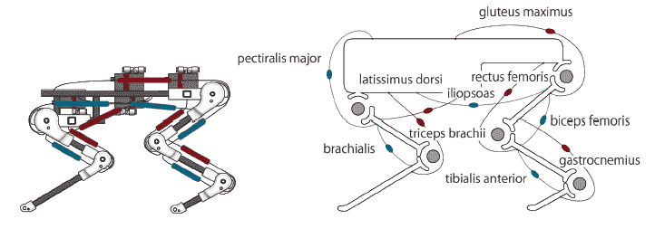

# 视频:四条腿的动物机器人 PIGORASS 自己跳跃、飞奔 TechCrunch

> 原文：<https://web.archive.org/web/http://techcrunch.com/2011/09/05/video-four-legged-animal-robot-pigorass-jumps-gallops-by-itself/>

# 视频:四条腿的动物机器人小猪自己跳跃、奔跑

在过去的年里，我们已经报道了来自日本的动物机器人在[中，但是由来自东京大学](https://web.archive.org/web/20230203165349/https://techcrunch.com/2009/07/06/dream-cat-venus-sega-toys-to-roll-out-creepy-animal-robot/)[的](https://web.archive.org/web/20230203165349/http://www.u-tokyo.ac.jp/index_e.html) [Yasunori Yamada](https://web.archive.org/web/20230203165349/http://www.isi.t.u-tokyo.ac.jp/~y-yamada/) 开发的 PIGORASS 无疑是突出的:Yamada 开发了一种四足机器人，它可以行走、跳跃，并且(在某种程度上)还可以飞奔。

鉴于山田仍然是一名硕士生，即使是高级机器人(例如本田的[阿西莫](https://web.archive.org/web/20230203165349/https://techcrunch.com/tag/asimo/))也只能以缓慢、劈砍的动作移动，PIGORASS 的工作方式令人印象深刻。

另一点值得注意的是，PIGORASS 通过模拟神经系统“自主”移动，这意味着它没有必要事先编程它应该采取的行动。相反，机器人使用一套气动人工肌肉(如下图红色所示)、被动肌肉(蓝色的弹簧)、压力传感器和电位计来推动自己前进:

这里的想法是“更好地理解动物运动技能背后的机制，以及如何将它们应用到机器人中”，并“捕捉动物肌肉骨骼系统的重要特征，以实现神经系统的体现”，正如 Yamada 等人在这里解释的【PDF】。

您可以在下面的视频中观看 PIGORASS 的运行:

【YouTube = http://www . YouTube . com/watch？v=gGihdJSxrbU&w=420&h=345]
通过[塑料伙伴](https://web.archive.org/web/20230203165349/http://www.plasticpals.com/?p=30286)