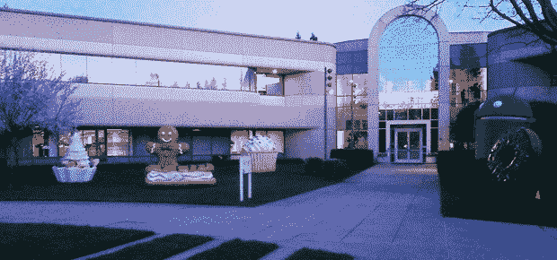

# 视频:谷歌推出他们全新的冰淇淋三明治雕像 

> 原文：<https://web.archive.org/web/http://techcrunch.com/2011/10/13/video-google-unveils-their-brand-new-ice-cream-sandwich-statue/>

# 视频:谷歌推出他们全新的冰淇淋三明治雕像

又到时间了，伙计们:随着 Android 下一个重要版本[的临近](https://web.archive.org/web/20230203060636/https://techcrunch.com/2011/10/13/samsung-google-announce-ice-cream-sandwich-event-october-19-in-hong-kong/)，另一座以该版本代号为主题的巨型雕像已经在谷歌总部矗立起来。最新的雕像加入了他们不断增长的大军:巨大的机器人形状的冰淇淋三明治。

Android 负责人安迪·鲁宾刚刚发布了一段发布视频——请看下面。

视频的描述(标题为“给所有冰淇淋三明治爱好者打电话”)只是一个链接，链接到 10 月 19 日重新安排的冰淇淋三明治/Nexus Prime 首次亮相的直播流。

他们现在已经为每一个主要的发布做了一个，从纸杯蛋糕，到甜甜圈，从字母表到蜂巢，再到现在的冰淇淋三明治。他们最好小心点，否则 44 号楼外的草坪很快就会变成拥挤不堪的怪异糖果乐园。

【YouTube = http://www . YouTube . com/watch？v=RX4btquQzUE&w=640&h=360]

Googleplex 系列的一个镜头，尽管没有今天的增加或令人难以置信的令人敬畏的[蜂巢](https://web.archive.org/web/20230203060636/http://www.google.com/search?gcx=w&sourceid=chrome&ie=UTF-8&q=techcrunch+honeycomb+statue)的展示:

