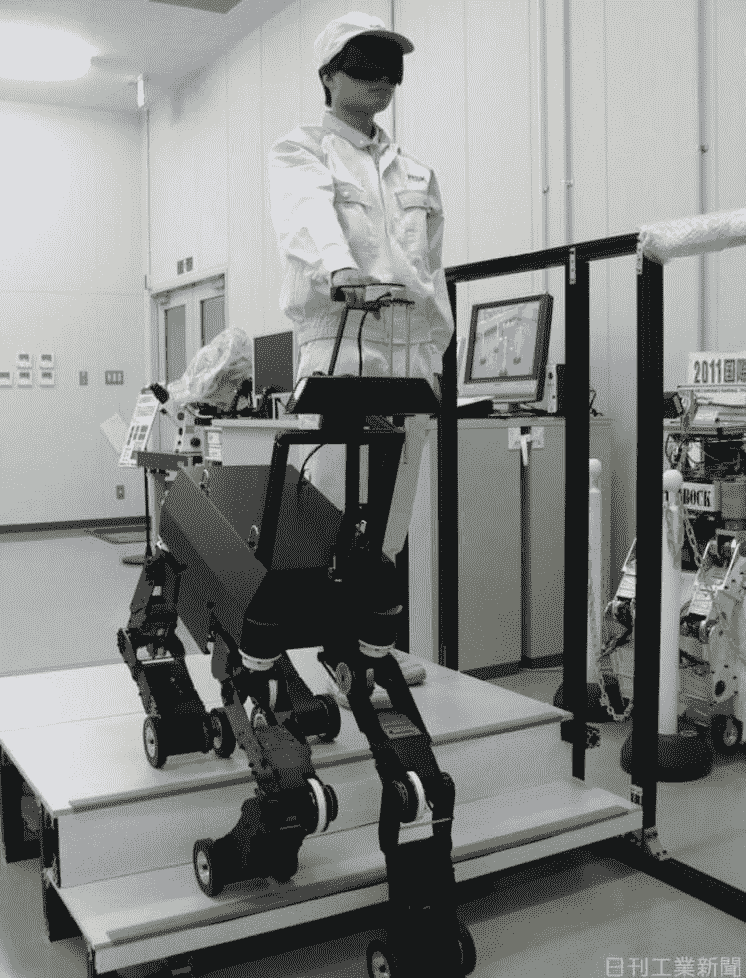

# 视频:日本获得机器人导盲犬 TechCrunch

> 原文：<https://web.archive.org/web/http://techcrunch.com/2011/11/04/video-japan-gets-robotic-guide-dog/>

# 视频:日本获得机器人导盲犬

索尼的 [AIBO](https://web.archive.org/web/20230203095352/http://en.wikipedia.org/wiki/AIBO) ，可能是世界上最著名的机器狗，可能已经在 2006 年停产，但这并没有阻止[其他](https://web.archive.org/web/20230203095352/https://techcrunch.com/2010/08/16/video-meet-g-dog-japans-most-advanced-robotic-dog/)日本公司继续开发类似的[机器人](https://web.archive.org/web/20230203095352/https://techcrunch.com/tag/robots)。在 AIBO 问世 12 年后，位于东京的 NSK 推出了一种更先进的机器狗。

与 AIBO 不同，NSK 机器人被设计成有一天能真正实现一个目的:作为盲人的导盲犬。机器人的工作始于 2005 年，最新型号的机器人能够以 3.8 公里/小时的速度行走。从第一批视频来看(见下文)，机器人相当慢，所以目前真正的动物仍然有作用。

这只“狗”每条腿有四个关节，并配备了一套摄像头和传感器，以帮助人类四处行走。正如机器人博客 [Plastic Pals](https://web.archive.org/web/20230203095352/http://www.plasticpals.com/?p=30573) 指出的那样，NSK 可以给他们的机器人配备 GPS、联网地图和其他功能，有朝一日，它将真正成为真狗的替代品。

下面是机器人在行动:
【YouTube = http://www . YouTube . com/watch？v = n5jckUTr-rU&w = 560&h = 315】

这个视频更详细地展示了狗狗爬楼梯的过程(左边可以看到之前的模型):

【YouTube = http://www . YouTube . com/watch？v=o6pSMhUFEQ0&w=560&h=315]