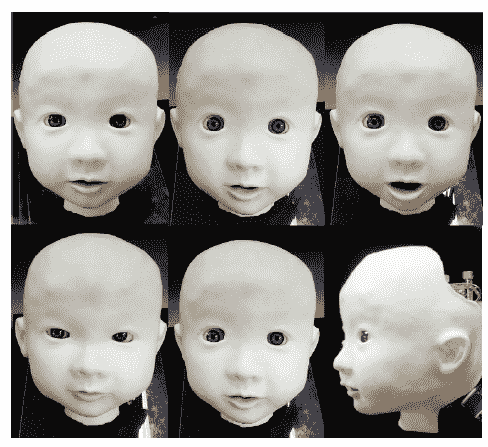
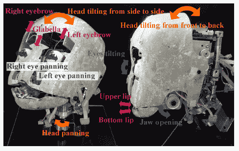

# 视频:日本婴儿机器人 Affetto 

> 原文：<https://web.archive.org/web/https://techcrunch.com/2011/02/09/video-japanese-baby-robot-affetto/>

# 视频:日本婴儿机器人 Affetto

日本有了一种新的令人毛骨悚然的婴儿机器人。继像孩子一样的类人机器人[M3-尼奥尼/M3-辛奇](https://web.archive.org/web/20221007005512/http://www.crunchgear.com/2010/03/04/meet-baby-humanoids-m3-synchy-and-m3-neony/http://www.crunchgear.com/2010/03/04/meet-baby-humanoids-m3-synchy-and-m3-neony/)、[M3-金迪和诺比](https://web.archive.org/web/20221007005512/http://www.crunchgear.com/2010/06/11/m3-kindy-and-noby-japan-gets-two-scary-kid-robots-video/http://www.crunchgear.com/2010/06/11/m3-kindy-and-noby-japan-gets-two-scary-kid-robots-video/)以及一堆类似的机器人之后，我们现在可以给你 Affetto(意大利语“感情”的意思)。Affetto 是 Minoru Asada 教授的心血结晶(去年他还开发了 M3 金迪和诺比)。

与前面提到的机器人相比，Affetto 在这一点上只是一个机器人头部，看起来应该像一个一到两岁的孩子。由于共有 12 个关节，它可以移动眼睛、下巴、眉毛和嘴唇。 

尽管 Affetto 还没有完成，但现实主义的水平已经相当高了(从下面嵌入的视频来看)。在计算机模拟中，Affetto 还能够复制人类使用的元音并模仿面部表情。

这里的目标是通过人机交互和交流来探索儿童和婴儿的人类认知发展过程。
【YouTube = http://www . YouTube . com/watch？v = quai 3s pkd 08&w = 480&h = 385】
【YouTube = http://www . YouTube . com/watch？v = VXgKNFQE-4 I&w = 480&h = 385】

经由[塑料伙伴](https://web.archive.org/web/20221007005512/http://www.plasticpals.com/?p=26907)