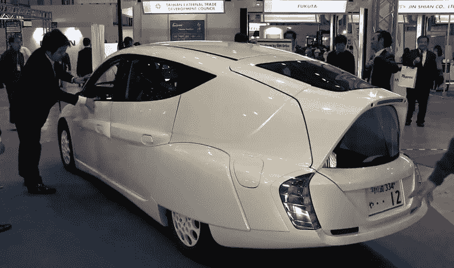

# 视频:日本电动汽车行驶里程超过 300 公里

> 原文：<https://web.archive.org/web/https://techcrunch.com/2011/12/29/video-japanese-electric-car-sim-lei/>

# 视频:日本电动车行驶里程超过 300 公里

在过去的几个月里，我们花了[两篇](https://web.archive.org/web/20230308212219/https://techcrunch.com/2010/01/25/japan-prepares-new-electric-car-for-launch-in-2013/) [的帖子](https://web.archive.org/web/20230308212219/https://techcrunch.com/2011/04/01/sim-lei-japans-newest-electric-car-reaches-333km-driving-range-and-its-fast/)在 SIM-LEI 上，这是一款由东京[庆应义塾大学](https://web.archive.org/web/20230308212219/http://www.keio.ac.jp/)的一家创业公司与总共 34 家国内外公司合作开发的电动汽车。似乎这家初创公司 [SIM Drive Corporation](https://web.archive.org/web/20230308212219/http://www.sim-drive.com/english/index.html) 有望在大约两年内开始大规模生产这种汽车。该公司成立于 2009 年 8 月。

最新版本的主要卖点是它可以以 100 公里/小时的恒定速度行驶 300 公里以上。在春天，SIM Drive 表示，SIM-LEI(“领先效率的轮内电机”)在“日本一般城市交通条件下”可以达到 333 公里。

新车型配备了 65kW/700 牛顿米发动机，仪表板内的 19 英寸显示屏，以及一套侧视摄像头。

这个由东京 [Diginfo TV](https://web.archive.org/web/20230308212219/http://www.youtube.com/redirect?q=http%3A%2F%2Fdiginfo.tv%2F&session_token=OSq9uPDosbMImkkesbcB_LETe_18MTMyNTI0NzAzMUAxMzI1MTYwNjMx) 拍摄的视频提供了更多的洞察:
【YouTube = http://www . YouTube . com/watch？v = vpwphfwtz 6 w&w = 640&h = 360】