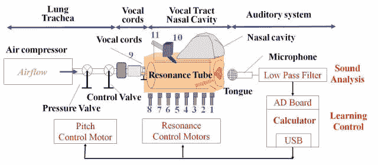

# 视频:日本机器人像人一样说话

> 原文：<https://web.archive.org/web/http://techcrunch.com/2011/07/13/video-japanese-robot-talks-like-a-human/>

# 视频:日本机器人像人一样说话

2011 年 7 月 14 日更新:现在有了更好的视频(请看下文)。

我们离机器人时代又近了一步:日本[香川大学](https://web.archive.org/web/20230204224435/http://www.kagawa-u.ac.jp/sub/english.html)的一个研究小组开发出了一个[机器人](https://web.archive.org/web/20230204224435/http://stwww.eng.kagawa-u.ac.jp/~s10d501/)，它能够像人类一样“说话”。虽然会说话的机器人无论如何都不是新的，但这个模型没有使用软件，而是一套机械的，类似人类的发声器官，例如人工声带或由硅树脂制成的舌头和嘴唇。

让机器人像人一样说话的关键元素是空气压缩机:机器人使用一套压力和控制阀，八个共振马达和一个共振管(喉咙)将气流转化为声音。这些声音然后通过麦克风记录下来，收集起来，然后通过计算机进行处理，使它们尽可能地像人一样。

更新:来自 [Diginfonews](https://web.archive.org/web/20230204224435/http://www.diginfo.tv/2011/07/14/11-0147-r-en.php) 的新的(更好的)机器人视频:

【YouTube = http://www . YouTube . com/watch？v=HmSYnOvEueo]

这是一个机器人行动的短片:

【YouTube = http://www . YouTube . com/watch？v=lYM17Wj3jWE&w=560&h=349]

这里有一个比较长的:
【YouTube = http://www . YouTube . com/watch？v = ls 7 ow 9 CRC 0 c&w = 560&h = 349】

Via [日本趋势](https://web.archive.org/web/20230204224435/http://www.japantrends.com/japanese-robot-replicates-human-speech/)和[秋叶原新闻](https://web.archive.org/web/20230204224435/http://en.akihabaranews.com/101359/robot/robotech-2011-professor-sawada%E2%80%99s-talking-robot)