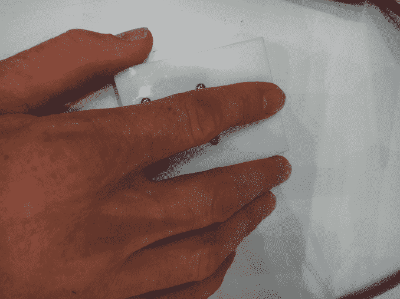

# 视频:迷你压力测量仪实时显示你的压力水平 

> 原文：<https://web.archive.org/web/http://techcrunch.com/2011/10/06/video-mini-stress-meter-displays-your-stress-level-in-real-time/>

# 视频:迷你应力计实时显示你的压力水平

你总是感觉压力很大，但是没有办法证明或者量化它？那么这个来自东京城市大学的 Nitta 教授开发的迷你应力计可能会帮你解决这个问题。该设备基本上是一个脉搏波传感器和一个改进的计算机鼠标集于一身。

其工作方式是，用户将手指放在鼠标上 10 秒钟，让测量仪通过分析用户指尖的血流来测量压力，然后让系统分析变化。压力水平实时显示在计算机屏幕上，分为四级。

[T3](https://web.archive.org/web/20230203133732/https://techcrunch.com/wp-content/uploads/2011/10/stress-meter-2.png)T5

关于“压力”一词的定义，Nitta 教授解释说:

> 你可能想知道我们测量的是否真的是压力。在这方面，压力最明确的指标是血液中激素的含量。来自这种血液分析的数据与我们软件的结果有大约 70%的相关性。因此，将这种测量解释为压力的指标可能是公平的，就像血液测试一样。

这段由 [Diginfo TV](https://web.archive.org/web/20230203133732/http://www.diginfo.tv/2011/09/30/11-0195-r-en.php) 拍摄的视频(英文)，提供了更多的洞察:
【YouTube = http://www . YouTube . com/watch？v = _ ZZ _ KfhTmTM&w = 560&h = 315】

Via [日本探测器](https://web.archive.org/web/20230203133732/http://www.japanprobe.com/2011/10/05/stress-measuring-device/)