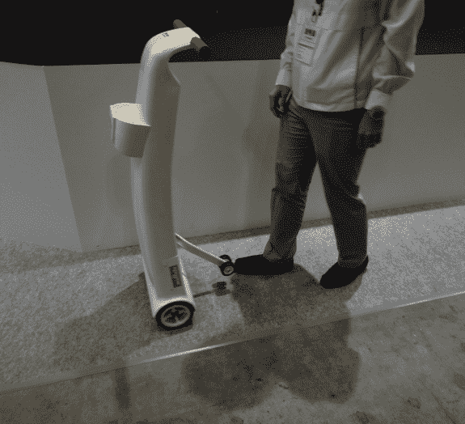

# 视频:村田展示机器人助行器/购物车 TechCrunch

> 原文：<https://web.archive.org/web/http://techcrunch.com/2011/10/28/video-murata-shows-robotic-walking-aid-shopping-cart/>

# 视频:村田展示机器人助行器/购物车

不久前，总部位于日本的村田凭借其令人敬畏的[独轮车](https://web.archive.org/web/20230203142629/https://techcrunch.com/2010/09/29/muratas-awesome-unicycle-robots-get-a-2010-upgrade/) [人形机器人](https://web.archive.org/web/20230203142629/https://techcrunch.com/2008/09/30/ceatec-2008-murata-girl-unicycle-robot-in-action-video/)在科技界引起了轩然大波，现在，该公司正在将这些机器中使用的机器人技术应用于一些不仅仅是观赏性的东西。特别是先进的平衡系统使得他们新开发的“辅助车”如此特别。

正如你在下面嵌入的视频中看到的，这辆车自己直立起来，没有翻倒。由于内置了动力辅助系统，只需一根手指就能让它“自动”前进或后退，这让村田想到了在未来将原型变成助行器、婴儿车或某种购物车。

[Diginfo TV](https://web.archive.org/web/20230203142629/http://www.diginfo.tv/2011/10/26/11-0209-r-en.php) 的视频(英文)展示了援助车在行动:
【YouTube = http://www . YouTube . com/watch？v = 8 NPV 23 k1 uue&w = 560&h = 315】