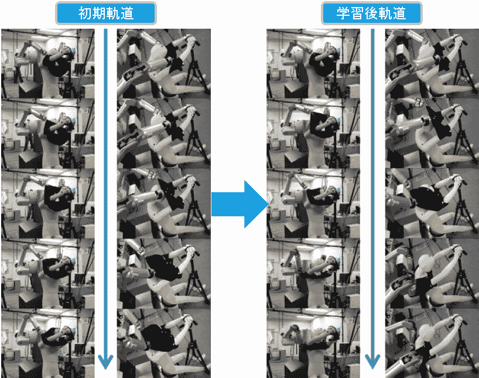

# 视频:机器人装扮假人 TechCrunch

> 原文：<https://web.archive.org/web/https://techcrunch.com/2011/10/31/video-robot-dresses-dummy/>

# 视频:机器人装扮假人

我们离机器人技术又近了一步:东京[奈良科学技术研究所](https://web.archive.org/web/20230203125356/http://www.naist.jp/en/) (NAIST)的研究人员正在研究一种[机器人](https://web.archive.org/web/20230203125356/https://techcrunch.com/tag/robots)，预计有一天它会自动给人类穿衣服。目前的原型，NAIST 说是世界上第一个这种类型的机器人，可以在大约 10 秒钟内帮假人穿上 t 恤。

有趣的是，对于手臂，NAIST 使用了 WAM 的 7 关节机器人手臂，由麻省理工学院的 Barrett 制造。据该研究所称，该机器人配备了 10 个高精度摄像机来执行(对机器人来说)困难的任务，并将在未来几年内得到改进。

这个视频展示了这个机器人的实际应用，这个机器人应该可以让老年人或残疾人的生活变得更轻松:

【YouTube = http://www . YouTube . com/watch？v=wOcO7i3eTPw&w=560&h=315]

请点击[此处](https://web.archive.org/web/20230203125356/http://www3.nhk.or.jp/news/html/20111025/t10013482451000.html)【JP】观看另一个(非嵌入式)视频。

via[robn able](https://web.archive.org/web/20230203125356/http://www.robonable.jp/news/2011/10/naist-1026.html)[JP]