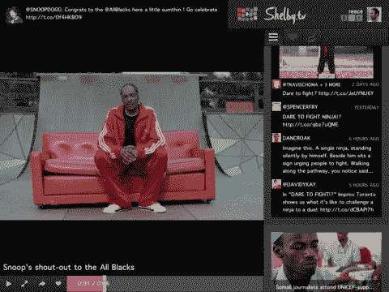

# 视频分享初创公司 Shelby.tv 推出新的 iOS 应用 TechCrunch 进行公开测试

> 原文：<https://web.archive.org/web/http://techcrunch.com/2011/10/24/video-sharing-startup-shelby-tv-launches-into-public-beta-with-new-ios-app/>

# 视频分享初创公司 Shelby.tv 推出新的 iOS 应用程序进行公测

视频分享初创公司 Shelby.tv (也是彭博 TechStars 真人秀节目的明星)今天退出了其私人 alpha 阶段，进入了公开测试阶段。这项服务由 Reece Pacheco、Dan Spinosa、Henry Sztul 和 Joe Yevoli 创建，它将你的朋友在社交网络上分享的视频链接进行聚合，以便为你提供个性化的视频推荐。

现在,[可以在 iTunes 应用商店](https://web.archive.org/web/20230203064604/http://itunes.apple.com/us/app/shelby.tv/id467849037?mt=8)买到，作为 iPhone 或 iPad 的原生应用。

这项新服务会自动将你的朋友在脸书、Twitter 和 Tumblr 上分享的所有视频整合到一个精选的视频频道中，你可以观看、收藏，然后再分享。还有一个浏览器书签，可以让你把网上的任何视频保存到 Shelby.tv 中，供以后观看。该产品简单易用，进入了流行([if](https://web.archive.org/web/20230203064604/https://techcrunch.com/2011/07/14/shelby-tv-raises-1-5-million-to-give-you-personalized-channels-of-online-video/www.frequency.com))的个性化视频空间。

根据一家公司[的博客文章](https://web.archive.org/web/20230203064604/http://blog.shelby.tv/post/11862748816/shelbylaunch)，新推出的 iOS 应用程序已经根据用户反馈进行了改进，现在提供了更高的速度和性能。一个值得注意的新增功能是新的重复删除功能，它可以智能地删除多个朋友共享的视频的重复副本。

在应用程序的指南中也有不同的方式来过滤视频——通过你的收藏夹(“喜欢”视图)，通过你保存的视频(“稍后观看”视图)，以及通过“时间线视图”，向你显示你的朋友正在分享的所有视频。您可以随时下拉视频指南，刷新您的推荐。

Shelby.tv 总共有 173 万美元的资金，最近在今年夏天从 Avalon Ventures 和一些天使投资人那里获得了 150 万美元的融资。

你可以在下面的视频中了解更多关于 iOS 应用的功能，或者在 iTunes 上下载。

【YouTube http://www.youtube.com/watch?v=e3PtrxwF3EA]

【T2