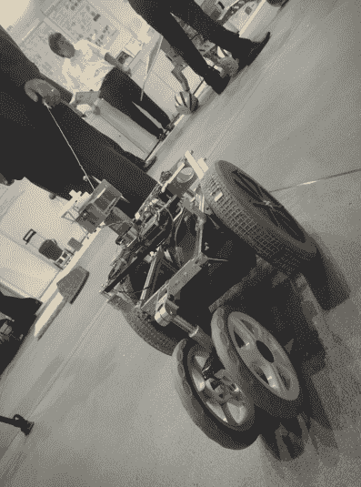
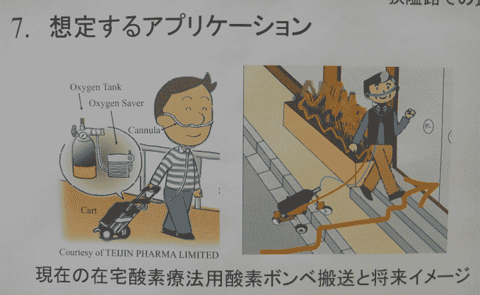

# 视频:简单的个人助理机器人跟随你，为你搬运物品 

> 原文：<https://web.archive.org/web/http://techcrunch.com/2011/09/28/video-simple-personal-assistant-robot-follows-you-carries-stuff-for-you/>

# 视频:简单的私人助理机器人跟着你，为你搬运东西

我们过去采访过不少来自日本的[私人](https://web.archive.org/web/20230204231155/https://techcrunch.com/2010/09/01/video-advanced-japanese-home-robots/) [助手](https://web.archive.org/web/20230204231155/https://techcrunch.com/2010/01/13/indoor-personal-mobility-robot-video/) [机器人](https://web.archive.org/web/20230204231155/https://techcrunch.com/2008/08/01/can-toyotas-winglet-become-a-segway-killer/)，但没有一个被贴上“私人搬运工”的标签。但是现在，来自东京工业大学的远藤教授制造了一种独特的机器人原型，它可以跟随主人到处走，还可以帮主人拿东西。

主人只需借助绳索拉动机器人，这种自动推进、电池供电的机器人就会跟随他们到任何地方。由于一组 4 个轮子(很像太空探索漫游车)，机器人可以在步行环境中克服大多数障碍。在目前的形式下，这个小家伙一次充电可以跑 2.5 小时(5 公里)。

远藤教授说，有一天，一种更精致的版本可能会帮助老年人或不得不依赖氧气疗法的人(见上文)。

这个由东京 [Diginfo TV](https://web.archive.org/web/20230204231155/http://www.diginfo.tv/2011/09/28/11-0193-r-en.php) 拍摄的视频，提供了更多的洞察:
【YouTube = http://www . YouTube . com/watch？v = jflece 85 rwe&w = 560&h = 315】