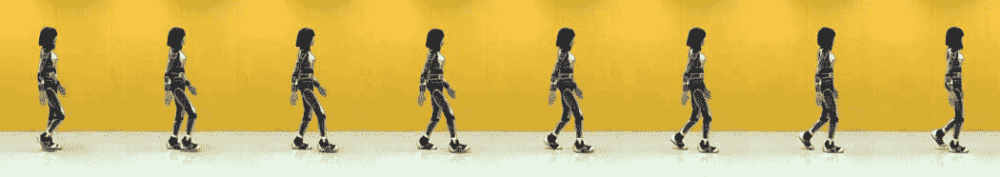

# 视频:超逼真的 HRP-4C 人形机器人像人一样行走 

> 原文：<https://web.archive.org/web/https://techcrunch.com/2011/11/11/video-super-realistic-hrp-4c-humanoid-walks-like-human/>

# 视频:超逼真的 HRP-4C 人形机器人像人类一样行走

大多数被贴上“类人机器人”标签的机器人仍然有一个共同的问题:它们只能以缓慢、机械和劈叉的动作行走。甚至 [HRP-4C](https://web.archive.org/web/20221007035815/https://beta.techcrunch.com/tag/hrp-4c/) ，在我看来是有史以来最逼真的人形机器人，也不例外——直到现在。

即使她会[唱](https://web.archive.org/web/20221007035815/https://beta.techcrunch.com/2009/10/06/robots-add-new-arsenal-in-their-war-against-humanity-singing/)，后来甚至学会了[舞](https://web.archive.org/web/20221007035815/https://beta.techcrunch.com/2011/06/06/215830/)，*走*从来都不是她的强项[初版](https://web.archive.org/web/20221007035815/https://beta.techcrunch.com/2009/10/25/digital-contents-expo-tokyo-cybernetic-human-robot-hrp-4c-demo-2-videos/)根本动不了腿。但是它的制造商，日本国家高级工业科学技术研究所( [AIST](https://web.archive.org/web/20221007035815/http://www.aist.go.jp/index_en.html) )一直在研究它:例如，最新的 HRP-4C 有脚趾在大步行走时支撑腿。

你可以在下面的视频中看到结果。HRP-4C 还不是*确切地说*像人类一样走路，但这是我(作为一个机器人宅男)迄今为止看到的最令人印象深刻的结果:
【YouTube = http://http://www . YouTube . com/watch？v = yvbaqw0 sk 6m&&w = 560&h = 315】
通过[塑料伙伴](https://web.archive.org/web/20221007035815/http://www.plasticpals.com/?p=30663)