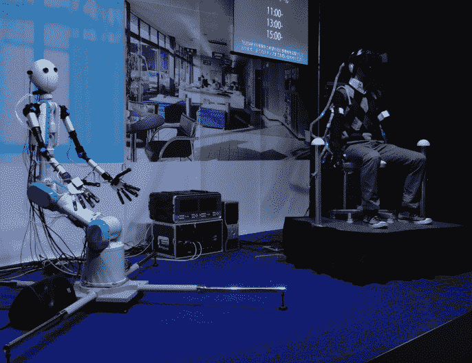

# 视频:网真机器人头像 TELESAR V TechCrunch

> 原文：<https://web.archive.org/web/http://techcrunch.com/2011/11/07/video-telepresence-robot-avatar-telesar-v/>

# 视频:网真机器人化身 TELESAR V

来自日本庆应义塾大学的 Tachi 教授从 20 世纪 80 年代就开始研究网真机器人 T2 T3，而 TELESAR V，一个所谓的网真机器人化身，是他在 T4 实验室 T5 的最佳作品。机器人使传输视觉、听觉甚至触觉成为可能，以便“将人们从时间和空间的限制中解放出来”。

它的工作方式是，机器人在远处成为你的另一个自我(或“化身”):人类操作员看到机器人看到的，听到机器人听到的。凭借 model V，操作人员甚至可以“感觉”到物体的形状和温度，这要归功于一组内置在手中的传感器。

这段视频(由 [Diginfo TV](https://web.archive.org/web/20230204200626/http://www.diginfo.tv/2011/11/07/11-0225-r-en.php) 拍摄，英文)提供了更多关于 TELESAR V:
【YouTube = http://www . YouTube . com/watch？v = zmf 0 p 15 gpyg&w = 560&h = 315】