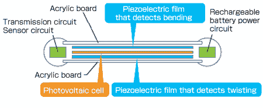

# 视频:这个可弯曲的遥控器没有按钮，不需要电池 

> 原文：<https://web.archive.org/web/http://techcrunch.com/2011/10/27/video-this-bendable-remote-control-has-no-buttons-doesnt-require-batteries/>

# 视频:这个可弯曲的遥控器没有按钮，不需要电池

我们已经在几周前向你展示了“Leaf Grip 遥控器”[，但是它的制造商，日本科技公司](https://web.archive.org/web/20230203095104/https://techcrunch.com/2011/09/23/muratas-flexible-remote-lets-you-control-your-tv-with-bending-and-twisting-motions/)[村田](https://web.archive.org/web/20230203095104/http://www.murata.com/)，决定等到 [CEATEC 2011](https://web.archive.org/web/20230203095104/https://techcrunch.com/tag/ceatec-2011/) 展会上向公众展示。该设备理论上可用于多种应用，但 Murata 将其首先定位为电视机遥控器。

Leaf Grip 遥控器允许用户通过扭动来改变频道，而音量可以通过弯曲来调节。摇动这个不需要电池就能工作的装置来打开或关闭电视。

村田解释道:

> 这个遥控器是用一种特殊的聚酯压电薄膜制成的。压电薄膜检测弯曲和扭曲等独特的运动，并产生电压作为响应。这种薄膜贴在板的两面。一面的薄膜对弯曲有反应，另一面的薄膜对扭曲有反应。薄膜是透明的，所以我们内置了一个光电池。来自电池的电能储存在一个双层电容器中，用来产生控制电视的信号。

这段视频——英文——展示了遥控器的工作原理(视频由[东京 Diginfo TV](https://web.archive.org/web/20230203095104/http://www.diginfo.tv/2011/10/26/11-0208-r-en.php) 提供):
【YouTube = http://www . YouTube . com/watch？v = hcelq 2k h6 ky&w = 560&h = 315】