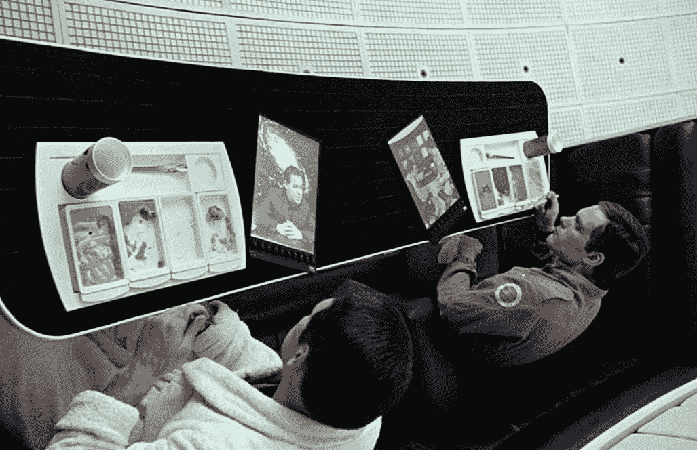

# 视频:这不是 iPad 3...但是我们可以做梦，对吗？

> 原文：<https://web.archive.org/web/https://techcrunch.com/2012/02/29/video-this-isnt-the-ipad-3-but-we-can-dream-right/>

你准备好迎接 iPad 3 了吗？我们是。我们有各种各样的报道，关于苹果何时推出小可爱，你应该期待什么，以及苹果是否会考虑在 T2 推出小 iPad。

但是为了打破真相与谣言的单调(和烦恼),我决定用一个直截了当的谎言来打击你们。所以需要澄清的是，**这不是 iPad 3** 。差远了。但是…我真的希望它是。

在去年 iPhone 5 发布之前， [Aatma 工作室](https://web.archive.org/web/20221006101406/http://www.aatmastudio.com./)的人做了同样类型的[概念视频](https://web.archive.org/web/20221006101406/https://beta.techcrunch.com/2011/08/26/iphone-5-concept-video/)，它同样令人敬畏。

看看这个:

【YouTube http://www.youtube.com/watch?v=9s2oYUy_cVY&w=640&h=360]

现在，老实说，我们在这个视频中看到的大部分都是可能的，基于我们在当今技术环境中的能力。一个边到边的屏幕不会太难，一旦它到位，让两个 iPads 合二为一也不会太难。事实上，根据我们看到的渲染图，三星的[泄露的 Galaxy S III](https://web.archive.org/web/20221006101406/https://beta.techcrunch.com/2012/02/27/the-samsung-galaxy-s-iii-leaked-1-5ghz-4-8-inch-1080p-display-ceramic-case/) 似乎具有边到边的显示。

我们真正进入幻想世界的地方是全息图像。当然，有了微型投影仪之类的东西，展开投影键盘或控件是完全可能的。然而，与此同时，使用这些控件也不是那么令人愉快。尤其是在游戏方面，触觉反馈是必要的。

但是在没有屏幕捕捉光线的情况下，将光线投射到虚无上的能力……嗯，这是行不通的。我们还没有完全搞清楚，但是这比使用投影到桌子上的键盘更没用。至少那时你会停留在(触摸)*某物*上，但是如果你仔细想想的话，操纵投射到任何物体上的图像会非常乏味。

无论哪种方式，你都必须把它交给 Aatma 的人们，因为他们在这方面很有创造力，尽可能地考虑未来。不过，仔细想想，Aatma 的前瞻性思维可能有点冒险回到过去(确切地说，是 1968 年)，因为无边设计首次出现在 2001 年的《太空漫游》中。那么，很高兴看到斯坦利·库布里克的设想实现了。

