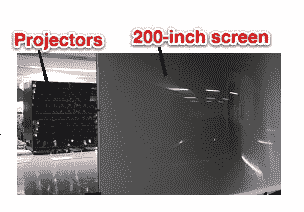
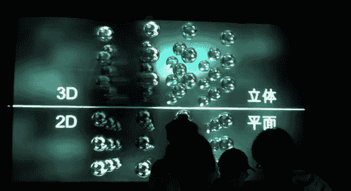

# 视频:世界上最大的 3D 显示器拥有全高清分辨率、200 英寸屏幕尺寸、57 个视角 TechCrunch

> 原文：<https://web.archive.org/web/http://techcrunch.com/2011/10/25/video-worlds-largest-3d-display-boasts-full-hd-resolution-200-inch-screen-size-57-viewing-angles/>

# 视频:世界上最大的 3D 显示器拥有全高清分辨率，200 英寸的屏幕尺寸，57 个视角

日本国家信息与通信研究所(T1)(NICT)和 T2 JVC Kenwood(T3)开发了他们所说的世界上最大的 T4 3D 显示器。该设备拥有 200 英寸的屏幕，提供 57 种不同的视角，最重要的是，它不需要你使用眼镜来观看 3D 图片。

自动立体显示器基于 57 个投影仪阵列，可制作全高清 3D 图片，重量为 500 千克。NICT 在今年 1 月[首次宣布了这一计划](https://web.archive.org/web/20230204121829/https://techcrunch.com/2011/01/25/nict-shows-200-inch-naked-eye-3d-display/)，但似乎此后有所改动(例如，早期版本使用了 64 台投影仪):

 

这个视频最近由东京的 Diginfo TV 拍摄，提供了关于最新型号的更多信息(英文):
【YouTube = http://www . YouTube . com/watch？v = niainndp 1s 0&w = 560&h = 315】