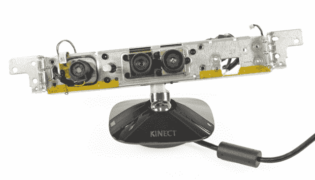

# 视频:TechCrunch 一个月的最佳 Kinect Hacks 和 Mods

> 原文：<https://web.archive.org/web/https://techcrunch.com/2010/12/07/videos-the-best-kinect-hacks-and-mods-one-month-in/>

Kinect 是一款令人印象深刻的游戏配件；没有人会质疑这一点。但事实是，硬件是一个 150 美元的 USB 设备，令人印象深刻，它值得自己的[维基百科](https://web.archive.org/web/20221207011526/http://en.wikipedia.org/wiki/Kinect)文章:

> “该设备具有“RGB 摄像头、深度传感器和运行专有软件的多阵列麦克风”，[21]提供全身 3D 动作捕捉、面部识别和语音识别功能 Kinect 传感器的麦克风阵列使 Xbox 360 能够进行声源定位和环境噪声抑制，允许通过 Xbox Live 进行无耳机聚会聊天等。”

显然，微软在这一点上打了一个本垒打。

开发社区立即抓住了这个设备，并且几乎立即开始了修改、破解和恶作剧的工作。Kinect 最初与它锁定的代码库进行了一些斗争，但 3000 美元的奖金引起了人们对原因的注意，有人最终破解了代码。看看 Kinect 刚刚推出一个多月，现在是我们收集迄今为止最好的黑客的时候了，说真的，从 30 多天内完成的成就来看，Kinect 可能会在明年的这个时候玩我们。

[3D 视频拍摄](https://web.archive.org/web/20221207011526/http://www.crunchgear.com/2010/11/14/more-kinect-craziness-mind-blowing-3d-video-effect/) — **发布后 10 天**

【YouTube = http://www . YouTube . com/watch？正如你所看到的，它本质上是映射到“深度”视频流上的“摄影”视频流，虽然肯定有一点奇怪，但它让我大吃一惊。

[进行任意表面多点触控](https://web.archive.org/web/20221207011526/http://www.crunchgear.com/2010/11/16/using-the-kinect-to-make-any-surface-multi-touch/)——**推出后 11 天**
【YouTube = http://www . YouTube . com/watch？v = BTH 0 tkrlvtk&w = 640&h = 385】

这很简单，真的。Kinect 以 3D 方式查看场景，您为交互区域建立一个平面和边界，然后嘣，多点触控。

[Kinect 皮影](https://web.archive.org/web/20221207011526/http://www.crunchgear.com/2010/11/19/the-ultimate-kinect-hack-shadow-puppets/)——**上线 14 天后**

[vimeo 16985224 w=620 h=349]

这个黑客在你的墙上创造了一个活生生的，会呼吸的数字鸟，由你的手动控制，展示了一些微软未经批准的黑客技术的惊人壮举。

[实时光剑](https://web.archive.org/web/20221207011526/http://www.crunchgear.com/2010/11/21/become-the-star-wars-kid-with-your-hacked-kinect/)——**上线 15 天后**
【YouTube = http://www . YouTube . com/watch？v = 3 eejcln 5 kyg&w = 640&h = 505】

Yankeyan 利用他所掌握的所有自制工具，创造了这个 Kinect 技巧，为你在屏幕上晃动的、不协调的图像增加了一把光剑。

[Kinect 控制的机器人](https://web.archive.org/web/20221207011526/http://www.crunchgear.com/2010/11/23/kinect-controlled-robot-its-this-generations-r-o-b/)——**上线 18 天后**
【YouTube = http://www . YouTube . com/watch？v = ryufu 64 vxkg&w = 640&h = 385】

这个基于 Kinect 的 R.O.B .由 Willow Garage 开发，仍处于早期阶段，但它已经比类似的系统领先了一大步，类似的系统使用更加昂贵和复杂的运动跟踪系统，只是因为它可以工作，而且是现成的。

[使用 2 台 Kinects 进行实时人物跟踪](https://web.archive.org/web/20221207011526/http://www.crunchgear.com/2010/12/07/kinect-hacked-to-support-3d-occlusions/) — **发布后 28 天**
【YouTube = http://www . YouTube . com/watch？v = x–xlKWBTAE&w = 640&h = 385】

瑞士洛桑联邦理工学院的一些学生黑进了两个 Kinect 传感器，创建了一个人类跟踪系统，可以完美地控制黑暗和光明中的遮挡。

[带避障的自主四旋翼](https://web.archive.org/web/20221207011526/http://www.crunchgear.com/2010/12/06/video-meet-a-flying-kinect-quadrocopter/)——**发射 32 天后**
【YouTube = http://www . YouTube . com/watch？v = eWmVrfjDCyw&w = 640&h = 385】

围绕预定轨迹自主移动，并将 Kinect 用作 3D 雷达来跟踪和避开物体已经完成。武器化很可能是下一个实现的工作，随后是自我复制和群体智能。