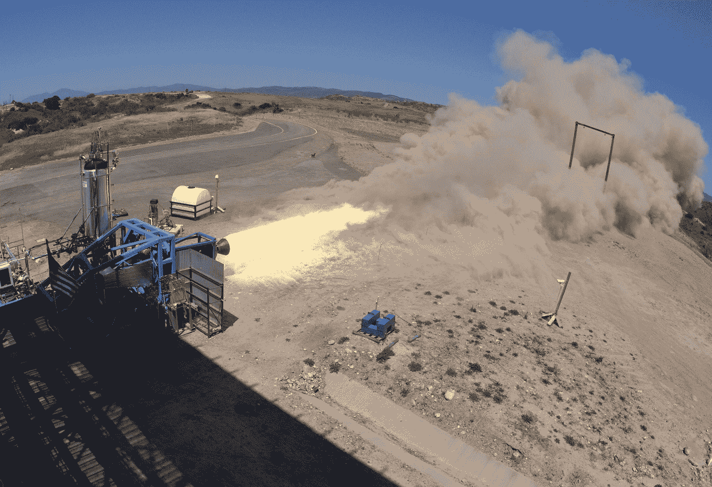

# 随着商业太空旅行火箭般飞向现实，维珍银河达到里程碑

> 原文：<https://web.archive.org/web/https://techcrunch.com/2012/06/16/virgin-galactic-whitesides-interview/>

# 随着商业太空旅行火箭般飞向现实，维珍银河达到里程碑

美国国家航空航天局可能不会很快将任何人送上火星，对太空及其以外的探索——尽管规模要小得多——正由理查德·布兰森和杰夫·贝索斯等人带头。(也许你听说过他们。)虽然贝佐斯和蓝色起源继续在得克萨斯州秘密工作，但维珍银河继续在莫哈韦忙碌着，最近为布兰森维珍帝国的亚轨道太空旅游部门取得了一个重要的里程碑。

[YouTube = http://YouTube . be/pa 99 dy 9 quam]

本月早些时候，维珍银河及其合作伙伴 Scaled Composites 获得了美国联邦航空管理局(Federal Aviation Administration)的实验发射许可，这是首次有人驾驶实验飞机的发射许可。考虑到自 2009 年以来母船(WhiteKnightTwo)和飞船(SpaceShipTwo)已经进行了多次试飞，我问维珍银河总裁兼首席执行官乔治·怀特塞德斯接下来会做什么。

“在接下来的六到八周内，我们将继续把火箭发动机组件集成到飞船(太空飞船二号)本身，”怀特赛德斯告诉我。“与此同时，我们将完成火箭发动机的地面测试，然后在年底前，我们将进入飞行器，并在 5 万英尺的高空进行首次动力飞行。这将是一个短暂的燃烧，但我们可能会达到超音速，看看车辆如何。”

随着 500 多名乘客在价值 20 万美元的太空飞行中支付了 2 万美元的押金，怀特赛德斯表示，银河公司“基本上有望”在 2013 年底进行商业发射。在这 500 多名乘客中，美国国家航空航天局前参谋长怀特塞德斯和他的妻子将与其他著名乘客一起登机，如阿什顿·库彻、斯蒂芬·霍金和充满活力的好莱坞二人组 Brangelina。怀特赛德夫妇是 2005 年购买门票的首批顾客中的两位。

Whitesides 说，除了明年会有更多的测试之外，FAA 的商业运营许可是下一个里程碑。“获得这一实验许可让我们走上了第一个里程碑的轨道，并有望实现 2013 年的里程碑。”

[YouTube = http://YouTube . be/Er9-stdhj 58]