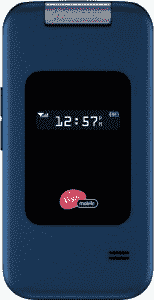

# 维珍移动美国出售京瓷 TNT！仅售 20 美元 

> 原文：<https://web.archive.org/web/https://techcrunch.com/2008/08/15/virgin-mobile-usa-to-sell-kyocera-tnt-for-only-20-bones/>

# 维珍移动美国出售京瓷 TNT！只需 20 美元

 
从 8 月 20 日开始，美国维珍移动将出售京瓷的 TNT！仅售 20 美元的手机；这种“触感柔软”的手机已经在沃尔玛、塔吉特百货、百思买和 Radio Shack 有售。

维珍移动说 TNT！翻盖手机既时尚又耐用，“非常适合喜欢简单手机的消费者。”像说话和发短信一样简单，(TNT 代表 Talk N' Text)。

维珍移动美国移动设备总监马蒂亚斯·蒙格斯(Matias Monges)表示:

> “在美国维珍移动，我们致力于为我们的客户提供他们在其他地方找不到的价值、服务和选择。TNT 炸药。是这一理念的完美体现，并表明我们可以提供一切—从像京瓷(Kyocera)的百搭牌这样的耐用设备到仍然能够出色完成工作的廉价设备。”