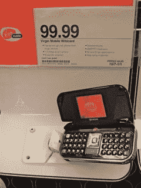

# 商店中提供维珍移动通配符 

> 原文：<https://web.archive.org/web/https://techcrunch.com/2007/10/15/virgin-mobile-wildcard-available-in-stores/>

# 商店中提供维珍移动通配符

哟，看看它处女移动用户。我敢打赌，每当一款新手机问世，你们都会兴奋不已，所以准备好高兴得尿裤子吧。如果你漫步到你当地的目标，你会发现京瓷可爱的新通配符。这款翻盖手机配备了 EV-DO，具有全 QWERTY 键盘、蓝牙和 130 万像素的摄像头。所有费用为 99.99 美元，不需要合同。看起来它也有一个 AIM 客户端。对于 100 美元来说是个不错的交易。一点也不差。

[维珍移动通配符到达商店](https://web.archive.org/web/20221007041337/http://www.phonenews.com/content/view/2429/9/)【电话新闻】