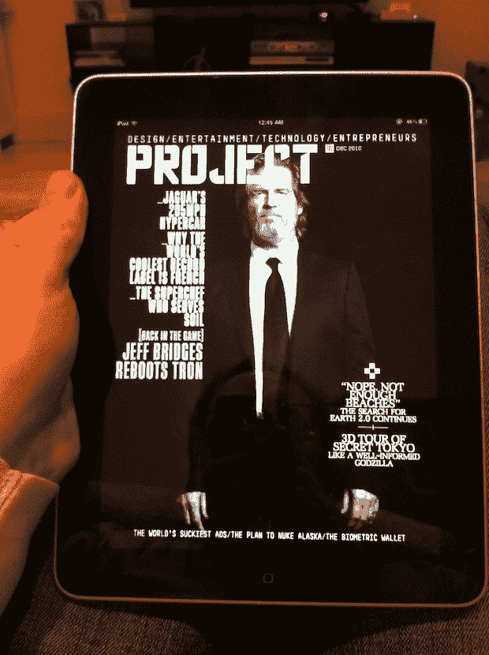

# 维珍的纯 iPad 项目登陆应用商店；每期 2.99 美元，需要 iOS 4.2 TechCrunch

> 原文：<https://web.archive.org/web/http://techcrunch.com/2010/11/30/virgin-project-ipad/>

# 维珍的纯 iPad 项目登陆应用商店；每期 2.99 美元，需要 iOS 4.2

正如[所料](https://web.archive.org/web/20230216160609/http://www.crunchgear.com/2010/11/24/virgins-all-digital-magazine-to-debut-next-week/)，维珍新的纯 iPad 杂志项目已经登陆 App Store。大多数人都在今天晚些时候期待它，但它实际上是在太平洋时间午夜左右在美国商店上线的。经过相当长时间的下载，我们才设法搞到了一份拷贝(这些杂志制作者真的需要控制这些文件的大小)。

一旦我们真正坐下来阅读该内容，我们将进行更彻底的演练。但是乍一看，这个项目看起来不错。互动电影封面让我想起了《哈利波特》电影*中的报纸。当然，一旦我通过了封面，我花了一点时间来弄清楚如何通过这该死的东西导航。但我最终找到了窍门。*

项目应用程序本身是免费下载的，但你必须购买问题。第一个封面是《创:传奇》的主演杰夫·布里吉斯，售价 2.99 美元。但显然这是整个月的一次性价格，你会偶尔获得新内容——至少我认为这是它将如何工作。

更多即将到来。现在，在这里找到应用[。](https://web.archive.org/web/20230216160609/http://itunes.apple.com/us/app/project/id404942717?mt=8)

**更新**:有读者在评论中提到，项目 app 要求 iOS 4.2，最新版本。因此，如果你还没有更新，现在将是时候，如果你想看到这个应用程序的行动。

