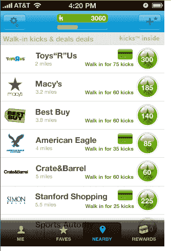
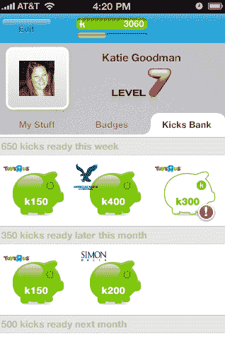

# Visa 与 Shopkick 合作，在销售点发放零售商奖励积分 TechCrunch

> 原文：<https://web.archive.org/web/https://techcrunch.com/2011/11/21/visa-teams-up-with-shopkick-to-dole-out-retailer-reward-points-at-the-point-of-sale/>

Visa 正在商业和技术领域采取重大举措，与创新的地理优惠券系统 Shopkick 合作，该系统已经获得了来自 Kleiner Perkins、Greylock、SV Angel 和其他公司的资助。这两家公司将开始为消费者提供一种方法，当他们使用 Visa 信用卡时，可以在销售点获得零售商的奖励积分。

通过这项名为“购买和领取”的新合作关系，Shopkick 用户在六家零售商中的任何一家刷 Visa 借记卡或信用卡都可以获得奖励(或“kicks”)，包括玩具反斗城、老海军、湿海豹、美国之鹰、西蒙购物中心和雅顿 b。

当然，要理解新交易的性质，您需要理解 Shopkicks 是如何工作的。Shopkick [不会像你使用 Foursquare 这样的地理应用程序那样登记，而是在手机上安装了免费的安卓](https://web.archive.org/web/20221207182815/https://beta.techcrunch.com/2010/08/03/shopkick/)[或 iPhone 应用程序的人走进商店时，自动识别出](https://web.archive.org/web/20221207182815/https://beta.techcrunch.com/2010/11/18/shopkick-brings-in-store-mobile-coupons-to-android-phones/)。一旦检测到 Shopkick 信号，该应用程序会向用户发送名为“kickbucks”的奖励积分，以奖励用户走进零售店、试穿衣服、扫描条形码和其他行为。

Kickbucks 随后可以在所有合作伙伴商店兑换礼品卡奖励或脸书积分。用户还可以在梅西百货、百思买或塔吉特百货等合作商店获得特定产品的特别折扣。忠诚度计划中的全国零售合作伙伴包括 Target、Best Buy、Macy's、Crate & Barrel、Old Navy、American Eagle、Sports Authority、Toys R Us、Simon Malls 等，以及 20 个品牌(P&G、联合利华、卡夫、高露洁、Clorox、迪士尼、惠普、英特尔)。其中一家零售商估计，shopkick 移动应用程序将带来 5000 万美元的可观增量收入。

正如 Shopkick 创始人西里亚克·罗丁向我们解释的那样，实体零售商的首要问题是获得客流量，Shopkick 通过其应用程序帮助解决了这一问题。但第二个和第三个问题是，当消费者在商店时，如何推动转化，以及如何确保顾客回来。“如果我们是购买交易的一部分，我们认为我们可以看到很好的结果，早期的测试已经证明了这一点，”他说。

现有的 Shopkick 应用程序用户将被自动提醒新的 Buy & Collect 计划的可用性，新用户将被告知该可选计划。为了开始在销售点收集 Kicks，Shopkick 用户必须在应用程序或网站上注册并链接他们的 Visa 信用卡或借记卡，然后在参与商店使用该卡进行的任何购买都将为你赢得 Kicks(如果你有借记卡，你需要将它用作信用卡来接收 Kicks)。

选择购买和领取计划的 Shopkick 应用程序用户将在他们的“附近”屏幕上看到一个绿色支付卡图标，让他们知道在参与的商家有额外的优惠。当他们在商店时，通过点击该商家，他们将在页面顶部看到购买和收集优惠，如“花 20 美元，获得 400 踢”。如果你在商店的花费超过平均购物篮的大小，消费者会得到额外的刺激。

一旦你在一个销售点购物获得了奖励，你的手机会自动收到一个推送通知，告诉你你的购物获得了多少奖励。

正如 Visa 信息产品高级业务负责人 Leigh Amaro 所说，“该计划是围绕 Visa 的战略建立的，旨在为消费者提供个性化的购物体验，提高转换率，为商家提供更大的购物篮……我们致力于使用新技术来改善消费者的购物体验，并为商家增加价值。”

罗丁说，这仅仅是一个开始，并打算将合作伙伴关系扩大到其他零售商。“上门奖励很重要，但上门奖励和购买的结合是杀手组合，”他说。

自从 Shopkick 于 2010 年 8 月推出[以来，该应用已经获得了惊人的](https://web.archive.org/web/20221207182815/https://beta.techcrunch.com/2010/08/03/shopkick-best-buy/) [7 亿次产品浏览量](https://web.archive.org/web/20221207182815/https://beta.techcrunch.com/2011/09/27/shopkick-by-the-numbers-700m-product-views-7m-product-scans-in-the-past-year-2-3m-users/)，这家初创公司预计今年的产品浏览量将超过 10 亿次。已经有超过 200 万人走进商店(从安装在商店的 Shopkick 信号设备测量)。这种设备现在安装在 3000 家大型商店和 250 家购物中心，甚至与 CW 电视网达成了一笔利润丰厚的[交易。](https://web.archive.org/web/20221207182815/http://gigaom.com/2011/05/19/shopkick-teams-with-cw-to-make-tv-ads-active/)

Shopkick 用户平均每月打开应用程序 14 天(通常一天几次)。每天他们打开应用程序，平均会浏览 16 家商店。这意味着，平均每个月他们会通过应用程序查看 200 多家商店。在过去的一年中，用户已经扫描了 700 万件产品，比二月份的 300 万件有所增加。

毫无疑问，商业的部分未来在[关闭赎回循环。](https://web.archive.org/web/20221207182815/https://beta.techcrunch.com/2011/07/24/redemption-loop-local-commerce/)正如我们之前所写的，当消费者看到广告或商家的优惠时，兑换循环开始，当消费者进行购买时，兑换循环结束，并且购买可以追溯到优惠。科技公司正在抓住这一点。信用卡公司是这种体验不可或缺的一部分。

例如， [Foursquare](https://web.archive.org/web/20221207182815/https://beta.techcrunch.com/2011/03/04/foursquare-sxsw-amex/) 和[脸书](https://web.archive.org/web/20221207182815/https://beta.techcrunch.com/2011/07/18/amex-facebook-deals-go-social/)也分别与信用卡公司美国运通建立了合作关系。今年早些时候，Visa 推出了一项基于位置的交易(T8 ),即 Gap 提供服务的交易(T9)。

商业的未来将是将购买数据与 Shopkick 的创新技术相结合，以帮助关闭接收回路，并鼓励消费者再次在零售商处购买。随着假日购物季的开始，对于 Shopkick、零售商和 Visa 来说，这是激励消费者多刷一点(和更频繁)的最佳时机。

【YouTube http://www.youtube.com/watch?v=IUDLSoJ4OlU]

[YouTube http://www.youtube.com/watch?v=CjDG7i9R0JQ&w=560&h=315]