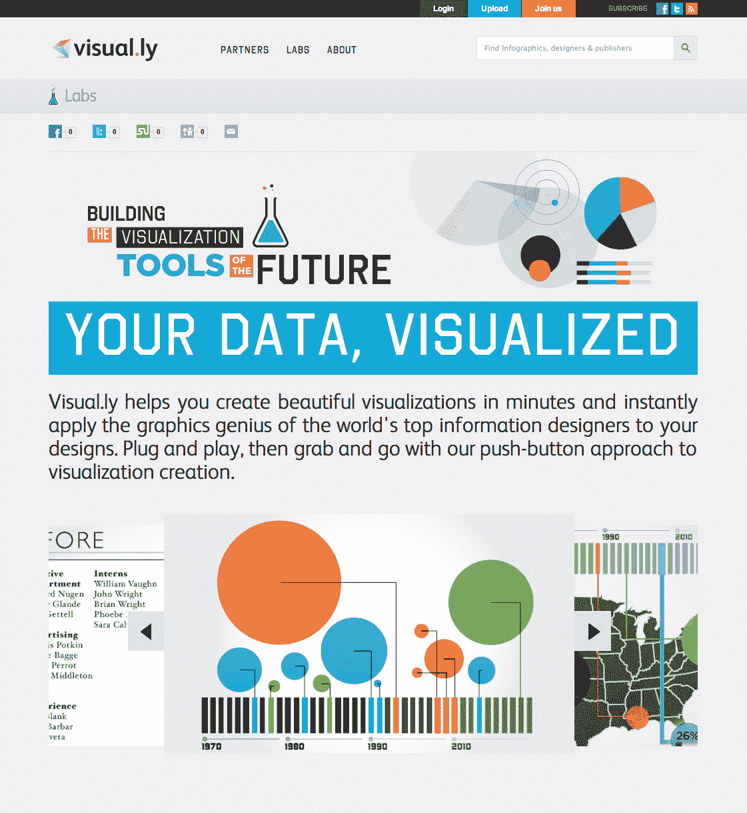
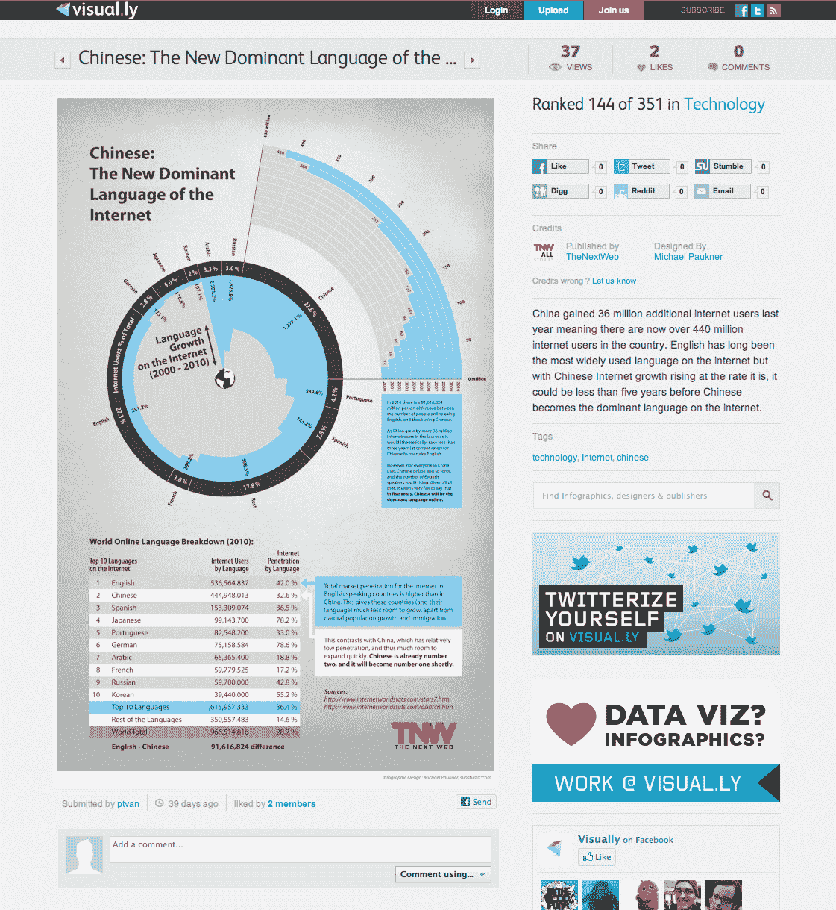

# 可视化发布，自动制作信息图 

> 原文：<https://web.archive.org/web/https://techcrunch.com/2011/07/13/visually-launches-to-automate-the-making-of-infographics/>

# 可视化启动以自动制作信息图

铸币局信息图表背后的神童 Stewart Langille 和 Lee Sherman 今天启动了第一家专注于大规模生产信息图表的创业公司。今天早上进行视觉访问的用户可以看到超过 2000 张由设计师上传的信息图，如[杰斯 3](https://web.archive.org/web/20221206074030/http://jess3.com/) 和[戴夫·麦克坎多斯](https://web.archive.org/web/20221206074030/http://www.davidmccandless.com/)以及上传他们自己的从科学到体育到经济的各种主题。

在第一次推出迭代中，visual 与《大西洋月刊》、《CNNMoney.com 好杂志》、Ebay、国家地理杂志和其他公司合作，提供信息图表内容，以换取共享链接——在 visual 上，每个参与的出版物都可以上传自己的图形，这些图形是使用 visual 生成的代码嵌入和共享的。

Visually 计划通过按月收费的方式让出版物订阅其产品，最终实现盈利。“每个人都需要创建一个图形或图表或其他东西，目前市面上的软件更侧重于商业智能，”Langille 说。“确实有必要为人们创造简单的视觉效果。只需三次点击，您就可以为网站创建可视化效果。”

Langille 希望通过 Visually 来创建一个设计师社区，就像 Dribbble 或 Forrst 一样，但也希望吸引那些关注曝光率和货币化等问题的信息图制作人。如果当网站的基本信息图表部分包括广告时，他希望纳入艺术家友好的商业实践，如收入共享。

如今，除了让人们上传和下载信息图，Visually 还创建了一个[Twitter 化你自己](https://web.archive.org/web/20221206074030/http://www.visual.ly/)的小工具，允许 Twitter 用户将自己与 Lady Gaga 和迈克尔·阿灵顿等名人进行比较，并根据体验创建信息图。虽然这并没有太多的实际好处，但却非常令人愉快。

这一自动化过程预示着视觉产品开发的到来，因为最终 Langile 将推出一个界面，客户将能够输入数据并获得视觉效果，各种艺术家的风格选择将融入到服务中。

二人组有将近 50 万美元的种子基金来实现这个梦想。兰吉尔告诉我，“这已经是网络上最大的信息图表集了。”很好。

【YouTube = http://www . YouTube . com/watch？v=AiVKfNeRbPQ&w=630]

