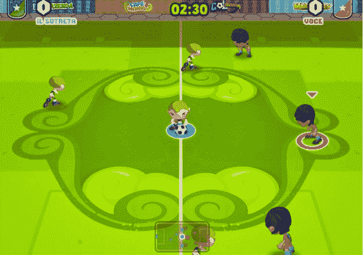

# 沃斯图首次推出 Golmania，一款 Orkut 和脸书的多人足球游戏 

> 原文：<https://web.archive.org/web/http://techcrunch.com/2011/09/29/vostu-debuts-golmania-a-multi-player-soccer-game-for-orkut-and-facebook/>

# 沃斯图推出 Golmania，这是一款为 Orkut 和脸书开发的多人足球游戏

巴西社交游戏公司 Vostu 推出了第一款将休闲游戏和社交游戏相结合的游戏，Golmania。多人足球游戏将在 Orkut 和脸书推出英语、西班牙语和葡萄牙语版本

作为背景，Vostu 是巴西最大的社交游戏公司之一。这家游戏公司现在拥有超过 3500 万用户，由三名哈佛同学于 2007 年创立:首席执行官丹尼尔·卡菲、首席科学家马里奥·施洛瑟和约书亚·库什纳(他也是 Thrive Capital 的积极种子投资者)。沃斯图由老虎管理公司、Accel Partners、英特尔投资公司和通用催化剂公司(General Catalyst)在 T2 支持。该公司还被[卷入了与社交游戏巨头 Zynga 的一场令人不快的诉讼](https://web.archive.org/web/20230203124647/https://techcrunch.com/2011/08/11/u-s-judge-slaps-around-brazilian-court-in-zynga-v-vostu/)。

在 GolMania，玩家在由 Vostu 的多人引擎驱动的实时足球比赛中对抗。游戏带玩家游览世界上最著名的体育场，每一个都开启新的环境、游戏和足球技巧。它以一个更快的游戏环境(几乎是街机风格)为特色，面向男性和女性以及足球初学者和专家。

就社交功能而言，玩家可以在足球场上摆开架势，但在场外与朋友合作以获得能量和金钱，组建自己的团队并解锁体育场。玩家还可以解锁足球技巧和特技，包括通过头球和自行车踢得分的能力，与裁判争论，以及在不怕红牌的情况下拦截球员。

与 Vostu 的其他游戏类似，用户可以在几个社交网络上玩 Vostu 游戏。例如，用户可以直接在脸书和他们的 Windows Messenger 好友一起玩游戏，并且可以跨越社交网络的界限发送礼物和合作玩游戏。这家游戏公司还与一些品牌合作推出了 Golmania。例如，百事可乐将成为葡萄牙语版本的赞助商。

Vostu 最近收购了 MP Game Studio，GolMania 是 MP 团队开发的第一款 Vostu 游戏，将他们的休闲游戏经验与 Vostu 的社交游戏经验相结合。

今年秋天晚些时候，Vostu 将推出其首款奇幻游戏。年底前，游戏公司还会推出三款游戏。

[YouTube http://www.youtube.com/watch?v=WIrGQYl-RLk&w=420&h=315]