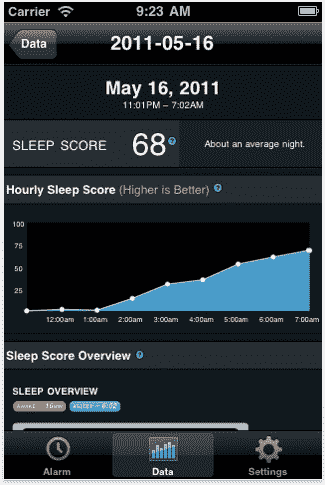

# WakeMate 2.0:帮助你告别那些昏昏沉沉的早晨。这次是真的。

> 原文：<https://web.archive.org/web/https://techcrunch.com/2011/06/28/wakemate-2-0-helping-you-kiss-those-groggy-mornings-goodbye-for-real-this-time/>

# WakeMate 2.0:帮助你告别那些昏昏沉沉的早晨。这次是真的。

对所有精通技术的企业家来说，WakeMate 的故事可以被视为一个警告:构建一个硬件设备比大多数网络应用要困难得多。WakeMate 的承诺很有吸引力——它出售一款 60 美元的腕带，可以跟踪你在夜间的运动，与智能手机同步，并在早上你处于最浅睡眠阶段时叫醒你，从而减少昏昏沉沉(希望如此)。但是这一路走来并不容易。

该公司艰难地度过了一年的[延迟](https://web.archive.org/web/20230209125109/https://techcrunch.com/tag/wakemate/)、[故障单元](https://web.archive.org/web/20230209125109/https://techcrunch.com/2010/12/31/wakemate-usb-fire/)，并在 12 月份最终开始发货之前让客户感到不安，但却遇到了另一个问题:拥有 WakeMate 单元的客户在附带的智能手机应用程序上遇到了问题，这些应用程序无法正确同步。这导致了更多的负面评论和挫折。

但是现在 WakeMate 的情况开始好转。4 月，它发布了移动应用程序的更新，修复了许多问题，今天它发布了 iOS 2.0 更新，带来了改进的用户界面、新功能和更多的错误修复。因为这些改进都是针对移动应用的，所以用户不需要新设备。你可以在这里获取 iPhone 更新[。](https://web.archive.org/web/20230209125109/http://itunes.apple.com/us/app/wakemate/id401276010?mt=8)

最大的升级在于可靠性。WakeMate 使用蓝牙连接在运动感应腕带和智能手机之间传输数据，但整夜保持连接将会严重消耗电池电量。因此，WakeMate 会智能地将其关闭，然后在接近唤醒时间时重新激活连接。唯一的问题是:有时连接无法重新建立，导致闹钟总是在“自动防故障”时间响起，完全否定了抗眩晕的因素。这个问题现在已经解决了，WakeMate 团队表示，这个闹钟现在工作可靠。

其他改进包括设备电池电量计的准确性更高，更深入的分析和标记(你可以提醒自己特定夜晚的睡眠条件)。另一个最近增加的功能是:如果你觉得原来的尺寸太紧，你现在可以购买更大版本的 WakeMate 腕带。

WakeMate 没有分享任何销售数据，但他们表示，自 4 月份更新以来，他们的评论普遍有所改善。这些评论有助于增加销售额——在过去的三个月里(自第一款移动应用发布以来)，他们的销售额逐月增长了 50%。现在这款应用已经实际运行，人们使用它的次数越来越多——自上个月以来，每晚上传 83%。

