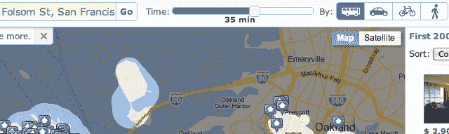

# Walk Score 揭开了新公寓定位工具 TechCrunch 的神秘面纱

> 原文：<https://web.archive.org/web/http://techcrunch.com/2011/09/26/walk-score-takes-wraps-off-slick-new-apartment-locating-tool/>

你可能对[步行评分](https://web.archive.org/web/20230203135915/http://www.walkscore.com/)很熟悉，这是一个将地图数据转化为一个街区或地区的简单“步行能力”评分的网站。你知道，食物和娱乐是否在附近，是否有交通工具，等等。现在有超过 10，000 个网站在使用它，这些网站列出了公寓和房地产，让你一眼就能看出你有多需要你的车。

他们坐拥来自交通部门、OpenStreetMap 和用户输入的大量数据，并决定利用这些数据开发一个更加以用户为中心的工具，即公寓搜索。它基本上是把望远镜转过来。你不需要选择一个你喜欢的地方并给出通勤和步行能力的分数，而是输入你的工作地点和期望的通勤时间，它会在这段时间内为你找到合适的地方。而且做的时候看起来真的很酷。

老实说，当我听说 Walk Score 的时候，我并不相信它。还是不要，真的。来自我信任的朋友和我自己的脚的关于步行能力的轶事，但是标准化这个模糊的概念对我来说一直是一个可疑的事情。但是这种数据的再利用非常有意义。这里有一个视频，你可以看看这个服务是什么样的:

[维梅奥·http://vimeo.com/29509407 w = 640]

也应该是[现在直播](https://web.archive.org/web/20230203135915/http://www.walkscore.com/apartments/)在 Walk Score 的网站。它的传播方式让我想起了好莱坞白宫简报中不可阻挡的传染。“再过 45 分钟，僵尸可能会远至巴拉德，长官。这是一个悲剧，因为那个社区真的开始崛起了。大农贸市场和古董商店。”

不过，真的，对我来说，这似乎是一个比实际步行分数更相关的统计数据。衡量通勤时间是一件棘手的事情，但 Walk Score 的联合创始人马特·勒纳(Matt Lerner)向我保证，他们的估计是经过非常仔细的计算的，包括站与站之间步行或等待火车的时间。它根据哪条路线最适合开车、走路、坐公交车等等来计算不同的路线，所以它不像看起来那么简单。特快列车，穿过公园的捷径，都在里面。

不过，这个演示让我喜欢上了它。用户的积极参与和数据的动态可视化表示是令人满意和实用的。它有助于发现，当然还有那些小而富有的公寓列表(你可以根据价格、面积等进行过滤。)很容易浏览，也很容易让 Walk Score 赚钱。

不喜欢什么？嗯，流动性不是很大。如果能够将一个街区、方向和一些有趣的公寓保存到移动公寓查找应用程序中，那就太好了。他们可能也很难吸引用户，因为这项服务更集中在 Walk Score 网站上，并且不太具有普遍的可嵌入性。

[你现在就可以试一试](https://web.archive.org/web/20230203135915/http://www.walkscore.com/apartments)，看看他们的估计与你已知的通勤时间相比如何，也看看你*可能会住在*的什么地方。对我来说，我的邻居是“步行者的天堂”,我的通勤距离大约是 10 步，所以我会呆在我现在住的地方。