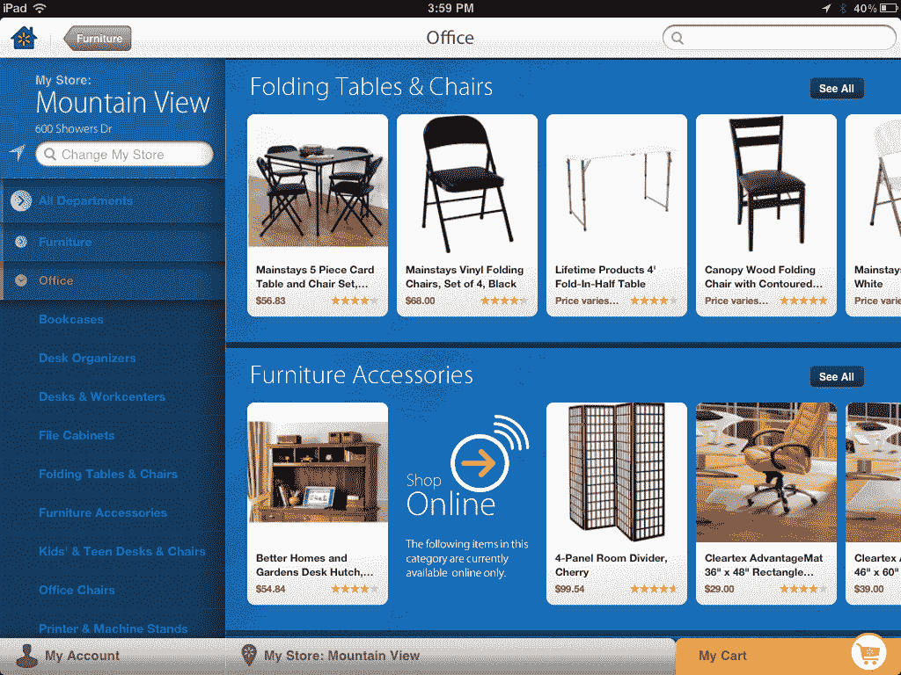

# 沃尔玛推出面向 iPhone 和 iPad 的新应用 

> 原文：<https://web.archive.org/web/https://techcrunch.com/2011/11/08/walmart-goes-mobile-with-new-apps-for-iphone-ipad/>

沃尔玛将推出一款更新的 iPhone 应用程序和一款新的 iPad 应用程序，以更好地连接客户的线下和线上购物体验。特别是 iPhone 应用程序带来了许多新功能，包括语音购物清单创建、条形码扫描和集成制造商优惠券，而 iPad 应用程序提供了在线和当地商店查找商品的能力。

这两款应用软件是@WalmartLabs 首批发货的产品之一，这是沃尔玛全球电子商务部门最近成立的一个小组，该小组源于零售商[今年早些时候对社交媒体初创公司 Kosmix 的收购。该集团也是沃尔玛新的社交购物脸书应用程序](https://web.archive.org/web/20230204205247/https://techcrunch.com/2011/04/18/walmart-ventures-into-the-social-media-space-with-acquisition-of-kosmix/) [Shopycat](https://web.archive.org/web/20230204205247/https://www.facebook.com/Shopycat) 的幕后推手，该应用程序将根据朋友在脸书的活动为他们推荐礼物。

虽然社交整合还没有出现在新的应用程序中(尽管即将到来)，但它们确实提供了一些自己的酷招。例如，您可以与 iPhone 对话来建立您的购物清单，而不必暂停或逐个说出每个项目。这意味着你可以一口气说出*“牛奶、鸡蛋、面包、洗衣液、瑞士奶酪、冷盘”*，并且该应用程序知道将每一项单独成一行。语音组件，就像新 iPhone 4S 上的一样，由 Nuance 提供支持。然而，在这种情况下，它被内置到应用程序中，允许向后兼容所有现有的 iPhone 型号。

购物清单也可以手动或通过条形码扫描进行更新，类似于 iTunes 中已有的其他购物清单应用程序。但与许多其他应用不同的是，沃尔玛的应用将包括定价信息和列表生成时的实时运行总数。

对于沃尔玛精打细算的购物者来说，另一个有用的功能是与 Coupons.com 的定制整合。当你添加物品到你的列表中时，你可以立即“裁剪”相关的优惠券，如果有的话。我们被告知，Coupons.com 在 iTunes 应用商店有自己的应用，但不会与沃尔玛的整合。

完成后，购物清单可以通过电子邮件发送给家人和朋友。

更新后的 iPhone 应用程序的最后一个值得注意的功能是项目查找器，现在处于测试阶段。这将显示您当地商店中每件商品的店内通道位置。未来，沃尔玛计划在这一功能的基础上，对你的购物清单进行分类，并绘制出你在商店中的路径，以提高效率和购物速度。

新推出的 iPad 应用程序提供了许多与 iPhone 相同的功能，但扩展了库存检查功能，包括访问 Walmart.com 库存和本地库存。这两个应用程序都提供了产品信息细节，包括客户评级和评论。

至于沃尔玛的主要在线竞争对手亚马逊，沃尔玛移动和数字业务高级副总裁吉布·托马斯(Gibu Thomas)只会评论说，沃尔玛现在在美国有 3800 家商店，每周在其实体店都有“互联网规模”的流量，在此期间有 1.4 亿人在其商店购物。虽然他不会将沃尔玛和亚马逊的努力进行直接比较，但在线、线下、移动以及即将到来的社交体验的日益融合，显然将在未来几个月的沃尔玛竞争战略中发挥重要作用，有可能将零售商的客流量转化为在线客户。

*更新:iPad 应用程序现已发布，iPhone 应用程序将在未来几天发布。*