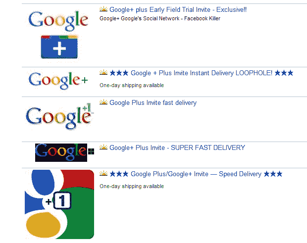

# 非常想要一个 Google+邀请？试试易贝 TechCrunch

> 原文：<https://web.archive.org/web/http://techcrunch.com/2011/06/30/want-a-google-invite-real-bad-try-ebay/>

# 非常想要一个 Google+邀请？试试易贝

所以你仍然没有进入 [Google+现场测试](https://web.archive.org/web/20230205024938/https://techcrunch.com/2011/06/28/google-plus/)，甚至在谷歌允许[发送邀请](https://web.archive.org/web/20230205024938/https://techcrunch.com/2011/06/29/google-plus-invites/)的早期用户一段时间之后，甚至在[漏洞百出的时候](https://web.archive.org/web/20230205024938/http://eu.beta.techcrunch.com/2011/06/30/how-to-hack-google-to-send-your-friends-invites-maybe/)？

绝望的时刻需要绝望的措施:掏出你的钱包，前往易贝，在那里 Google+邀请的售价高达[75](https://web.archive.org/web/20230205024938/http://cgi.ebay.com/Google-Plus-Google-Invite-Speed-Delivery-/110709160613?pt=LH_DefaultDomain_0&hash=item19c6c7baa5#ht_500wt_1156)。现在购买它，你也将能够享受谷歌全新的脸书挑战者带来的[奇迹。](https://web.archive.org/web/20230205024938/https://techcrunch.com/2011/06/29/google-plus-is-actually-pretty-good/)

你说你没有那么疯狂是什么意思？

大部分都附带免费教程，免费送货和即时配送，乡亲们！

**更新:**抱歉，上面链接的页面上不再显示 75 美元的“立即购买”价格。

(感谢 [@mikerbrt](https://web.archive.org/web/20230205024938/http://twitter.com/#!/mikerbrt/status/86446290313023488) 的提醒)

