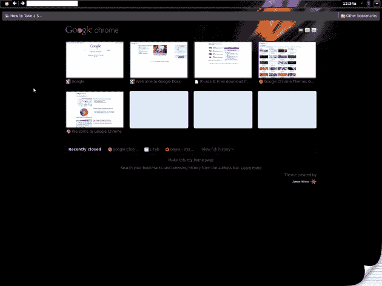
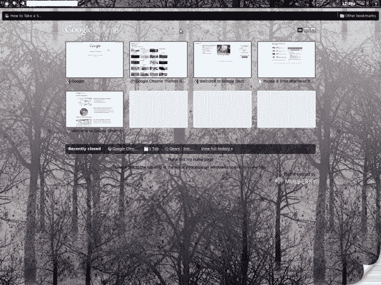

# 想要早期 Chrome OS 版本吗？你猜对了。TechCrunch

> 原文：<https://web.archive.org/web/https://techcrunch.com/2009/10/14/want-that-early-chrome-os-build-you-got-it/>

# 想要早期 Chrome OS 版本吗？你猜对了。

TechCrunch 的读者 Jonathan Frederickson 不断点击，他将 Chromium build 网站上“chromeos”文件夹的[初始展示](https://web.archive.org/web/20230405053205/https://techcrunch.com/2009/10/12/chrome-os-peaks-out-its-head-a-bit-further-and-what-is-the-touchpad/)变成了[穿越](https://web.archive.org/web/20230405053205/https://techcrunch.com/2009/10/13/a-first-glimpse-of-chrome-os-in-the-flesh-at-least-the-browser-part/)。今天，[他正在做](https://web.archive.org/web/20230405053205/http://livinginagoogleworld.blogspot.com/2009/10/google-chrome-os-browser-unstable-build.html)谷歌不会做的事情:让早期的 Chrome OS 版本可供下载。

弗雷德里克森已经把他几天前下载的文件放在了一个 Rapidshare 账户上，任何人都可以访问。你可以在这里找到它们。

谷歌会对此感到高兴吗？可能不会，考虑到他们在我们的帖子发布后不久就从 Chromium 文件夹中删除了这些文件。但不管怎样，它是开源的。

提醒一下，如果你有 Linux，你将只能安装这个。

作为奖励，Frederickson 还发布了几张 Chrome OS 浏览器主题的截图。找到下面的。

