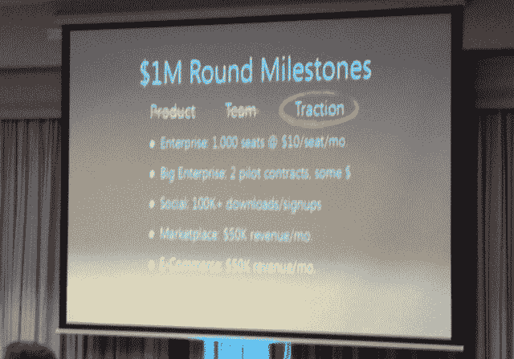

# 想筹集一百万美元吗？以下是您需要的内容 

> 原文：<https://web.archive.org/web/https://techcrunch.com/2013/04/22/want-to-raise-a-million-bucks-heres-what-youll-need/>

所以，你已经为自己做了一个不错的小产品。也许你已经筹集了一些朋友和家人的资金；也许你还在独自创业。不管怎样，现在你正在寻求筹集至少 100 万美元来帮助接下来的步骤。

虽然这种事情没有完美的公式，但这些来自 AngelList 的 Ash Fontana 的统计数据很好地表明了你应该追求的指标。

今晚，作为在智利圣地亚哥举行的 [FirstTuesday](https://web.archive.org/web/20221224210014/http://ft.la/santiago/showcase/1/) 初创公司聚会的一部分，Ash 展示了一张幻灯片，概述了初创公司在进入第一轮大投资之前应该瞄准的一些大概指标:

*【图片鸣谢:[塞萨尔·萨拉查](https://web.archive.org/web/20221224210014/https://twitter.com/cesarsalazar/status/326489614774829057)500 家创业公司】*

作为 AngelList 的一名风险黑客，Ash 的工作包括仔细研究数以吨计的交易，试图找出一笔好交易成功的确切原因。在我之前和 Ash 的一次谈话中，他让我注意到这些数字只是他基于这种洞察力的粗略估计；它们不是直接从 AngelList 的数据库中提取的。

这张幻灯片的大部分内容都是不言而喻的——只要把每一个要点看作是那些希望在给定类别中融资 100 万美元以上的公司的一种理论入门门槛。

如果你是一家社交公司，在追求百万美元投资之前，你最好至少有 10 万次下载和/或注册。如果你在经营一家市场或电子商务公司，你应该把每月收入定在 5 万美元左右。如果您在追求企业，您将需要至少 1000 个付费席位，每个席位每月 10 美元(或与您的定价模式相当)；如果你专注于大企业，你应该锁定至少两个巨大的(试点)合同。

您可能会注意到，幻灯片顶部的“产品”和“团队”被划掉了。这是在演讲的早些时候，Ash 重申了牵引力的重要性。假设我们谈论的是一个拥有普通产品的普通团队(也就是说，除非你的团队有一两个非常优秀的企业家，或者你已经开发了一些真正核心的、独一无二的技术)，牵引力就是一切。

当然，这些数字并不具体。事实上，它们是非常大概的数字。你不应该指望下载到第 100，000 次后，硅谷的每一个风投都会突然敲你的门。如果你能在这些范围内得到你的统计数据，并能在一些会议中得分，那么，你可能不会有太多的麻烦来达成交易。