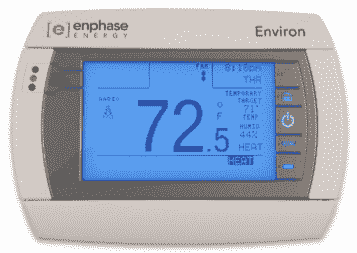
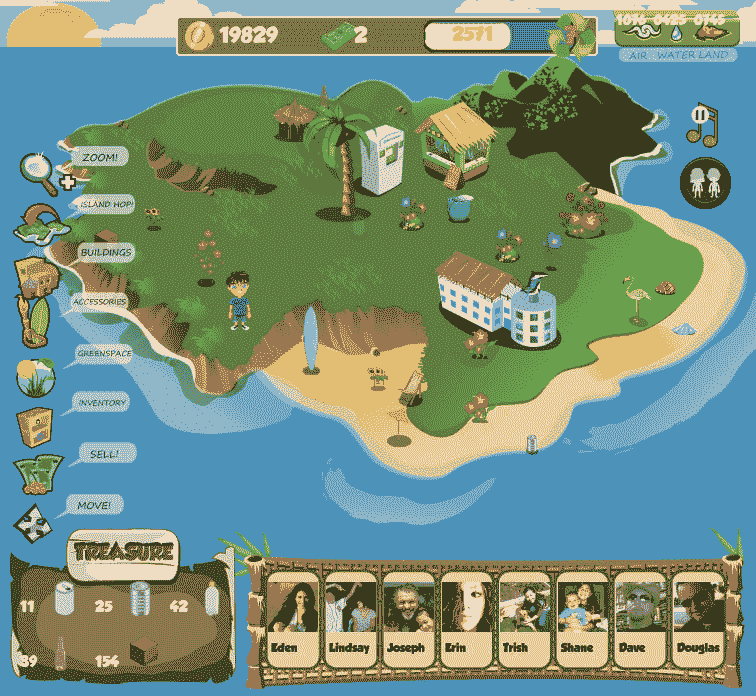

# 一个有任务的脸书游戏:废物管理启动 Oceanopolis 

> 原文：<https://web.archive.org/web/https://techcrunch.com/2010/07/20/waste-management-to-launch-oceanopolis-facebook-game/>

# 一个有任务的脸书游戏:废物管理启动海洋城市

 [废物管理](https://web.archive.org/web/20221207081810/http://www.crunchbase.com/company/waste-management)和其子公司[绿色城市](https://web.archive.org/web/20221207081810/http://www.crunchbase.com/product/greenopolis)凭借一款名为[海洋城市](https://web.archive.org/web/20221207081810/http://www.facebook.com/oceanopolis)的脸书新应用投身社交游戏。该游戏将推出测试版，预计在未来几周内全面推出。

在游戏中，玩家通过回收垃圾来建立一个可持续发展的社区，并与朋友互动，从而维护自己的岛屿。获得的积分实际上变成了可打印的优惠券，可以在电影院、餐馆和商店使用。或者，它们可以变成现金捐赠。在现实生活中，也可以通过回收或在绿色城市网站上写博客来获得积分。

当两年前推出环保主题社交网站和博客社区 Greenopolis 时，迈克尔·阿灵顿写道，它更适合作为脸书的应用。Oceanopolis 似乎符合这个要求。

据该网站称，到目前为止，Greenopolis 成员已经获得了 670 万份奖励，实体回收亭已经回收了 350 万个瓶子、罐子和其他物品。

绿色海洋城和海洋城的创意总监 Anthony Zolezzi 说，创建海洋城的原因是为了吸引消费者。“大公司参与解决方案至关重要，”他补充道。"废物管理做的一件事是让绿色城市作为解决方案的一部分独立运作."废物管理公司是北美最大的回收公司。

Oceanopolis 正在为海洋援助组织(Ocean Aid)筹集资金，开始它的测试版发布，该组织将举办一年一度的音乐会，资助对充满污染的海洋环流的研究。Greenopolis 将代表任何发推文的人捐赠一美元:“兴风作浪。与 http://apps.Facebook.com/Oceanopolis #海洋城一起对抗海洋污染。”

虚拟岛屿上的回收是否能激发现实生活中的回收，以及 Oceanopolis 是否能获得大量用户，还有待观察。至少，海洋城可能是一个令人上瘾的游戏，让你感觉良好，而不是感到内疚。