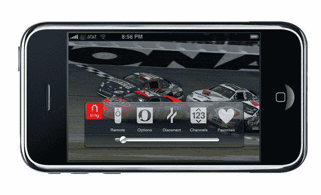

# 即将从 Sling Media 推出:通过 iPhone 观看有线电视 TechCrunch

> 原文：<https://web.archive.org/web/https://techcrunch.com/2009/01/05/watch-cable-tv-from-your-iphone/>

# 即将从吊索媒体:观看有线电视从你的 iPhone

Sling Media ，这是一家流行的(并且非常酷的)机顶盒公司，可以让你把有线电视从家里传输到电脑上，看起来它超越了自己。在本周的 Macworld 大会上，该公司将展示其即将推出的 iPhone 应用程序，该程序有效地让 iPhone 用户从任何有网络连接的地方即时访问他们的有线电视和 Tivos。不幸的是，你还得再等一会儿(该公司表示，该应用将在 Q1 提交给苹果)，但看起来等待是值得的。

从公告来看:

> SlingPlayer Mobile 为消费者提供了完整的家庭电视体验，包括本地频道、本地运动队、视频点播、按次付费等。任何你可以在家里的沙发上观看的节目，现在你都可以通过标准的网络连接通过你的 iPhone 来观看。此外，SlingPlayer Mobile for iPhone 用户还可以控制他们的家庭数字录像机(DVR)观看录制的节目，暂停、倒带和快进直播电视，甚至在离家时排队新的录制内容。

该公司还将宣布面向 Mac HD 的 SlingPlayer，这使 Mac 用户能够在该公司最近推出的 Sling.com 视频中心[T4](https://web.archive.org/web/20221003205849/http://www.sling.com/)上使用基于网络的播放器观看高清 SlingBoxes 中的高清内容。