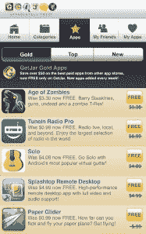

# 小心亚马逊:GetJar 发布了一个免费的高级 Android 应用程序的完整目录 

> 原文：<https://web.archive.org/web/https://techcrunch.com/2011/09/08/watch-out-amazon-getjar-launches-a-full-catalog-of-premium-android-apps-for-free/>

# 小心亚马逊:GetJar 发布了一个免费的高级 Android 应用的完整目录

今天，第三方移动应用商店 [GetJar](https://web.archive.org/web/20230204142617/http://www.getjar.com/) 公开推出其 [GetJar Gold](https://web.archive.org/web/20230204142617/http://www.getjar.com/gold) 服务，该服务在过去一个月中一直处于测试阶段。这项新服务对亚马逊的 Appstore 及其有时间限制的“每日免费应用”提出了一个可行的挑战，它免费提供一整套优质 Android 应用程序。这些应用质量很高，没有广告，可以随时下载。

 在发布会上， [GetJar Gold](https://web.archive.org/web/20230204142617/http://www.getjar.com/gold) 将推出 50 款游戏，包括水果忍者 THD、僵尸时代、TuneIn Radio Pro、Solo 和 Splashtop Remote Desktop。它们的总价值约为 60.00 美元。GetJar 首席执行官 Ilja Laurs 表示，每天都会增加新的应用程序。事实上，该公司几乎已经与移动应用行业的另一家“知名”公司达成协议，但目前不能透露细节。(请做愤怒的小鸟！)

新商店只考虑没有应用内广告的优质(付费)应用，其运营模式与苹果、谷歌和亚马逊的零售应用商店不同。在其他地方，开发者与应用商店提供商分享一定比例的高级应用销售额，通常是 70/30(开发者/应用商店)分成。

然而，对于 GetJar，该公司按每次安装向开发人员支付应用程序费用，这确保了开发人员获得报酬。反过来，GetJar 通过向其他应用程序开发人员提供 GetJar Gold 中的赞助列表来产生收入。

使用一种类似于 Google AdSense 的模式，开发者对他们愿意支付的每次安装费用进行竞价。每个用户的出价可以低至 1 美分，也可以高达 1.5 美元到 2.00 美元。出价越高，在 GetJar Gold 搜索结果中的排名就越高。也像谷歌一样，赞助应用程序用不同的颜色(蓝色)清晰地标记和突出显示。

Laurs 说，这种模式之所以有效，是因为移动用户倾向于在每次会话中下载多个应用程序。消费者也乐于尝试与他们兴趣相关的赞助应用。但最重要的是，这种模式之所以可行，是因为当应用程序免费时，用户更有可能下载它们——GetJar 发现，下载的可能性是免费的 10 到 20 倍。

[GetJar Gold](https://web.archive.org/web/20230204142617/http://www.getjar.com/gold) 现已在 GetJar.com 网站、移动网站及其[独立 Android 应用程序中推出](https://web.archive.org/web/20230204142617/https://market.android.com/details?id=getjar.android.client&feature=search_result)。