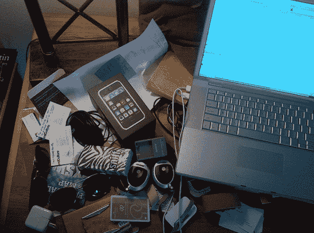

# 小心奥斯汀！Dogpatch Labs 将开设一个临时的 SXSW 办公室

> 原文：<https://web.archive.org/web/https://techcrunch.com/2011/02/08/watch-out-austin-dogpatch-labs-is-opening-a-makeshift-sxsw-office/>

# 小心奥斯汀！Dogpatch Labs 在 SXSW 开设了一个临时办公室

如果上面是你的 SXSW 工作区通常的样子，你很幸运:今年，[北极星风险投资公司](https://web.archive.org/web/20230310111806/http://www.polarisventures.com/)将首次在奥斯丁开设一个临时的 [Dogpatch Lab](https://web.archive.org/web/20230310111806/http://dogpatchlabs.com/) 办公室 [SXSW](https://web.archive.org/web/20230310111806/http://www.sxsw.com/) 这样需要一个地方工作或只是闲逛的企业家可以找到一个远离所有互动疯狂的安全避难所。

Dogpatch Labs 的奥斯汀分部将位于东六街 501 号的 Treehouse Pub，并将拥有 Dogpatch 纽约、剑桥和旧金山的所有便利设施:免费食物、桌子、WIFI、空间和(是的)桌上足球。那些希望避开选择不当的室友、喝醉的同事或只是与志同道合的人交往的人可以在这里注册。北极星创投公司的合伙人彼得·弗林特告诉我，他们正试图与尽可能多的企业家签约，所以不要害羞。

除了提供工作场所，风投们 [Flint](https://web.archive.org/web/20230310111806/http://www.twitter.com/pflint) 、 [Mike Hirshland](https://web.archive.org/web/20230310111806/http://www.twitter.com/vcmike) 、 [Dave Barrett](https://web.archive.org/web/20230310111806/http://www.twitter.com/dbodbo) 和 [Ryan Spoon](https://web.archive.org/web/20230310111806/http://www.twitter.com/ryanspoon) 将在奥斯汀的 Dogpatch Labs 办公，显然他们非常有兴趣与新兴公司会面。你可以在这里抢在其他人之前。

以下是 Dogpatch Austin 的完整时间表:

> 上午 9 点至晚上 11 点，DPL 为企业家开放。
> 下午 3 点-6 点北极星办公时间:http://ohours.org/PolarisVentures
> 下午 5 点-6 点与合作伙伴的非正式开放办公时间
> 晚上 8 点-11 点 DPL SXSW 派对(私人邀请)
> 
> 周一:上午 9 点至晚上 11 点，DPL 为创业者重新开放。
> 3p-6p 北极星办公时间 http://ohours.org/PolarisVentures
> 晚上 8 点到 10 点合伙人 vs 企业家桌上足球赛(私人邀请)

图片:[梅丽莎·吉拉·格兰特/Flickr](https://web.archive.org/web/20230310111806/http://www.flickr.com/photos/dpstyles/5427733731/)