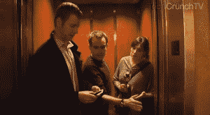

# 小心 SF 迷你吧:我们今晚试驾酒店(TCTV)

> 原文：<https://web.archive.org/web/https://techcrunch.com/2011/02/01/watch-out-sf-minibars-we-testdrive-hotel-tonight-tctv/>

# 小心 SF 迷你吧:我们今晚试驾酒店(TCTV)

 [今晚的酒店](https://web.archive.org/web/20230204112155/http://www.hoteltonight.com/)——一个让你可以通过 iPhone 方便快捷地预订最后一分钟酒店的应用程序，昨天扩展到了芝加哥、波士顿和华盛顿 DC——与保罗在这里概述的梦想公司[几乎一模一样](https://web.archive.org/web/20230204112155/https://techcrunch.com/2010/12/06/witn-rambling-hotel-complaint-edition-plus-some-ideas-for-travel-businesses/)。

这听起来好得令人难以置信，所以我们决定和今夜酒店的首席执行官萨姆·尚克一起试驾一下。为了增加对他不利的可能性，我们选了一个周五晚上，在 MacWorld 大会之前，在旧金山。

下面视频。