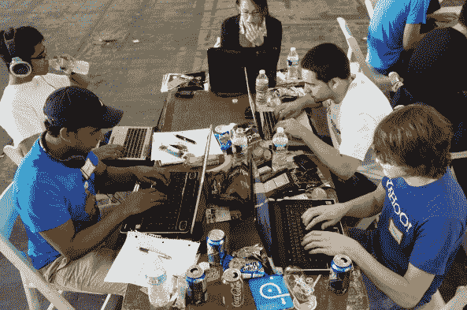

# 观看 TechCrunch 现场颠覆黑客马拉松！

> 原文：<https://web.archive.org/web/https://techcrunch.com/2011/05/22/watch-the-techcrunch-disrupt-hackathon-live/>

# 观看 TechCrunch 现场颠覆黑客马拉松！

大约 500 名黑客从昨晚深夜[到今天凌晨](https://web.archive.org/web/20221207100750/https://beta.techcrunch.com/2011/05/22/and-they-hacked-and-they-hacked-and-they-hacked-into-the-night/)参加了在纽约举行的 TechCrunch Disrupt 黑客马拉松，他们组成团队，在今天早上唤醒或弹出足够多的红牛，以便向包括风投杰夫·克拉维尔和 Canv.as 创始人克里斯托弗·普尔、产品副总裁布拉德利·霍洛维茨和 Canv.as 创始人克里斯托弗·普尔在内的名人展示他们的黑客技术。

今年的纽约黑客马拉松是我们有史以来最大的一次展示，黑客团队提出的东西将在舞台上接受美国偶像式的评判，每个团队有 60 秒的时间进行陈述。如果你参加这没什么大不了的，去年的参与者之一， [GroupMe](https://web.archive.org/web/20221207100750/http://www.groupme.com/) 最终获得了 1060 万美元的资金。

你可以观看评审直到下午 3 点，见上图。

