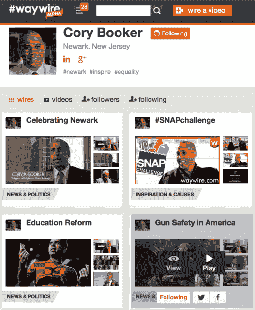

# 科里·布克的#Waywire 成为“视频的 Pinterest ”,重新关注策展 TechCrunch

> 原文：<https://web.archive.org/web/https://techcrunch.com/2013/04/16/waywire-cory-booker/>

你把你在网上找到的视频放在哪里，它们如何表达你的身份？#waywire 2.0 旨在解决这一问题。由纽瓦克市长科里·布克和九个月前推出的共同创立的 [#Waywire 专注于](https://web.archive.org/web/20230204135642/https://techcrunch.com/2012/06/30/waywire/)原创和用户生成的内容。但随着今天的更新，你周围的测试版重新开始从 YouTube、Vimeo、Vine 和新闻网站收集视频到[主题播放列表](https://web.archive.org/web/20230204135642/http://waywire.com/users/corybooker/playlists)。

从一个角度来看，这一更新是明智的。这是#waywire 试图找到自己的定位。“Pinterest for video”有点狭隘，但它象征着#waywire 希望提供的价值。

这家初创公司最初的雄心是巨大的,( T7)——通过让一代新闻观察者拍摄和播放新闻片段或对他们感兴趣的事情的回应，将他们转变为新闻制造者，并通过原创的内部新闻内容来增加他们的影响力。但是拍摄新闻节目是一项艰苦的工作，它给用户参与制造了一个很大的障碍，而人们已经有了足够多的新闻来源和行为模式。虽然#waywire 只是处于初级阶段，但我没有看到它获得任何吸引力，该公司拒绝提供任何用户数量。

走向策展让#waywire 建立在一个更快的活动基础上，这个活动依赖于大多数已经进行的消费。即使人们在监管的是官方的#waywire 制作的视频，它也会让你信任新闻来源，而不是另一个传统机构。

在#waywire 2.0 中，你不只是将视频发布到你的订阅源。你从网上几十个最受欢迎的视频提供商那里收集视频，并把它们组织成关于特定主题的“连线”。例如，[市长布克有电线](https://web.archive.org/web/20230204135642/http://waywire.com/users/corybooker/playlists)致力于民权，枪支演讲，和他的演讲集。

您现在还可以添加标签，设置哪个视频是主题连线的特色，以及每个视频上显示什么缩略图。这些都让你有能力创作更多引人入胜的关于迷人主题的视频。它还打开了通过传统的视频预滚动和覆盖以及赞助帖子更容易赚钱的大门，因为更新给了广告商做广告的主题。这应该会让包括首轮资本、特洛伊·卡特和奥普拉在内的[投资者感到高兴。](https://web.archive.org/web/20230204135642/http://www.crunchbase.com/company/waywire)

#waywire 现在从 200 个可信来源获得内容，包括 BedRocket Media、CollegeHumor、HuffPost Live、Refinery29、Slate、Young Turks 等。这确保了人们有质量来管理，而#waywire bookmarklet 让他们可以轻松地从/web 上获取内容。该网站的界面肯定还需要一些工作，才值得放弃测试版称号。葡萄藤的肖像底部被#waywire 的风景播放器切断，而且似乎没有办法将你已经分享的现有视频添加到特定的电线上。

不过，在我看来，毫无疑问，观看由专家整理的视频播放列表是一种非常有效的学习方式。因此，#Waywire 的新形式可能会产生重大影响。

我希望布克能继续推进改变新闻创作和讨论方式的大胆使命。但也许这是为了下一代，他们不仅热爱视频，而且从小时候就开始制作自己的视频。

这种适度的更新可能会为这一代人创造合适的产品。起初有书签网站来管理链接，然后是 Pinterest 来管理图片和电子商务。现在可能是我们策划视频新闻的时候了，即使我们不能制作它。