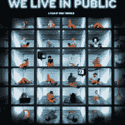

# 我们现在都生活在公共场合。习惯就好。

> 原文：<https://web.archive.org/web/https://techcrunch.com/2009/12/30/we-all-live-in-public/>

随着网络变得越来越社会化，隐私变得越来越难以获得。人们在脸书和推特上过度分享，在 Foursquare 和 Gowalla 上每十步广播一次他们的行踪，并将他们最隐私的时刻的照片和视频上传到网上供所有人观看。说隐私已死很容易，我们现在都生活在公共场合，处理就好。

但是事情有点复杂。以前是我们私底下生活，选择把生活的一部分公开。现在，这种情况正在彻底改变。我们生活在公共场合，[就像电影《T4》中说的那样(除了通过微信号而不是 24-7 视频自我监控)，选择我们生活中的哪些部分保持隐私。Public 是新的默认设置。](https://web.archive.org/web/20221007194111/http://www.weliveinpublicthemovie.com/)

斯托·博伊德和他之前的其他人把这种新的曝光状态称为“公开的”(相对于隐私或保密)。他写道:

> 公共性的概念无非是:基于公共性的工具默认事物是开放的，并且可以开放访问，而不是隐藏事物，并限制那些被明确邀请的人的访问。

我并不特别喜欢这些新词，但其背后的思想却非常正确。这种变化代表着社会结构的重大转变，而这只是刚刚开始。如果你认为在 2009 年有很多隐私问题，那就等到 2010 年吧。脸书新的隐私政策有利于更多的公开分享，这将是这一转变的一大驱动力，Twitter 的持续使用也是如此，其设计本身就将个人言论公开化。还有像 Blippy 这样的创业公司，他们走得更远，把每一次购买都变成公开声明。

适应在公共场所生活的想法需要一些时间。正如我几个小时前与 Andrew Keen 讨论的那样，在公开场合[在 Twitter](https://web.archive.org/web/20221007194111/http://twitter.com/erickschonfeld/status/7209488124) 上，我们将把公开场合*变成公开场合*，而不是把公开场合*变成私人场合*。“当默认设置为公开时，您会故意选择要保密的内容，而不是相反。

并不是隐私消失了。但这更像是一个强调的问题和一个有意识的决定。博伊德指出:

> 有些人在网络上相当于裸体主义者:他们在网络上过着非常开放的生活，透露他们关系中的隐私细节，他们对朋友和同事的看法，他们与家人和当局的互动。酪。。即使这些表面上完全开放的网络用户也可能会保留一些隐私或秘密。

隐私和保密是两回事。博伊德写道，秘密可以被分享，因此成为“将分享秘密的人联系在一起，并将其他人排除在外的社会对象”。对于网络公司来说，让人们容易地从公共网站转移到私人网站，以及在两者之间转移，将变得越来越重要。

回到最初的问题，隐私仍将存在，但会被改变，变得几乎无法辨认。毫无疑问，很多人会误以为是死了，一直拔头发。我们其余的人将继续我们的公共生活。