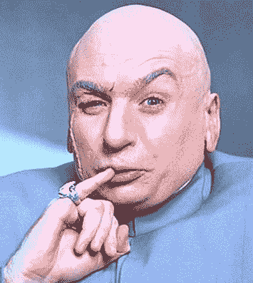
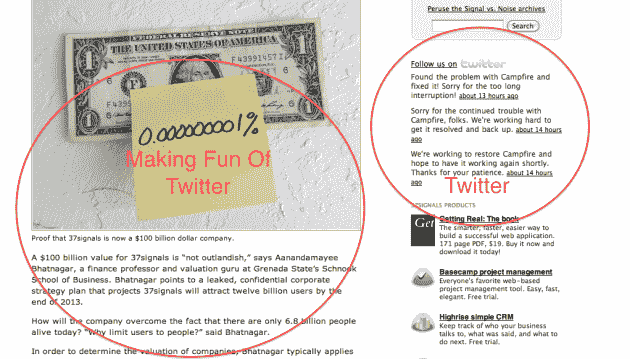

# 我们持有 Twitter 亿美元的赎金 

> 原文：<https://web.archive.org/web/https://techcrunch.com/2009/09/25/we-hold-twitter-ransom-for-100-billion-dollars/>

[ 37signals](https://web.archive.org/web/20230213032857/http://www.37signals.com/) 创始人 [Jason Fried](https://web.archive.org/web/20230213032857/http://www.crunchbase.com/person/jason-fried) 可能在今天的《今日邮报》上嘲笑了 [Twitter 最近](https://web.archive.org/web/20230213032857/https://techcrunch.com/2009/09/16/twitter-closing-new-venture-round-with-1-billion-valuation/)[传言的](https://web.archive.org/web/20230213032857/https://techcrunch.com/2009/09/16/source-insight-venture-partners-is-the-new-twitter-investor/)轮融资的 10 亿美元估值。这篇名为“[新闻稿:37SIGNALS 在大胆的风险投资](https://web.archive.org/web/20230213032857/http://37signals.com/svn/posts/1941-press-release-37signals-valuation-tops-100-billion-after-bold-vc-investment)后估值突破 1000 亿美元”的帖子非常有趣。但这也是不真诚的。

作为讽刺，弗里德提出了一些观点。但他发现的关键问题是估值、收入(或缺乏收入)、商业模式和炒作。他在 Twitter 上选择了一个简单的目标，Twitter 不乏反对者，他们简直无法相信这项服务不断获得的资金和估值。但是弗里德无疑知道这个游戏是怎么玩的，通过对当前“it”公司的挑剔，一些人注意到他的帖子看起来更像是酸葡萄心理。但他的观点还是绝对值得一谈的。

**估值**

弗里德开玩笑说，37signals 的价值为 1000 亿美元，这是基于一群人以 1 美元购买该公司 0.00000001%的股份。他的观点是，基于投资的估值是荒谬的。但这并不完全正确。

当然有些是——微软在脸书的投资使其估值达到 150 亿美元就是一个很好的例子。但关键的一点是，微软在脸书投资并不是希望在公司最终退出时变得富有。相反，它正在进行一项小规模(1.6%)的战略投资，主要是为了远离谷歌。当时，每个人都为 150 亿美元这个数字而疯狂，但从一开始就不现实。自那以后，脸书(其规模已经增长了很多)已经以低得多的估值[筹集了真金白银](https://web.archive.org/web/20230213032857/https://techcrunch.com/2009/05/26/facebook-takes-that-200-million-investment-from-the-russians-at-a-10-billion-valuation/)。那么微软是不是被耍了？不，因为从来都不是钱的问题。

但在弗里德的例子中，让我们假设 1 美元的投资者投入资金，希望最终能够收回。如果他们真的支付 1 美元购买 0.000000001%的公司股份，估值为 1000 亿美元，这些投资者将希望退出*超过*1000 亿美元(不包括他们围绕退出可能拥有的各种类型的交易和选择)。所以 1000 亿美元这个数字确实有意义。

同样，在不知道其最新一轮融资细节的情况下，10 亿美元的数字可能对 Twitter 有意义。如果 an 在完成这一轮[最新的 1 亿美元](https://web.archive.org/web/20230213032857/https://techcrunch.com/2009/09/24/more-investors-pile-into-twitters-funding-round-now-reportedly-close-to-100-million/)时，那些投资者将寻求超过 10 亿美元的退出。你可以打赌 T. Rowe Price 想从这笔交易中赚钱，参与其中的公司也是如此。他们显然认为 Twitter 价值超过 10 亿美元。而且他们[很难](https://web.archive.org/web/20230213032857/https://techcrunch.com/2009/04/03/twitter-wouldnt-sell-for-1-billion-says-source/)单独。

**收入&商业模式** 

”*炒笑话，为了增加公司的价值，37signals 已经决定停止创收。*”并继续说道，“*一旦有了利润，就不可能随便编东西了。这是千真万确的，迈克最近写了一篇很棒的文章，讲述了 Twitter 很快将面临的困境。*

但这是弗里德拿出令人厌倦的“Twitter 不赚钱”牌。让我们明确一点:如果 Twitter 现在想做，它可以赚钱。(就算没有利润，至少也有收入。)他们只需打开广告(由于最近 TOS 的变化，他们现在可以这样做了)一些钱，可能不是一个微不足道的数目，将开始滚滚而来。

与此同时，如果它做到了这一点，投资者将对他们的业务潜力有更好的了解，如果这些数字不是很出色，这可能会让一些人对天价估值保持警惕——弗里德和迈克都正确地指出了这一点。

但正如 Twitter 多次声明的那样，它赚钱的真正意图(至少现在)不是走广告的道路，而是做专业的账户和工具。Twitter 似乎越来越接近推出这项服务，他们已经表示计划在今年年底前开始盈利。我们正在接近这一点，所以可以肯定新投资者对 Twitter 的策略有很好的了解。如果是这样的话，他们显然喜欢他们所看到的，足以投入 1 亿美元(同样，假设这一轮结束)。

有传言称，在新一轮融资中，Twitter 将拥有约 1.3 亿美元的银行存款。就像之前的脸书一样，这将给公司足够的时间来开始赚有意义的钱。事实上，脸书刚刚过去的这个季度[第一次出现了正现金流](https://web.archive.org/web/20230213032857/https://techcrunch.com/2009/09/15/facebook-crosses-300-million-users-oh-yeah-and-their-cash-flow-just-went-positive/)——在这些年里获得了超过 7 亿美元的资金。相比之下，Twitter 似乎非常苗条。

关键是，他们将有充足的现金，因此，有足够的时间来担心如何建立正确的商业模式。显然，如果这些投资者认为这不会发生，他们就不会投资。

**炒作**

Bhatnagar 承认(估值的)数学方法主要是猜测，但他指出“媒体相信了这一点”。’”弗里德写道。毫无疑问，这是真的，我们媒体确实吃了这种东西。大数字很性感，会引发有趣的，或者至少是活跃的讨论。但同样，这表明基于投资的估值是疯狂的。在某些情况下，他们是，但并不总是。如果作者和读者都明白它们是如何工作的(不可否认，事实往往并非如此)，它们可以成为有用的参考点。

“信号将引领新的全球运动，充满对增长和货币化潜力的假想假设，”他继续说道。“我们很高兴推出一系列未经证实的收入可能性，包括众包、一套强大的小工具创建工具、3G、增强现实、社交内容和应用商店。此外，我们制造的所有东西都将包括一个指南针，”Fried 总结道。

尽管他后来[收回了](https://web.archive.org/web/20230213032857/http://twitter.com/jasonfried/status/4349516064)的说法，但似乎很明显，弗里德是在暗示推特几乎全是炒作。我们[昨天稍微提到了这一点](https://web.archive.org/web/20230213032857/https://techcrunch.com/2009/09/24/are-we-kingmakers-or-prognosticators/)，但最终，这仍有待观察。但有趣的是，在他的帖子的边栏上，Fried 自己有一个 Twitter 小工具，它实际上在他的 37 个信号产品列表之上。这并不像那些在推特上大声宣称推特全是炒作的人那么糟糕。

但不管你在炒作辩论中处于什么位置，真正重要的是投资者显然不认为这是炒作。他们显然仍在向它投入大量资金，认为它将是下一个大事件。多大？大到有超过 10 亿美元的出口。我哪里知道？估价告诉我。

【YouTube = http://www . YouTube . com/watch？v=jTmXHvGZiSY&w=640&h=505]

*【图片和视频:新线影院】*