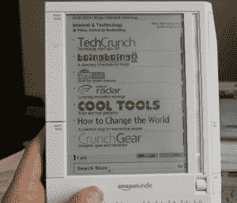
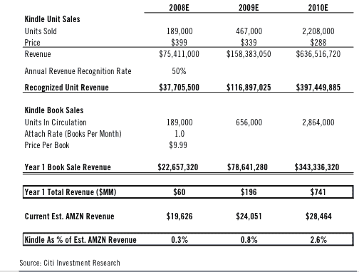

# 我们知道亚马逊卖出了多少 Kindles 万台 

> 原文：<https://web.archive.org/web/https://techcrunch.com/2008/08/01/we-know-how-many-kindles-amazon-has-sold-240000/>

# 我们知道亚马逊卖出了多少 Kindles 万台

自从去年 11 月亚马逊[推出 Kindle](https://web.archive.org/web/20221205164925/http://www.beta.techcrunch.com/2007/11/19/kindle-first-impressions/) 以来，我们一直想知道它到底有多成功。电子书最初销售一空，供应一直很紧张。Kindle 在亚马逊整体业务中所占的份额如此之小，以至于该公司并未公布其销量。但我们还是发现了:据一位接近亚马逊的消息人士透露，自去年 11 月以来，已经有 24 万台 Kindles 被售出。

稍微回溯一下信封数学，这使得该设备迄今为止的总销售额在 8600 万美元到 9600 万美元之间(该设备的价格从去年 5 月的 400 美元降至 360 美元)。然后再加上为在设备上阅读而购买的数字书籍、报纸和博客的金额，你就会得到一个迄今为止轻松带来超过 1 亿美元的业务。(每购买一份价值 25 美元的电子书，总收入将增加 600 万美元)。

这些数字与华尔街分析师的预测一致。如果针对教科书/学校市场[的](https://web.archive.org/web/20221205164925/http://www.beta.techcrunch.com/2008/07/17/amazon-to-target-55-billion-textbook-market-with-new-kindle/)[新 Kindle](https://web.archive.org/web/20221205164925/http://www.beta.techcrunch.com/2008/07/15/kindle-20-coming-around-october-2008/) 上市，销量可能会更高。

Stifel，Nicolaus & Co .的分析师斯科特·德维特(Scott Devitt)预测，亚马逊将在未来四个季度(包括本季度)再销售 50 万至 75 万台 Kindles。他估计，Kindle 用户将为每台设备额外购买价值 120 至 150 美元的书籍和其他内容，使这段时间的总收入达到 2.25 亿至 3.55 亿美元。基于此，他认为 Kindle 为亚马逊带来了 10 亿美元的收入。

早在 5 月份，花旗分析师马克·马哈尼估计 Kindle 今年的总销量只会达到 189，000 部。这个数字可能已经被超过了(取决于亚马逊在 1 月份之前售出的 240，000 台中有多少)。他预计明年出货量为 46.7 万部，2010 年为 220 万部，总收入将从 2008 年的 6，000 万美元增至 2010 年的 7.41 亿美元。也许是时候让他向上修正这些数字了。(以下是他 5 月份的模型):

【T2