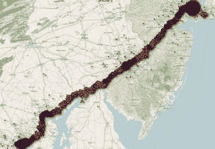

# 我们翻译苹果关于位置数据的问答，因此您不必 

> 原文：<https://web.archive.org/web/http://techcrunch.com/2011/04/27/we-translate-apples-qa-on-location-data-so-you-dont-have-to/>

> 1.为什么苹果在追踪我 iPhone 的位置？
> 
> 苹果没有追踪你的 iPhone 的位置。苹果从来没有这样做过，也没有计划这样做。

我们[不知道](https://web.archive.org/web/20230205031020/https://techcrunch.com/2011/04/27/apple-finally-responds-to-location-data-tracking-kerfuffle/)你把你的 iPhone 带到哪里去了。

我们不是~~谷歌~~邪恶。

> 2.那为什么大家都这么关心这个？
> 
> 为移动用户提供快速准确的位置信息，同时保护他们的安全和隐私，这带来了一些非常复杂的技术问题，很难在一段新闻中进行交流。用户感到困惑，部分原因是这项新技术的创造者(包括苹果)迄今为止没有提供足够的关于这些问题的教育。

我们很抱歉让你一时糊涂了。现在请冷静下来，很抱歉在你有任何理由冷静下来之前没有要求你冷静下来。

> 3.为什么我的 iPhone 会记录我的位置？
> 
> iPhone 不会记录您的位置。相反，它维护着你当前位置周围的 Wi-Fi 热点和手机信号塔的数据库，其中一些可能距离你的 iPhone 超过 100 英里，以帮助你的 iPhone 在需要时快速准确地计算出它的位置。仅使用 GPS 卫星数据计算手机位置可能需要几分钟。iPhone 可以通过使用 Wi-Fi 热点和手机信号塔数据来快速找到 GPS 卫星，甚至在 GPS 不可用时(如室内或地下室)，仅使用 Wi-Fi 热点和手机信号塔数据来三角定位，从而将这一时间缩短到几秒钟。这些计算是在 iPhone 上实时执行的，使用的是 Wi-Fi 热点和手机信号塔数据的众包数据库，由数千万部 iPhone 以匿名和加密的形式向苹果发送附近 Wi-Fi 热点和手机信号塔的地理标记位置而生成。

我们不会记录*您的*位置，只记录您和其他人连接到网络或发送短信或其他内容的位置。这有助于我们在您下次更快速地连接时计算您的位置。我们甚至都不想知道你都去哪了。

> 4.这个众包数据库存储在 iPhone 上吗？
> 
> 整个众包数据库太大，无法存储在一部 iPhone 上，所以我们将一个适当的子集(缓存)下载到每部 iPhone 上。此缓存受保护但未加密，并且每当您备份 iPhone 时都会在 iTunes 中备份。备份是否加密，取决于 iTunes 中的用户设置。研究人员在 iPhone 上看到的位置数据不是 iPhone 过去或现在的位置，而是 iPhone 位置周围的 Wi-Fi 热点和手机信号塔的位置，这些位置可能距离 iPhone 超过一百英里。我们计划在即将到来的软件更新中停止备份该缓存(参见下面的软件更新部分)。

我们不会将收集的所有数据存储在您的手机上，但我们会将部分数据备份到您的电脑上。这是无辜的数据，我们发誓，但我们将很快停止备份它。

> 5.苹果公司可以根据我的地理标记 Wi-Fi 热点和手机信号塔数据来定位我吗？
> 
> 不。这些数据是以匿名和加密的形式发送给苹果公司的。苹果无法确定这些数据的来源。

为什么我们甚至想知道你经常去当地的沃尔玛购物——或者他们从我们这里偷走的微软零售店？

> 6.人们已经发现 iPhone 上存储了长达一年的位置数据。为什么我的 iPhone 需要这么多数据来帮助它找到我今天的位置？
> 
> 该数据不是 iPhone 的位置数据，而是众包 Wi-Fi 热点和手机信号塔数据库的子集(缓存),从苹果下载到 iPhone 中，以帮助 iPhone 快速准确地计算位置。iPhone 存储这么多数据的原因是我们发现了一个漏洞，并计划很快修复(见下面的软件更新部分)。我们认为 iPhone 不需要存储超过 7 天的这些数据。

好吧，我们承认我们保存了位置数据，这些数据可能会在很长一段时间内决定你的位置，但这是一个错误。我们已经为此解雇了一些工程师，所以这不再是一个真正的问题。我们会把保存数据的时间缩短到一周，好吗？

> 7.当我关闭定位服务时，为什么我的 iPhone 有时会继续从苹果的众包数据库更新其 Wi-Fi 和手机信号塔数据？
> 
> 不应该。这是一个错误，我们计划很快修复(见下面的软件更新部分)。

哎呦！你把我们带到了那里。当我们[修复小故障](https://web.archive.org/web/20230205031020/http://www.moviewavs.com/0094473955/WAVS/Movies/Office_Space/fixedtheglitch.wav)时，看另一边。

> 8.除了众包 Wi-Fi 热点和手机信号塔数据之外，苹果还从 iPhone 上收集了哪些位置数据？
> 
> 苹果现在正在收集匿名流量数据，以建立一个众包流量数据库，目标是在未来几年为 iPhone 用户提供更好的流量服务。

在一些研究人员再次做一些研究，你开始抱怨他们的发现之前，是的，我们收集其他类型的位置数据，但我们将使用它来建立一个真正神奇的服务，直到你忘记整个位置跟踪的折磨曾经发生过。

> 9.苹果目前是否向第三方提供从 iPhones 收集的任何数据？
> 
> 我们向选择加入第三方开发者的用户提供匿名崩溃日志，帮助他们调试应用程序。我们的 iAds 广告系统可以将位置作为定向广告的一个因素。位置不会与任何第三方或 ad 共享，除非用户明确同意将当前位置给予当前 ad(例如，请求 ad 定位离他们最近的目标商店)。

我们尚未发现任何会自动将您的所有位置数据转发给您的母亲、妻子或雇主的漏洞。还没有。

> 10.苹果认为个人信息安全和隐私重要吗？
> 
> 是的，我们非常想。例如，iPhone 是第一个要求用户为每一个想要使用定位的应用程序提供许可的手机。苹果将继续成为加强个人信息安全和隐私的领导者之一。

既然你问了；我们爱你，对你没有恶意。我们也不会伤害你。

> 软件更新
> 
> 在未来几周的某个时候，苹果将发布一个免费的 iOS 软件更新:
> 
> –减少 iPhone 上缓存的众包 Wi-Fi 热点和手机基站数据库的大小，
> –停止备份该缓存，
> –在定位服务关闭时完全删除该缓存。
> 
> 在下一个主要的 iOS 软件版本中，iPhone 上的缓存也将被加密。

再说一次，我们并不邪恶。但是我们会修复一些被其他人发现的错误，以确保你永远记得我们不是邪恶的。最精彩的部分？我们甚至不会向你收费。看，闪亮的[白色 iPhones 正在进行](https://web.archive.org/web/20230205031020/http://www.crunchgear.com/2011/04/27/the-white-iphone-is-official/)！