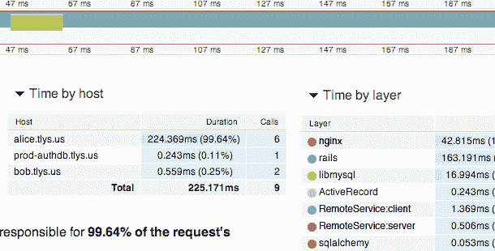

# Web 应用程序性能解决方案 Tracelytics 从 Google Ventures、Battery & Flybridge TechCrunch 筹集了 60 万美元

> 原文：<https://web.archive.org/web/http://techcrunch.com/2011/11/03/web-app-performance-solution-tracelytics-raises-600k-from-google-ventures-battery-flybridge/>

# Web 应用性能解决方案 Tracelytics 从 Google Ventures、Battery & Flybridge 获得 60 万美元

应用性能和分析解决方案提供商 [Tracelytics](https://web.archive.org/web/20230204100538/http://www.tracelytics.com/) 刚刚完成了来自 Battery Ventures、Flybridge Capital Partners、Google Ventures 和几位知名天使投资人的 60 万美元种子轮投资。Tracelytics 解决方案目前处于有限发布阶段，是一个基于 SaaS 的应用性能管理(APM)工具，用于提供对用 PHP、Ruby 或 Python 编写的复杂分布式 Web 应用程序的可见性。

正如任何初创公司都会告诉你的那样，确保你的 Web 应用程序保持正常运行是至关重要的，但这并不是一件容易的事情。这也可能会耗费大量昂贵的时间，尤其是当许多当前孤立的解决方案无法让您全面了解正在发生的事情时。 [Tracelytics](https://web.archive.org/web/20230204100538/http://www.tracelytics.com/) 试图通过处理跨层和跨机器的数据收集来简化这一过程，然后在一个易于阅读的仪表板界面中呈现给你，这样你就可以看到正在发生什么，在哪里发生，为什么发生。

该服务提供端到端跟踪、数据过滤、机器级指标和错误报告。目前，它可以在 Debian、Ubuntu、Red Hat 和 CentOS 上工作，并支持 HTTP 和 Thrift 协议。

这家位于罗德岛普罗维登斯的公司于 2010 年 6 月由[斯皮罗斯·埃利奥普洛斯](https://web.archive.org/web/20230204100538/http://www.linkedin.com/pub/spiros-eliopoulos/24/668/452)、[丹·库伯里奇](https://web.archive.org/web/20230204100538/http://www.linkedin.com/in/kuebrich)和[克里斯·欧文](https://web.archive.org/web/20230204100538/http://www.linkedin.com/in/cerway)创立。Eliopoulos 和 Kuebrich 之前在李正吉街一起工作，而 Erway 之前在 IBM 工作。

该公司目前正通过其网站向早期用户提供折扣价格。

