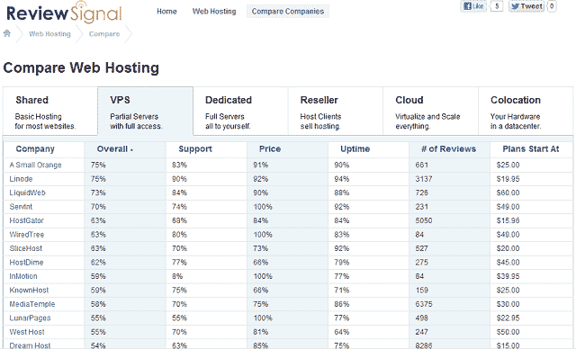

# 虚拟主机评论是一个粪坑。《信号评论》想要解决这个问题

> 原文：<https://web.archive.org/web/https://techcrunch.com/2012/09/25/web-hosting-reviews-are-a-cesspool-review-signal-wants-to-fix-that/>

你曾经尝试过搜索网页托管服务的评论吗？结果通常分为两类:A)轶事经验和 B)垃圾邮件发送者试图在联盟计划中赚钱。几乎不可能知道哪些主机实际上有好的声誉。

广受欢迎的虚拟主持论坛的前主持人 Kevin Ohashi 想要改变这种情况。Ohashi 的硕士论文是关于情感分析的，这给了他使用 Twitter 来确定哪些主机拥有最满意的客户的想法。于是[复习信号](https://web.archive.org/web/20230302114813/http://reviewsignal.com/)诞生了。

Ohashi 承认情感分析是一门不精确的科学。他说，在情感分析中，60-70%的准确率是非常好的。但是如果一个用户进入评论信号的首页，看到三四条明显分类错误的推文，那整个网站就名誉扫地了。所以 Ohashi 关注的是信心而不是完整性。如果 Review Signal 对某条特定推文的正确观点不是非常有信心，或者这条推文是否指的是特定的虚拟主机服务，那么这条推文将被丢弃。这意味着满足于更小的样本量，但更好的可信度。这也意味着亚马逊网络服务还不能被列为网络主机，因为有太多不准确的结果，但 Ohashi 说 AWS 无论如何都是一个网络主机的离群值。

他也承认，阻止垃圾邮件发送者利用结果并不容易。“这将是一场持久战，”他说。“谷歌天天跟 SEO 打架。”他花了大量的时间来查看被分析的推文，并调整算法，以便剔除不好的结果，他将继续这样做。此外，用户可以投票决定特定评论是否有用。

他指出，他已经收集推特一年半了，所以如果一家公司的正面评价大幅上升，他就能发现它。他已经见过一个非恶意的案例，在这个案例中，主持人的积极情绪突然激增。这是主机的周年纪念日，许多用户张贴“生日快乐”的消息。他说，他确实对算法做了一点调整，剔除了一些类似“生日快乐”的评论，但他确实保留了一些类似“生日快乐，多年来一直是快乐的顾客”的推文

我问他是否看到了关于 GoDaddy 停机的任何趋势[或该公司多年来的任何负面宣传。他说他有几起事件的数据:T4 超级碗广告 T5，前首席执行官猎象惨败 T7，公司在 SOPA 的 T8 位置 T9 以及最近的域名服务中断。只有最近的停机时间产生了明显的影响。](https://web.archive.org/web/20230302114813/https://techcrunch.com/2012/09/11/how-pissed-are-godaddy-customers-about-yesterdays-outage/)

通过在网站上发布正在分析的推文，他希望给主机排名过程带来更多透明度。Ohashi 网站上确实有附属链接，但他说他不会让它影响排名。例如， [Linode](https://web.archive.org/web/20230302114813/http://linode.com/) ，它没有会员计划，是网站上排名最高的主机之一。目前这可能是好的，但如果网站增长，不信任和诱惑(甚至潜意识)调整算法有利于分支机构可能会增长——特别是因为他必须手动选择排名主机。所以我猜他最终还是要找到另一种商业模式。

然而，他否定了出售品牌监测服务的想法——这个市场上已经有很多公司了。他想做消费者业务。他说他也想进入其他垂直领域。他说，他将从增加对相关服务的审查开始，如域名注册商和电子邮件提供商。但他也想涉足其他领域，比如电影和娱乐评论。他说，关键在于获得有代表性的数据。Twitter 在主持评论方面非常有效，但它并不适用于所有类型的产品和服务。

他将面临的另一个挑战是访问推特。目前他只是在使用 Twitter 搜索 API，但那已经关闭了。随着网站的发展，他可能需要访问消防水管，或者从其他人那里获得搜索结果。这将增加他的成本。

抛开挑战不谈，这看起来已经是对现状的巨大改善。让我们希望它保持这种方式。