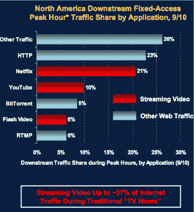

# 在电视高峰时段，网络视频占据了 37%的网络流量

> 原文：<https://web.archive.org/web/https://techcrunch.com/2010/11/19/web-video-37-percent-internet-traffic/>

# 在电视高峰时段，网络视频占据了 37%的网络流量

几周前，一些[数据显示](https://web.archive.org/web/20230404033735/http://www.multichannel.com/article/458744-Netflix_Accounts_For_20_Of_Peak_U_S_Internet_Bandwidth_Study.php)仅网飞就占了电视高峰时段互联网流量的 21%。但是，如果你从网络上添加一些其他来源的流媒体视频，即 YouTube 和其他形式的 Flash 视频，网络视频的流量份额将跃升至 37%(其中 10%来自 YouTube，6%来自 Flash 视频)。BitTorrent 占另外 8 %,其中大部分也是视频。

这些惊人的数字是由摩根士丹利互联网分析师玛丽·米克尔在本周早些时候的 Web 2.0 峰会上的[报告](https://web.archive.org/web/20230404033735/https://techcrunch.com/2010/11/16/ten-questions-internet-execs-should-ask-and-answer/)中整理成幻灯片的。所有 HTTP web 流量只占总流量的 23%。

这是否意味着网络上的头号活动是观看视频？不完全是。流量是根据使用的带宽和传输的位数来衡量的。流式传输视频文件比加载网页需要多一个数量级的比特。结果，视频占用了带宽。

而且视频越长，需要的带宽就越多。这也许解释了为什么网飞的带宽使用量是 YouTube 的两倍。人们正在从网飞观看两小时的完整电影，而不是两分钟的视频片段。人们仍然在 YouTube 上观看更多的视频，花费更多的时间。根据 comScore 的数据，10 月份，观众在 YouTube 上花费了 234 亿分钟，而在 Netflix.com 上花费了 7 . 5 亿分钟。YouTube 吸引了 1.16 亿独立访客，而网飞吸引了 2000 万。

当你看到这些数字时，请记住，他们测量的是互联网上消耗的带宽流量负载，而不是花费的时间。尽管如此，如果视频在黄金时段吃掉了超过三分之一的互联网带宽，想象一下如果一个像样的电视体验出现在网络上会是什么样。