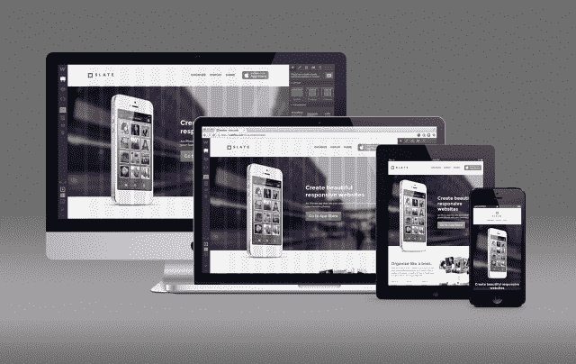
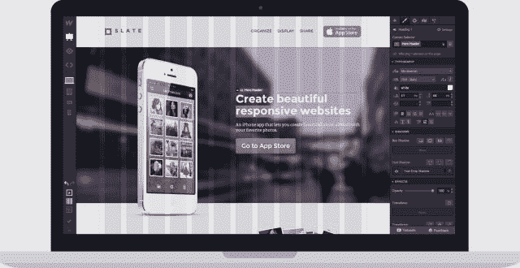

# Webflow 让您可以直观地设计响应性网站，完成后立即发布 

> 原文：<https://web.archive.org/web/https://techcrunch.com/2013/08/05/webflow-lets-you-design-responsive-websites-visually-publish-instantly-when-youre-done/>

由 Y Combinator 支持的初创公司 Webflow ，为创意专业人士提供了一种更简单、更直观的方式来设计和托管响应性网站，正在推出封闭测试版，已经有大约 10，000 名用户注册。这个想法的时代已经到来，因为世界上更多的人现在通过各种设备和屏幕尺寸与网络进行交互，包括台式机、笔记本电脑、平板电脑和智能手机——后两者也可以在纵向或横向模式下转动和观看。

迄今为止，网页设计师通常只是在使用 Photoshop 或 Illustrator 等工具创建设计本身后，将编写响应网站的工作外包出去，或者他们使用 Twitter 的 [Bootstrap](https://web.archive.org/web/20230204180242/http://getbootstrap.com/) 或 Zurb 的 [Foundation](https://web.archive.org/web/20230204180242/http://foundation.zurb.com/) 等框架进行前端开发。但 Webflow 是不同的，因为它不仅提供了一个可视化编辑器，让您可以拖放、自定义响应布局，并为您想要支持的每个设备定义 CSS 样式，而且您还可以在完成后立即发布您的站点。

这家总部位于山景城的公司是由弗拉德和塞尔吉·马格达林兄弟以及首席技术官布赖恩特·周创建的。Vlad 和 Bryant 之前曾在 Intuit 工作，在那里他们建立了 Intuit 的第一个企业 SaaS 项目 [Intuit Brainstorm](https://web.archive.org/web/20230204180242/http://brainstorm.intuit.com/) 。

虽然该公司几周前才推出测试版，但 Webflow 是弗拉德多年来一直在思考的一个想法——事实上，他甚至在关于这个主题的毕业论文中，使用了与他当时描述的概念相同的名称。“对我个人来说，这是一个十年的旅程，”弗拉德说。“我们的想法是让人们更容易建立更复杂的网站和网络应用程序，”他解释道。

然而，尽管弗拉德在提交了一系列低价报价后，最终仅以 2900 美元的价格获得了域名 Webflow.com，但他在放学后暂停了该项目的计划，以便接受 Intuit 的工作。此外，弗拉德指出，他必须与佛罗里达州的 Learn.com 竞争，才能获得 Webflow 的商标。与此同时，HTML5 和 CSS3 等必要技术仍处于早期阶段。这些因素的结合导致他将 Webflow 的工作推迟到最近。

但今年秋天早些时候，两位联合创始人辞去了工作，开始与设计师一起测试这个概念。一个早期的原型被传来传去征求反馈，但它仍然要求最终用户知道如何编码。“一旦我们把它展示给设计师，他们就被它吓跑了，因为它要求他们学习一种新的模板语言，而他们在学习 WordPress 和 PHP 方面已经有困难了，”Vlad 说。"所以我们又回到了起点。"

对于下一次迭代，Vlad 决定了一些对不知道如何编码的联合创始人 Sergie 有用的东西。“如果你必须建立这些响应性网站，你需要做些什么？”，他问他的兄弟。结果就成了今天的 Webflow。

3 月中旬，这项技术在 playground.webflow.com 的早期演示在《黑客新闻》上爆红，超过 33，000 人注册了发布列表，尽管当时甚至还没有产品推出。动力和兴趣促使创始人申请了 Y Combinator。

现在任何人都可以尝试，用户可以开始在 Webflow.com 建立他们的响应网站。今天，重点是建立单页网站，但该公司将在不久的将来扩展到支持多页网站。用户可以从少量的基本模板或应用程序模板中进行选择，或者从头开始创建自己的自定义网站。Webflow 允许设计者可视化地与 CSS 网格系统交互，通过从右边栏拖放项目到页面上，然后定义 CSS 类。

在第一次创建网站的原始版本之后——比如笔记本电脑版本——设计师可以进入下一个迭代，比如平板电脑版本，并继续调整风格。页面结构和顺序将保持不变，但设计师可以调整各种元素，以便在较小的屏幕上更好地工作——例如，在 iPhone 网站上缩小字体大小。“相当于 CSS 媒体查询的东西，你必须手写，”弗拉德解释说。

Webflow 的目标不是中小型企业，而是为客户建立网站的设计师和代理商。在为期 3 周的私人测试中，迄今已有数十人转换为 [premium](https://web.archive.org/web/20230204180242/http://www.webflow.com/pricing/) 账户类型，允许无限制的网站导出和托管自定义域名。目前有两种[付费等级](https://web.archive.org/web/20230204180242/http://www.webflow.com/pricing/)(24 美元/月和 49 美元/月)。

除了增加对多页面网站的支持，该公司还致力于增加对其他定制表单的支持，以消除集成外部服务的需要，如 WuFoo 或必须粘贴的代码片段。

在某种程度上，除了 Bootstrap、Foundation 或 Adobe 的 Edge Reflow 之外，这种服务没有多少竞争对手。但 Webflow 的区别因素不仅仅是可视化编辑器部分，而是用户可以选择直接发布网站，而不是事后导出代码。

感兴趣的用户可以[在这里](https://web.archive.org/web/20230204180242/http://www.webflow.com/pricing/)注册 Webflow。该公司目前正在筹集种子资金。