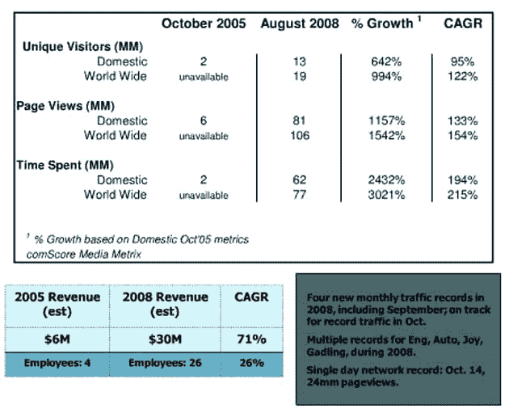

# Weblogs，Inc .三年后:惊人的页面浏览量和收入增长 

> 原文：<https://web.archive.org/web/https://techcrunch.com/2008/10/22/weblogs-inc-three-years-later-impressive-page-view-and-revenue-growth/>

# Weblogs，Inc .三年后:令人印象深刻的页面浏览量和收入增长

本月早些时候，新闻集团庆祝了收购 MySpace 三周年。今天，AOL 为他们在 2005 年 10 月收购的 Weblogs，Inc .博客网络做着同样的事情。

据 2008 年 8 月的 comScore Media Metrix 统计，自收购以来，Weblogs，Inc .的博客(包括 Engadget、TMZ、Download Squad、TUAW、Joystiq、Autoblog 和其他博客)的全球独立访问者攀升了近 1000%(平均每年 122%)，页面浏览量增加了 1500%(平均每年 154%)。2005 年 10 月，博客在美国拥有 140 万独立访问者，并创造了约 600 万美元的收入。今天，其 1300 万独特的和收入约 3000 万美元。

简而言之，这是 AOL 较好的收购之一。

更多详细信息，请参见下面的截图和 Powerpoint 演示文稿。

[http://viewer.docstoc.com/](https://web.archive.org/web/20230216124406/http://viewer.docstoc.com/)
[三周年博客公司 _ AOL 11](https://web.archive.org/web/20230216124406/http://www.docstoc.com/docs/2020026/Third-Anniversary-Weblogs-Inc-_-AOL-11)