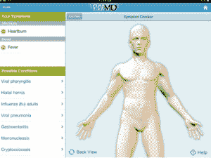
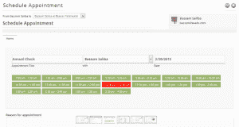
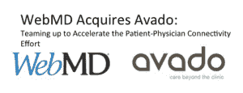

# WebMD 以 2000 万至 3000 万美元收购 Avado，帮助推动其从媒体公司向患者参与平台发展 TechCrunch

> 原文：<https://web.archive.org/web/https://techcrunch.com/2013/10/29/webmd-acquires-avado-for-20-30m-to-help-drive-its-shift-from-media-company-to-patient-engagement-platform/>

成立 17 年后， [WebMD](https://web.archive.org/web/20221205130318/http://www.webmd.com/) 仍然是网上基本健康和诊断信息(以及疑病症支持)的首选资源之一。WebMD 诞生于网络繁荣的巅峰时期，是为数不多的几家公司之一，这些公司不仅能够承受随之而来的崩溃，而且能够继续实现盈利，市值达到 10 亿美元，并保持其市场领导者的地位——即使在今天也是如此。

然而，对 WebMD 来说，这是一条崎岖不平的道路，前面的坑坑洼洼不会变小。随着医疗保健行业的转型加速，对 WebMD 业务及其食物链顶端地位的威胁开始成倍增加。尽管 WebMD [今天宣布，其健康网络](https://web.archive.org/web/20221205130318/http://www.prnewswire.com/news-releases/webmd-announces-third-quarter-financial-results-229750191.html)在第三季度每月有 1.38 亿独立访客，总流量为 29.5 亿页面浏览量——在 7 月报告其六个季度以来首次盈利[——但其受欢迎程度在过去十年中有所动摇。有时，WebMD 比先锋更引人注目。](https://web.archive.org/web/20221205130318/http://finance.yahoo.com/news/webmd-buy-back-shares-carl-121334629.html)

#### 适应或者死亡

今天，WebMD 主要以其面向消费者的健康和诊断门户网站和移动应用程序而闻名。当你想到 WebMD 时，你会想到它的经典症状检查器，在那里你可以输入像“流鼻涕”这样的关键词，然后它会为你提供可能的诊断匹配。然而，多年来，该公司一直在悄悄地多元化，增加服务，使其能够接触到新的受众。

例如，通过 Medscape，该公司通过其基于注册的门户网站和应用程序向医疗保健提供商提供医疗新闻和信息。反过来，WebMD 也开始通过其基于订阅的患者参与平台和私人在线健康门户来瞄准雇主和健康计划，这为员工提供了一个安全的网关，通过该网关他们可以访问他们的个人健康信息、计划数据和保险索赔。

#### WebMD 2.0:从媒体到技术

 尽管 WebMD 已经围绕其旗舰健康信息网站建立了坚实基础，但这些服务仍然各自独立。随着人们继续采用各种各样的数字健康工具，并变得越来越习惯使用这些工具，患者和医疗保健提供者进行联系和沟通、患者控制(并更好地监控)其医疗保健的机会将呈指数级增长。

如果 WebMD 要继续成为紧急医疗保健 2.0 时代对话的一部分，它就必须加快步伐，适应这些变化。

此外，WebMD 的商业模式在很大程度上以广告为中心。制药业——其广告收入的主要来源——去哪里，WebMD 就去哪里。但是，当该公司希望通过允许医生将内容推送到患者手机上来缩小其面向消费者的应用和服务与其面向提供商的门户之间的差距时，机会开始出现。通过让医生能够跨应用程序指定教育材料和内容，进入个性化医疗保健信息服务和行为改变，WebMD 可以减少对广告的依赖。

展望未来，WebMD 将继续提供其核心媒体服务，但或许对其生存更为关键的是将自己重新定义为一家健康技术公司的过程。为此，WebMD 今天在这个方向上迈出了第一步，宣布将收购 TechCrunch Disrupt 决赛公司和“患者关系管理”(或“PRM”)软件制造商 [Avado](https://web.archive.org/web/20221205130318/http://avado.com/) 。

#### Avado 和以患者为中心的医疗保健

像医疗保健本身一样，WebMD 历来定制其产品，以满足系统内两个截然不同的“世界”:消费者世界和专业世界。传统上，这两个部门好像被 30+纽约市街区分开。随着五年来的首次收购，WebMD 希望 Avado 在隐喻和物理上都成为其办公室和客户(消费者、患者和医生)之间的结缔组织。

 [自 2011 年](https://web.archive.org/web/20221205130318/https://beta.techcrunch.com/2011/05/24/avado-is-the-mint-for-your-personal-health-records/)推出以来，Avado 创始人和微软资深人士戴夫·蔡斯、巴萨姆·萨利巴和约翰·伊伊一直在寻求为医疗保健和个人健康记录做 Salesforce 为客户关系管理(CRM)所做的事情。[ **披露:**戴夫·蔡斯多年来为 TechCrunch 撰写了许多关于健康科技领域的文章。Chase 说，这个想法是为了提高医疗服务提供者和消费者之间的联系水平，使医疗服务更加有效，并改善患者的治疗效果。

“时机是正确的，”WebMD 的首席技术官和首席运营官比尔彭斯告诉我们。“传统上，患者和医疗保健提供商生活在不同的孤岛中，但随着电子健康记录和移动设备的日益普及，加上传感器技术的进步，现在比以往任何时候都有更多的机会将两者联系起来，并提供个性化的直接面向消费者的服务。”

#### 前方的路

虽然两家公司尚未准备好谈论收购后路线图上的新产品，但 Pence 确实表示，这些产品将直接集成 Avado 的技术。除此之外，至于 Avado 并入 WebMD 生态系统后会发生什么，Chase 表示，Avado 将在 WebMD 的技术团队中占据一席之地，目前该公司的 1600 名员工中有一个很小但不断增长的部分。

收购完成后，Avado 创始人蔡斯和萨利巴将继续留任，向彭斯汇报工作。Avado 团队的其他成员也将加入 WebMD 的技术团队，并将留在西雅图的公司总部。

 虽然两家公司拒绝透露收购条款的细节，但接近交易的 TechCrunch 消息人士表示，价格在 2000 万美元至 3000 万美元之间，这对创始人和投资者来说都是一个积极的结果。Avado 在 3 月份从投资者那里筹集了 100 万美元，投资者包括纽约市合作基金和医疗天使，如安迪·帕尔默和 QxMD 创始人丹尼尔·施瓦茨博士。

尽管 Avado 设法获得了外部投资，吸引了“数百”名医疗保健提供商客户和“数千”名消费者，但与 WebMD 相比，它的吸引力微乎其微。Chase 说，虽然 WebMD 可能不是医疗保健领域最性感的品牌，但它拥有美国最大的关注健康的消费者和医疗保健提供商群体。

这也是这一成果对 Avado 的真正价值所在——不仅有机会帮助 WebMD 构建“健康图谱”并将其技术整合到更大的连接和患者赋权服务套件中，还能接触到数以百万计的受众。

另一方面，当 WebMD 发现自己重新盈利并坚守其市场地位时，在线消费者医疗保健先驱正处于十字路口。是的，他们有很长的触角，但是没有能够帮助它建立第三方生态系统的人才，WebMD 可能会错过一个很好的机会。

WebMD 渴望重新定位自己，从一家数字媒体公司转型为一家健康技术公司，尤其是成为一个真正的患者参与平台。Avado 相信它可以帮助 WebMD 缩短两年的过渡期。将类似 Salesforce 的患者授权软件(和 API)集成到其产品组合和基础设施中是朝着这个新方向迈出的第一步。

更多信息，请点击查看[收购公告。](https://web.archive.org/web/20221205130318/http://www.marketwatch.com/story/webmd-acquires-avado-inc-2013-10-29?reflink=MW_news_stmp)