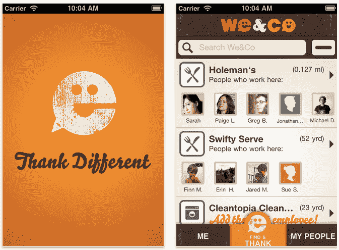

# We&Co:这些是你的邻居(酒吧、咖啡店等)。)TechCrunch

> 原文：<https://web.archive.org/web/http://techcrunch.com/2011/07/22/weco-these-are-the-people-in-your-neighborhood-bar-coffee-shop-etc/>

# We&Co:这些是你的邻居(酒吧、咖啡店等)。)

你和当地的酒保、咖啡师或皮革销售员是朋友吗？We&Co 是让他们知道你在乎他们的一种方式。这款 iPhone 应用于 7 月 15 日推出，允许企业注册员工，然后访问者可以对这些员工进行评级(重点是积极的批评)，并将他们添加到你的“最喜欢的人”收藏中。可以把它想象成粒度更大的 Yelp。

我想问题是“为什么？”当你自己可以感谢他们的时候，为什么还要用一个 app 呢？很可能，总分会鼓励其他人经常光顾员工的工作场所，从而为他们赢得更多的小费和潜在的令人毛骨悚然的跟踪者。它也给你每天在当地餐馆、酒吧和临时住所看到的面孔起了名字。

这家位于佐治亚州亚特兰大的小公司的技术基于创始人马克·马修的[公司 BeDo](https://web.archive.org/web/20230203035727/http://bedo.com/) 的工作。你可以使用 Twitter、脸书或一个独特的 We & Co 账户登录。该应用程序获取当前位置(和员工)，并允许您将位置和员工添加到不同的位置。然后你选择有问题的员工，给他们一个击掌之类的，实际上。

该系统允许你从一个地方到另一个地方跟踪你最喜欢的员工(例如，调酒师或发型师),雇主可以选择奖励你的评级。

作为一个厌世者，我对在工作场所主动寻找并感谢特定员工的想法感到有些不安，我当然更愿意给他们一大笔小费而不是敲敲按钮来感谢他们。也就是说，FSM 祝福这些南方孩子，因为他们试图在购买咖啡或轮胎的沉闷、没有灵魂的仪式中注入一点善意。我担心这不会经常被使用，不足以保证有很多热情的评论，但事实上这个想法是可靠的，这个应用程序是可行的，所以击掌，我们&公司。

[产品页面](https://web.archive.org/web/20230203035727/http://itunes.apple.com/us/app/we-co/id448178784?ls=1&mt=8)