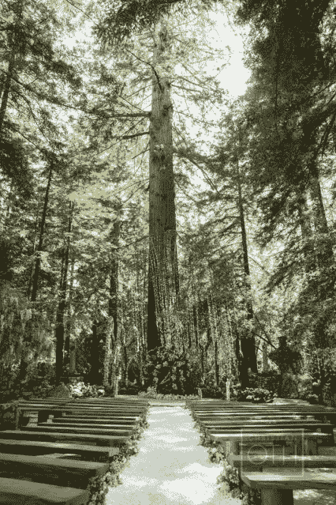
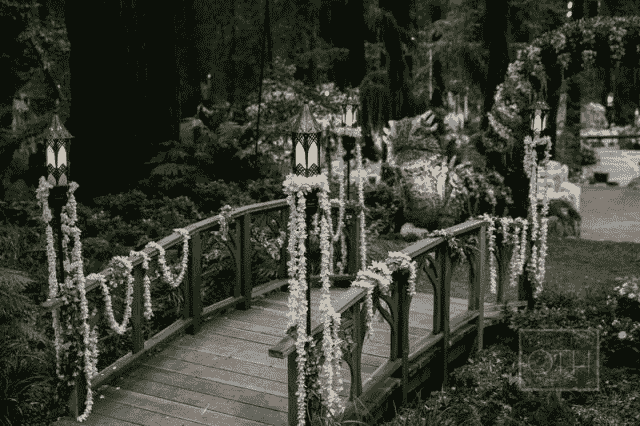
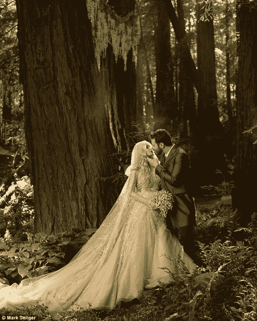

# 婚礼曾经是神圣的，关于互联网新闻的其他教训 TechCrunch

> 原文：<https://web.archive.org/web/https://techcrunch.com/2013/06/27/weddings-used-to-be-sacred-and-other-lessons-about-internet-journalism/>

**编者按:** *[肖恩·帕克](https://web.archive.org/web/20230218183802/http://www.foundersfund.com/team/sean-parker)是创始人基金的执行普通合伙人。此前，他是 Napster 的联合创始人，也是脸书的创始总裁。他目前担任 Spotify 的董事。在推特上关注他 [@sparker](https://web.archive.org/web/20230218183802/https://twitter.com/sparker) 。*

### 我们的婚礼

我的妻子亚历山德拉和我五年前相遇，坠入爱河，并几乎立即开始幻想我们的婚礼，我们都同意，应该在一个迷人的森林深处举行。(你知道，有点像托尔金的《指环王》中凯兰崔尔的神话之家。)我们希望我们的婚礼以“*从前……*”开始，以“*”结束……从此他们幸福地生活在一起。但是生活很少像童话故事中那样发展，就像我们希望的那样。讽刺的是，我要讲的故事开始于许多童话故事的结尾:一场婚礼。*

在我们结婚的那天，我们的朋友和家人沿着一条蜿蜒的小路步行到婚礼现场。每走一步，风景就变得越来越神奇，越来越茂盛，越来越超现实。最终，在进入森林之前，我们的客人到达了一块空地上的一扇美丽的大门。跨过那道门槛，他们离开了平凡的世界，进入了一个非凡的世界，这个世界被想象成我和我未来的妻子亚历山德拉之间的一种合作艺术项目。

我们希望我们的婚礼是精神上的，虽然不是公开的宗教。每个人都熟悉人造大教堂，但还有另一种大教堂，是上帝建造的。在许多古老的生长森林中，红杉自然地在曾经有一棵枯树的肥沃土壤周围呈环状生长。站在这些树木丛中，四周都被森林覆盖，很难不被这个自然“大教堂”的雄伟所感动，这是一个无与伦比的美丽的古代设置。

我们花了两年多的时间徒步穿越加州的红杉林，试图找到举行婚礼的最佳地点。找到一片适合举行婚礼的古老红杉林绝非易事。我们得到了著名的保护组织“拯救红杉联盟”的帮助，帮助我们确定一个合适的地点，并提供如何避免破坏红杉自然栖息地的建议。在他们的指导下，我们最终选定了大苏尔 Ventana Hotel & Spa 露营地内的一片红杉林，之所以选择这个地方，主要是因为这个地方已经被开发过了，从而最大限度地减少了对森林的影响，并避免了大量游客践踏“原始”森林的问题。

我们婚礼的愿景是尽可能地融入自然——展现场地的自然美，同时融入人们在婚礼上需要的各种现代设施。因为我们想避免对森林造成任何伤害，所以我们要求联盟派他们的科学总监 Emily Burns 到现场，为我们的景观设计师提供在森林中工作的[最佳实践](https://web.archive.org/web/20230218183802/https://www.dropbox.com/s/zj1fece9820n6ge/savetheredwoods%20email.pdf)。

仪式结束后，我们中的许多人都觉得好像永远不想离开那片森林，事实上，许多客人一直呆在那里，直到第二天早上太阳升起。我们躺在布满鲜花的小径上，抬头看着头顶的红杉树冠。从海上滚滚而来的雾气笼罩着我们，让这一刻充满了一种超自然的幸福感觉。

婚礼后的那个星期一，我们在酒店的房间里醒来，刚刚结婚，还在为我们一生中最激动人心的一天而兴奋不已。随着婚礼策划的压力和焦虑被抛在身后，我们终于准备好放松，深呼吸海洋空气，享受在大苏尔一起的浪漫。我们许多徘徊不去的朋友讲述了他们对婚礼的记忆，用“美丽”、“有品味”、“迷人”、“史诗”和“幻想”这样的词来描述这场婚礼。空气中有一种魔力，大多数新婚夫妇可以自由地沐浴在那一刻的余晖中。

### **善后事宜**

我们没那么幸运。

那天早上，我们醒来时发现媒体的强烈反对，媒体用我们在报纸上见过的最尖刻的语言攻击我们的婚礼。与此同时，一群网络流氓、生态狂热者和来自互联网各个角落的其他愤怒的人释放出粗俗的侮辱，淹没了我们的电子邮件和脸书页面。

#### 这是通常为种族灭绝独裁者保留的愤怒谩骂。

这些反应是如此极端，如此疯狂，如此充满咒骂，对我们来说似乎是浪费；这是通常为种族灭绝独裁者保留的愤怒谩骂。有些太夸张了，如果情况不同，我们可能会觉得它们很有趣。当然，当陌生人在你结婚两天后公开攻击你的妻子时，很难找到什么好笑的。这应该是我们一生中最亲密、神圣、珍贵和浪漫的事件:我们的婚礼。

但是在互联网上没有什么是神圣的，即使是婚礼。标题歇斯底里地描述了对网站的破坏，比如:“[破坏生态的婚礼](https://web.archive.org/web/20230218183802/http://grist.org/news/gavin-newsom-kamala-harris-partied-at-sean-parkers-eco-wrecking-wedding/)”；[生态婚礼灾难](https://web.archive.org/web/20230218183802/http://www.theatlanticwire.com/entertainment/2013/06/sean-parker-wedding-fines/65869/)；[【1000 万美元毁一座公园](https://web.archive.org/web/20230218183802/http://qz.com/90833/sean-parkers-10-million-destruction-of-a-park-epitomizes-whats-wrong-with-silicon-valley/)】；还有"[无味的生态垃圾婚礼](https://web.archive.org/web/20230218183802/http://www.theregister.co.uk/2013/06/04/sean_parker_wedding_fine/)"网络媒体和舆论法庭指控我们犯下了各种可以想象的环境罪。

有人写道，我们的婚礼非法破坏了红杉林，捣毁了大苏尔露营地，威胁到一种特殊声音的鱼——濒临灭绝的虹鳟鱼——的栖息地。媒体描述了我们如何“践踏”了一片“巨大的古老红杉林”，践踏了一个“原始的”公共公园，导致一条小溪“沉淀”,这条小溪是鳟鱼的产卵地。媒体声称红杉树被推土机砍伐，我们破坏了这个非常敏感、脆弱的红杉栖息地。这场婚礼被广泛嘲笑为“乏味”、“令人讨厌”和“奢侈”

#### 互联网上没有什么是神圣的，甚至连婚礼也不例外。

如果我们的朋友给我们发来贺电，我们也不会看到。如果亚历山德拉的朋友在称赞她选择的婚纱，她错过了这些信息。事实上，如果有人对我们的婚礼说了什么好话，那也完全淹没在噪音中，淹没在充满仇恨和恶意的信息海洋中。我们在脸书发布的结婚公告和结婚照引来了数百条这样的信息，愤怒的旁观者让我们“滚开”，称我们“自私”、“可鄙”、“恶心”和“伪君子”对我的描述包括“混球”和“刺”，对我妻子的描述包括“掘金者”和“妓女”。幸运的是，在这群乌合之众中有一些非常有创意的仇恨传播者，他们设法通过散布创造性的侮辱来吸引我们的注意力，如“douchemonster”，“jackassery”，“jackwagon”，以及我个人最喜欢的“冲洗独木舟”(我不知道“冲洗独木舟”或“运货马车”是什么，但我认为它们既不是交通工具，也不是赞美。)

我们被告知，我们应该为我们的罪行被“绞死”，“最好是挂在灯柱上，因为树对他们来说太好了。”许多人认为坐牢是为了“杀鸡儆猴”。一个更有思想的评论者建议说，“和诺特诺一家一起在萨利纳斯蹲监狱”是一个比普通的老监狱更合适的惩罚。那是不行的。

我们预计戏剧性的媒体反弹是短暂的。这可能是一厢情愿的想法。攻击持续了几天，一波又一波的文章，每个标题都比上一个更夸张，更严厉，每个故事都进一步夸大了婚礼的所谓成本、损失和人身攻击。

在忍受了几天的公开殴打后，我已经忍无可忍了。我在网上为我们的婚礼辩护，匆忙写了一封信，旨在反驳亚历克西斯·马德里加尔(Alexis Madrigal)在《大西洋连线》(The Atlantic Wire)上发表的[帖子](https://web.archive.org/web/20230218183802/http://www.theatlantic.com/technology/archive/2013/06/new-government-documents-show-the-sean-parker-wedding-is-the-perfect-parable-for-silicon-valley-excess/276521/)，该帖子将我们的婚礼称为“硅谷过度的完美寓言”虽然他的批评并不孤单，但牧歌的声音在谴责我们婚礼的人群中脱颖而出，部分原因是他的故事更好地表达了出来，并且来自一位可信的作家，部分原因是它对我和亚历山德拉，我们的意图，以及我们所谓的犯罪的蓄意和肆意的性质做出了全面的结论。

别介意这些指控实际上都不是真的。真相以一种有趣的方式阻碍了一个伟大的故事。

### **澄清事实**

我对亚历克西斯·马德里加尔(Alexis Madrigal)不会太苛刻，因为他很友好地阅读了我的电子邮件，很友好地道歉，并有着坚强的性格和新闻诚信，公开发布了我的电子邮件，并做出了某种撤回，这是大多数记者都不愿做的事情。正如我在给他的回复中所写的，没有人会选择在红杉林结婚，除非他们热爱红杉林。此外，我们的婚礼没有在公园、自然保护区或任何其他形式的受保护的公共土地上举行。我们从一家经营豪华酒店 Ventana Inn & Spa 的公司租下了我们的婚礼场地，这家酒店由两家价值数十亿美元的私募股权公司所有，两家公司都是加州房地产领域的资深玩家。婚礼的地点是一个私人的营利性车辆露营地，大部分铺着黑色沥青，满是压实的泥土，在森林地面上挖了几个大坑，土堆在这些坑周围。

#### 别介意这些指控实际上都不是真的。真相以一种有趣的方式阻碍了一个伟大的故事。

这座房产以前曾被用于举办活动，包括至少一场婚礼。当我们第一次参观这个地方的时候，路面铺设机器还在营地剩余的未铺柏油的地方铺设新的柏油，推土机正在挖掘露营“垫”供房车停放。整个森林的地面都不见了，取而代之的是泥土和沥青。

你期望在原始红杉林中找到的自然植被已经被推平了——没有酢浆草叶地被，没有蕨类植物，没有野花。虽然许多古老的树木仍然留在这片土地上，但该地已经经历了一个世纪的砍伐，剩下的大部分森林是第二次或第三次生长。你在我们的照片中看到的所有绿色植物，蕨类植物和其他植物，都必须由我们带入现场，以重现一片未受干扰的红杉林，而这片森林显然不是。

许多新闻报道都集中在这样一个概念上，即我们在某种程度上损害了环境。这根本不是真的。没有红杉树受到任何伤害。没有濒危物种受到伤害，事实上，也没有人居住在这片土地上。织物衬垫用于保护地面免受我们的景观美化工作的影响。我们小心翼翼地不直接种在地里，而是引进了盆栽植物。

#### 我们没有法律、合同或其他义务申请许可证。

加州海岸委员会的执行主管丽莎·哈格在上周五的委员会听证会上说，“与婚礼相关的建筑工程对环境的破坏没有我们最初担心的那么严重，部分原因是大部分开发是在露营地和现有道路上进行的，而不是在原始森林中。”

从一开始，我们的目标就是让森林处于比我们发现时更好的状态。现场的一切都是临时搭建的。布景是中空的，在现场外制作，像乐高积木一样拼在一起。甚至石制品内部也没有砂浆，以方便拆卸。

我们没有义务——法律的、合同的或其他的——去申请许可。我们不是业主，也不是从业主那里“租赁”的财产。我们已经向酒店支付了活动费用，以便利用他们的露营地来举办我们的婚礼。我们没有法律资格申请与我们不拥有的财产相关的许可。不仅如此，如果不询问业主，我们根本不知道需要什么许可证，我们在出租物业之前就已经问过了，酒店管理层告诉我们不需要任何许可证。业主有责任告知我们任何与物业相关的土地使用限制或许可证问题。

从一开始，我们就和酒店分享了安装舞台背景和其他婚礼相关设备的计划。酒店是建设过程的积极参与者——这并不像我们在火星上做准备——这一切都发生在酒店的后院，酒店管理层每天都在现场监督项目。他们从未暗示与加州海岸委员会或任何其他政府机构有任何问题。事实上，在这件事之前，我甚至没有听说过加州海岸委员会。为什么我会有？我在加州沿海地区没有任何财产。如果我在租用网站之前就知道这些问题，我会把我的生意带到其他地方。

#### “与婚礼相关的建筑工程对环境的破坏没有我们最初担心的那么严重，部分原因是大部分开发是在露营地和现有道路上进行的，而不是在原始森林中。”–丽莎·哈格，加州海岸委员会

还有一种鱼的问题，那就是所谓的“T1”鳟鱼，据说它受到了我们婚礼筹备工作的威胁。媒体报道说，这种鱼是“濒危”物种，它的产卵地是我们婚礼现场附近的一条小溪。然而，在谷歌上简单地搜索一下“虹鳟鱼”就会发现，这种鱼并不像媒体报道的那样是真正的“濒危”物种，而是常见的“虹鳟鱼”的一个奇特变种，这种鱼在北美非常丰富——事实上，数量如此之多，以至于有时被认为是一种有害物种。(虹鳟和三文鱼一样，会逆流而上，在海洋中度过一生。这种虹鳟鱼的变种在加州一些受保护的地区已经看到了它的数量下降，但它很难像媒体所说的那样是濒危物种。事实上，国家野生动物联盟报告称虹鳟鱼“没有灭绝的危险”)

加州海岸委员会自己关于此事的公开报告提到了一条名为 Post Creek 的小溪，它显然穿过了这片地产，尽管他们对这条小溪中是否真的有鳟鱼，或者这条小溪中是否有足够的水让鳟鱼产卵不置可否。该报告称，有可能是我们的建设“可能”导致了这条河流的沉积，这反过来“可能”阻止了鱼类继续它们的业务。在婚礼前的几天里，多位生物学家访问了该地点，他们的报告证实了溪流中“浊度没有增加”，这意味着没有发生“沉淀”。更荒谬的是，如果这些鱼真的存在于小溪中的话，它们会在小溪中产卵，[并不在进行婚礼建设的那部分地产上](https://web.archive.org/web/20230218183802/http://documents.coastal.ca.gov/reports/2013/6/F5.1-s-6-2013.pdf)。

如果媒体阅读了这些文件，也许这种公开的受难会减少。但是，不，媒体不能被这些事实所困扰，因为它们隐藏在众目睽睽之下，特别是因为他们从事的是针对一个“恶心”、“骇人听闻”、“破坏生态”的有钱人的名誉暗杀的严肃业务。所以毫不奇怪，媒体也没有提及最重要的细节。

露营地本应作为酒店的一个盈利项目向公众开放，但实际上自 2007 年以来就一直关闭，主要是因为一个相当不幸的、名副其实的*发臭的*事件。原来，蒙特雷县的检查员发现了人类排泄物泄漏到波斯特克里克。几乎干涸的、被认为是鳟鱼产卵场的地方，实际上已经变成了一个人类排泄物的浴池，这些排泄物是由酒店里有缺陷的或者不充分的废水处理设施造成的。这导致蒙特雷县发布了一项命令，出于明显的公共卫生原因，关闭了该营地，等待该废水处理设施的修复。

这是媒体在匆忙判断中错过的很大一部分。由于我们婚礼的宣传，委员会开始调查这个地方，并发现，在我们不知道的情况下，这个露营地已经非法对公众关闭了六年。从加州海岸委员会的角度来看，主要的违规行为不是婚礼对红杉栖息地造成的破坏，而是在没有业主(酒店)寻求许可的情况下就在该地点进行了开发，此外，酒店有义务将该地点作为商业露营地向公众开放。这个问题——露营地对公众关闭——不是由我们引起的，这绝不是我们的错，但当委员会因我们的婚礼开始调查酒店时，这个问题被发现了。

#### 媒体对这些事实不屑一顾，因为它们隐藏在众目睽睽之下，尤其是因为它们从事的是严重的名誉暗杀业务。

为了理解这个问题的重要性，人们必须首先理解加州海岸委员会的两个主要职责:第一，管理沿海地区的发展，以保护沿海资源；第二，确保公众和娱乐进入海岸，这被认为是加州的公共资源。委员会被授权通过对财产所有者征收罚款来保护公众使用权，但从技术上讲，它需要将财产所有者告上法庭才能做到这一点。委员会主要通过被称为“同意令”的合同来解决这些纠纷。甚至这些合同的名字都强调了一个事实，与其说它们是“订单”，不如说严格来说是*两厢情愿*。只有当委员会无法达成和解时，他们才会将问题提交给法院系统，这对加州纳税人来说是一个昂贵的过程，而且在实践中很少发生。

因此，委员会最大的问题原来与婚礼本身无关:委员会对低成本露营地自 2007 年以来对公众关闭感到不安。在 1982 年加州海岸委员会与 Ventana 签订的和解协议中，该酒店被要求维护这一公共露营设施，作为其经营豪华酒店许可的一个条件。几年后，有毒的人类排泄物开始出现在小溪中，蒙特雷县关闭了露营地，这个计划就此流产。

委员会声称他们从未得到适当的通知，这实际上使这两个政府机构的愿望相互对立。委员会认为，从 2007 年起，Ventana 应对营地关闭造成的损害负责。6 月 12 日，委员会女发言人莎拉·克里斯蒂公开承认了这一点，她告诉《蒙特雷县周刊》:“帕克先生在租赁露营地时，实质上租赁了一个正在进行的违反海岸法案的行为。”

### **媒体反应**

*“把龙排除在你的计算之外是不行的——如果你住在他附近的话。”–j . r . r .托尔金*  

我们在婚礼策划中犯的最大错误是忘记了媒体:那条沉默的、看不见的龙一直盯着我们。没有什么比媒体对这一“争议”的处理更让我震惊的了:有数百篇文章被写出来，然而——令人难以置信的是——只有一名记者在发表他们的故事之前麻烦地征求我们的意见。

虽然并不是所有的出版物都是这样运作的(有些避免参与公开的私刑，一些传统的记者，如[本刊](https://web.archive.org/web/20230218183802/http://www.usatoday.com/story/tech/2013/06/21/sean-parker-says-he-had-to-pay-wedding-fines/2447219/)和[本刊](https://web.archive.org/web/20230218183802/http://articles.latimes.com/2013/jun/18/local/la-me-parker-speaks-20130619)事后发表了准确的反驳)，但事实上，如此多的出版物确实参与了错误信息的攻击，甚至是像《大西洋月刊》这样可信的媒体，这是对网络新闻现状的惊人证明。几乎每一个记者都没能采访到任何人，更不用说询问他们报道的主题了，这怎么可能呢？我们会很高兴地回应，也许这种痛苦可以避免。

#### 在这个快速而松散的“博客赚钱”的世界里，当写缺乏事实的尖刻的故事是一种更有效的产生流量的方式时，做原创报道可能感觉是浪费时间。

我知道媒体有时是不负责任的，但这代表了一个新的低点。媒体不应该发布错误的信息，做出毫无根据的指控，质疑私人婚礼的神圣性，尤其是在没有进行任何调查或采访的情况下。在线小报媒体不是基于原始资料进行报道，而是利用这个故事，互相寻找消息来源，以最快的速度写出越来越耸人听闻和夸张的标题。我从未见过一个几乎每个记者都没有原创报道的故事得到如此多的关注。

他们真的不会为此烦恼:数百名记者打电话给零来源，问零问题，做零研究，甚至设法忽略现成的公开文件中包含的信息。在这个瞬息万变的“博客赚钱”的世界里，当写一些缺乏事实的尖刻的故事是一种更有效的产生流量的方式时，做原创报道可能感觉是浪费时间。无论如何，看到这么多不准确的衍生故事，却不考虑事实核查或来源，这是令人震惊的。

大约 20 年前，当我开始进入这个行业时，情况有所不同。那时候没有博客，没有推特或脸书，编辑世界仍然是一个成长中的行业。与我互动的记者们勤奋地研究他们的故事，追踪消息来源，进行采访，甚至在出版前核实他们的故事。网络媒体的问题在于他们没有动力去做这些事情。用尖刻的故事比硬新闻更容易产生流量，而且把故事的事实搞错，甚至完全捏造也没有坏处。法律没有提供追索权，因为作为一个“公众人物”,无论出于何种意图和目的，你都得不到诽谤法的任何保护。博客攻击你，造成伤害，然后转向下一个目标。现在，由于互联网的持久性和谷歌的便利性，这些恶毒的在线攻击留下了很难洗掉的声誉污点。

### **剖析危机**

关于我们如何因法律上不属于我们责任的违规行为而最终陷入 100 万美元的账单，以及我们如何决定额外捐赠 150 万美元的慈善捐款的故事，就像大多数事情一样，始于泄密。亚历山德拉和我已经为我们完美的童话婚礼努力了将近两年。

一个有点尴尬的坦白是适当的:我的妻子和我是超级书呆子。正如媒体猜测的那样，我们举办了一场盛大的书呆子婚礼。亚历山德拉和我一直是幻想迷，尤其是“高度幻想”的信徒我们都是在这种类型的书籍中长大的，我们都在心中为托尔金保留了一个特殊的位置，因为幻想，或者像托尔金所说的“童话故事”，可以成为一种探索具有强大道德指南针的大型原型人类主题的工具。善与恶。权力和责任。死亡和永生。年轻时，亚历山德拉是幻想写作协会的成员。她不愿承认这一点，但她甚至在中世纪庆祝了几个最近的生日。

我们的仪式以及我们的誓言最突出的主题之一是“避难所”的概念——找到一个真实存在的慰藉之地，在那里我和妻子可以在一起，独自思考，平静地面对自己，能够公开表达自己，而不用担心审判或社会监督。从这个意义上来说，“避难所”是向彼此表达“真实”自我的自由，这是亲密关系的基础。在我们这个科技超负荷、高度互联的世界里，这样的地方越来越难找到。除非你选择远离社会过修道生活，否则你无疑会受制于社会强化的观念，即你是谁，你在社会中代表什么。对于那些被名人或恶名所诅咒的人来说，强加于你的身份的外界假设只是被夸大了。

我们为我们的婚礼选择了一个环境，这是我们寻找避难所的字面表达——一个安全、私密和亲密的地方。我们选择了一个偏远的地点(大苏尔)，没有邀请任何媒体，并尽最大努力对媒体隐瞒这个地点。我们没有引起注意——恰恰相反，我们要求客人在门口检查他们的手机和相机，我们没有把我们的照片卖给小报。这有可能是因为我们想要保护这个特殊日子的隐私，这种损害了这个神圣事件的强烈反应加剧了。(小报媒体的怪物就像龙一样，吃饱了更开心。)在报道我们婚礼的狂热中，除了婚礼的施工照片，媒体没有什么可报道的，除了这个虚假的破坏生态的主题，也没有什么可谈论的。

我们的婚礼与我们生活的充满科技的世界截然相反；一个我参与创造的世界。这是对自然环境的敬意。这也是一个千载难逢的机会，迫使 364 名自尊的成年人穿上精心制作的幻想服装，这是一个恶作剧的壮举，我们很高兴尝试。奥斯卡获奖服装设计师(因《指环王》获奖)，恩吉拉·迪克森，是我们的同谋，她出色的设计甚至超出了我们最大胆的梦想。

这种对隐私的强调是为什么当小报新闻渠道 TMZ 开始对我们的婚礼进行报道时，这是如此令人惊讶，包括与我们在婚礼上所花的钱有关的完全夸大的报道。这些虚构的谣言引起了当地社区对我们婚礼的质疑。这是我们第一次发现媒体可能有问题，然而离婚礼还有几个月，事情似乎已经步入正轨。我和文塔纳的关系很友好，我没有理由期待会有什么大问题。

然后灾难降临了。就在我们婚礼前 20 天，酒店接到加州海岸委员会的电话，要求我们停止工作。媒体对婚礼的关注激起了当地社区的好奇心，他们将此事提交给了蒙特雷县，后者又将此事提交给了委员会。那时我们从未听说过这个委员会。我们很自然地答应了这个要求，我急忙去找一个了解这个神秘政府机构的人。

经过两年的婚礼策划，我们现在离大喜的日子只有几周了。到那时，我们所有的客人都已经被预订到酒店，所有的准备工作都已经做好了。婚礼前的几周至关重要；对于规划师、设计师和工作人员来说，这是最忙的几周。有成百上千的有创造力的人在这个项目上工作，他们和我们一样倾注了他们的心血。现在我的准新娘正面临着失去婚礼的危险。我不想让她失望。

文塔纳一发现有问题，他们就威胁要取消婚礼，除非我签署一份广泛的赔偿协议。那时我们无处可去，没有备用计划，大苏尔地区也没有可以容纳 360 名客人的地方。我们所有的设备、材料、装饰品和其他物品都在现场，如果没有佣金结算，我们就无法搬迁它们。具有讽刺意味的是，如果把所有东西放在网站上的过程都构成了“开发”，那么删除它们的过程也是如此。我被夹在 Ventana 所有权和 CCC 之间的纠纷中，尽我所能帮助他们解决问题，这样婚礼才能进行。

委员会提供了一个“临时事件豁免”,从理论上讲，它应该涵盖婚礼中的临时发展。(虽然我们对场地的改造都是临时的，但我们的婚礼涉及到一些繁重的景观美化，如砌石、安装一个小假池塘，以及其他可能会使婚礼不合格的舞台装饰。)应该指出的是，我们所做的所有工作都是在露营地现有的铺面或空地上进行的，并且从一开始就设计成在婚礼后立即拆除。

我们被堵在墙上。最终，Ventana 不愿意承担任何经济责任，宁愿取消我们的婚礼，也不愿与委员会协商解决问题。我们别无选择，只能介入并为他们所有的违规行为买单，包括未经许可的建筑以及过去与营地关闭相关的责任。

婚礼前的 20 天是我一生中压力最大的日子；我们甚至不确定婚礼会不会举行。在整个过程的最低点，我不得不告诉亚历山德拉，我们很有可能不会在 6 月 1 日结婚。在没有确定性的情况下推进如此大规模和如此重要的制作，这种焦虑是极其沉重的。

该委员会声称有人进行了未经许可的开发。由于不想在这个备受瞩目的案件中显得对富人“手软”，委员会在其工作人员报告中对可能造成的伤害采取了强硬态度。尽管我很尊重加州海岸委员会的使命和辛勤工作，但重要的是要注意到“同意令”的世界是一个假设的世界。同意令中的一切都是被指控的，而不是被证明的，委员会通常采取一种“厨房水槽”的方法来创建这些同意令和附带的工作人员报告。写一份有效的报告的关键是挑出每一个可以想象的、可以想象的、可能的论点，不管多么牵强，以证明对被指控的侵权者处以最大可能的罚款是合理的。没有直接有效的执行权力，委员会被迫采取这种咄咄逼人的姿态，以原告起草诉讼的方式陈述他们的指控。

这一点在[委员会主席 Mary Shallenberger 的话](https://web.archive.org/web/20230218183802/https://www.dropbox.com/s/v0j36w8zh4021c1/CCC%20Hearing%20Transcript%20%286.14%29.pdf)中有所体现:“如果 Parker 先生不愿意与我们和解，如果他坚持己见，说‘见鬼，不’，你知道，唯一的选择就是在这个问题上诉诸法律。因此，我感谢他自愿这样做，并与我们的工作人员一起工作；但是，如果他不愿意这样做，我们就没有权力强制甚至要求他与我们谈判并接受任何形式的惩罚。”(欧盟委员会可能需要更大的权力来像大多数其他委员会一样实施罚款，但在拥有这种权力的同时，他们也需要缓和其手段的激烈程度。)

一些媒体报道采取的立场是，富人“可以花钱摆脱任何事情。”然而，我的和解是委员会历史上最大的一次和解。之所以这么大，不是因为我的违规行为如此令人发指，而是因为我被逼到了墙角，别无选择，只能屈服于酒店或委员会对我提出的任何要求。

所谓的“有钱人”在委员会没有得到任何特殊待遇。如果说有什么不同的话，那就是他们得到了更糟糕的待遇。委员会对外表很敏感；他们不能轻易放过一个“有钱人”。我与他们和解而不是上法庭，这并没有什么特别之处。由于委员会不能直接实施罚款(他们需要将问题提交法院系统)，他们非常愿意解决案件。事实上，大多数案件都是通过“同意令”解决的，从未诉诸法庭。这对委员会有好处，对加州人民也有好处——诉讼费用昂贵，和解带来的资金可用于海岸保护和恢复项目。在和解宣布后的一份新闻稿中，玛丽·夏伦伯格说:“任何时候我们都可以解决违规行为并避免诉讼，我们认为这是一个好的结果。”

我和 CCC 总部的工作人员一起呆了五个小时，我们制定了和解的条款。我将支付 100 万美元的罚款，从技术上讲，这是酒店的责任，包括他们过去的违规行为，并提供远超这种情况下正常情况的“缓解”。同意令和员工报告通常被写得听起来很严厉，以证明罚款是合理的。这是导致媒体得出如此极端结论的部分原因，因为他们大多不熟悉委员会的内部运作。在为自己辩护时，该委员会在其新闻稿中提供了关于我如何“合作”的语言，但这通常被记者忽视了，他们选择关注所谓的违规行为，好像它们是铁的事实，而且不幸的是，好像它们是我的错。

我们的婚礼定于 6 月 1 日星期六举行。我们忍受了 18 天的残酷谈判——我们、酒店和加州海岸委员会之间的三方谈判。紧张与日俱增，在整个过程中，我们做好了最坏的心理准备——我们无法与各方达成一致，婚礼将被取消。结婚的那个星期，事情还没有解决。最后，在婚礼前的那个星期四，我们达成了一致，在我们婚礼的前一天早上 6 点，我签署了同意书。该协议不仅涵盖了酒店对未经许可的开发的责任，还涵盖了我们使用该网站之前的一系列违规行为。我还自愿捐赠了一笔相当大的慈善捐款——150 万美元——用于当地社区与沿海有关的项目。

婚礼即将举行。我要结婚了。我可以看到亚历山德拉走过过道时脸上的表情。

我们结婚的那天是一个美梦成真的日子。在经历了之前 19 天的压力之后，婚礼顺利进行。后来，我们兴奋地去度蜜月，忘记一切。

然后媒体的反弹开始了。接下来我所知道的是，媒体把我描绘成一个粗鲁、麻木不仁、破坏生态的亿万富翁，漫画般地开着一辆巨大的推土机，兴高采烈地铲平“蕨谷:最后的雨林”的残骸。《神圣蜜蜂》简直把我变成了一部政治漫画。

我成了媒体最新的[替罪羊](https://web.archive.org/web/20230218183802/http://pandodaily.com/2013/06/08/the-silicon-valley-whipping-boy/)，一个新崛起的硅谷精英堕落的标志，现在媒体显然试图将我定位为那种需要不时在流行神话中出现的过度的象征。80 年代有米尔肯，90 年代有埃伯斯，过去几年的金融危机给了我们一大堆坏蛋，包括臭名昭著的麦道夫。也许媒体对超级富豪最近没有犯罪行为越来越不耐烦了？

#### 我想这个关于我的神话对包括媒体在内的人们来说是一个太好的故事，以至于不能停止讲述它。尽管我不在，这个关于我的神话依然存在，而且在我离开后，它甚至可能在没有我的情况下继续存在。

我被认为是一长串符合这种陈旧刻板印象的公众人物中的最新一个，一个腐败、邪恶的商人，他选择了政治制度，通过暗中收买来解决问题，并在此过程中践踏了一个受保护的生态区。对于媒体来说，我只是下一代商业领袖走向黑暗面的一个很好的例子。然而，我无法逃避这种感觉，在被要求扮演的角色中，我严重流产了。首先，案件的事实并不支持这种描述，我自己的态度和信念也是最矛盾的。我对红杉林的迷恋以及选择和装饰这个地点的认真态度与描述不一致。鉴于我的进步政治、理想主义和普遍的反体制偏见，我有一种明显的感觉，如果这些记者中有任何一个真的见到我，他们可能会对他们选择的候选人感到非常失望；也许是共和党人对米特·罗姆尼的感觉。

我以前被用作一个阴谋工具——电影《社交网络》在媒体的想象中塑造了我的漫画形象:道德上应受谴责的“骗子”混球。我被神话化了。我越想这个概念，我就越开始意识到神话是有自己生活的故事，故事很好，人们不断地讲述和重复，即使它们不是真的。我认为，关于我的神话是一个太好的故事，人们，包括媒体，不能停止讲述它。这个关于我的神话继续存在，尽管有我，在我离开后，它甚至可能没有我而继续存在。

如果我是一个冷酷无情的混蛋，那么为什么委员会称赞我的努力呢？在遭遇强烈反对后不久，即 6 月 14 日，加州海岸委员会举行了公开听证会，主席玛丽·沙龙伯格(Mary Shallenberger)感谢我在揭露该酒店长期违规事件中发挥的作用。“我感谢帕克先生在那里举行婚礼，因此我们发现了所有违规事件以及公众无法进入的六年时间，”沙龙伯格说。

****

### **保护红杉树**

#### 红杉林面临着实实在在的威胁。我们的婚礼不在其中。

红杉林面临着实实在在的威胁。我们的婚礼不在其中。媒体在提到红杉林时，总是使用“脆弱”和“敏感”这样的形容词，暗示我们在这些参天大树之间的森林中所做的工作可能会对它们造成伤害。

事实是，红杉林是一个强健而富有弹性的生态系统，能够经受住自然和人类对它们的各种侮辱，从火灾到虫害，甚至干旱。“红杉林是一个充满活力的地方，”拯救红杉联盟的科学主任、红杉生态学专家艾米丽·伯恩斯写道。烧焦的红杉树的中空外壳，不知何故仍然活着，对于任何花时间在红杉树间徒步旅行的人来说都是熟悉的景象。甚至还有一个受欢迎的旅游景点，枝形吊灯树，尽管它的树干底部被切开了一个大洞，一个大到你可以开车穿过的洞，但它仍然存在。

然而，有一件事肯定会摧毁红杉林，那就是伐木。为了获取木材而砍伐红杉林的做法在加利福尼亚一直延续到今天，古老的红杉也不例外。大约三分之一现存的古老红杉林为木材公司所有，与人们的预期相反，这些树木没有受到加州或联邦法律的保护。

在伐木之前，人们认为加利福尼亚至少有 210 万英亩海岸红杉林。今天，只有 5%的原始森林保留了下来，其中大约 133，000 英亩保存在加利福尼亚的红杉州立公园和国家公园。至少有 100，000 英亩的古老海岸红杉掌握在商业木材公司手中，因此处于危险之中，而人们对此却无所作为。在媒体反弹开始后的一封电子邮件中，拯救红杉联盟(Save the Redwoods League)的艾米丽·伯恩斯(Emily Burns)指出了这种回应的公然荒谬:“当红杉在其他地方面临更值得八卦的实际威胁时，人们却把注意力集中在这件事上，这很有趣！”

#### 所有关于我们婚礼的误导性报道只会强化一种无益的误解，即古老的红杉林实际上是一个受保护的生态系统，而事实并非如此。

该联盟是为数不多的几个组织之一，他们实际上正在为这些威胁做些什么，主要是通过筹集资金购买土地，或者在土地上放置保护地役权，或者将其捐献给国家公园系统。在 20 世纪早期引入先进的伐木技术期间，这导致了更快的森林砍伐，联盟在拯救仅存的几片红杉林方面发挥了至关重要的作用。他们是保护运动的早期领导者，建立了加州国家公园系统，然后在过去的一个世纪里尽可能多地购买古老的红杉林。很大程度上是因为他们的努力，我们仍然保留着原始的老红杉。

我坚信红杉林应该是一个受保护的生态系统，但今天情况并非如此。与我们婚礼相关的各种媒体报道称，我们所在的区域是一个“受保护”的生态系统。我们租的露营地受到加州海岸委员会的土地使用限制，但遗憾的是，红杉林本身在加州没有特殊的法律地位。

我认为他们应该，古老森林的遗迹应该被保护起来，不被砍伐和开发。(尽管加州的红杉被贴上了“海岸红杉”的标签，但大多数这些森林并不位于沿海地带，因此它们不受海岸委员会或任何其他州政府机构的保护。)所有关于我们婚礼的误导性报道只会强化一种无益的误解，即古老的红杉林实际上是一个受保护的生态系统，而事实并非如此。

过去的两个星期已经证明了网络社区是多么的残酷和愚蠢。但是亚历山德拉和我都是非常坚韧的人，就像我们结婚时的红杉树一样，我们经受住了更严重的侮辱。对发生的事情撅嘴是没有意义的；我们最好充分利用糟糕的情况。一种方法是唤起人们对针对红杉林的真正犯罪的关注。我们将继续支持像拯救红杉联盟这样的组织。我们还将尽我们所能，让我们提供的 150 万美元慈善捐款真正发挥作用。我们欢迎你就如何使用这笔捐款提出创造性的建议。该项目必须是保护或公共访问相关的，必须是在蒙特雷半岛。

### **到底有什么教训，真的？**

如果我们的婚礼不像亚历克西斯·马德里加尔最初声称的那样是“硅谷过度的完美寓言”，那它是什么样的寓言呢？如果有的话，我们应该从这个故事中吸取什么教训呢？这是一个完美的寓言，描述了由于科技在我们之间制造的距离，我们之间非人化的分离。一个破碎、失灵的媒体的完美寓言？还是现代版的伊卡洛斯神话，他敢于飞得离太阳太近？

这是专家们的问题。可能根本就没有什么教训，至少没有一个广泛适用的教训。就我个人而言，这整个经历促使我思考新闻业的现状，特别是社交媒体、博客、新闻周期的加速以及媒体格局的扁平化在过去十年中如何改变了新闻业。人们可以很容易地通过对媒体的全面批评来忽略所发生的事情:他们已经成为链接诱饵豺狼，相信“真相”是驱动点击的东西。

然而，这种简单化的描述忽略了媒体近年来经历的更深层次的结构性变化，其中一些变化是我促成的。我经常想，既然媒体已经“开放”，进入门槛更低、摩擦更少、辩论中包含更多声音，我们作为一个社会是否会更好。互联网(广义)和社交媒体(狭义)带来的变化对公民社会是有益的还是有害的，或者两者兼而有之？这是一个必须向记者们自己提出的问题。作为一个经常成为媒体报道对象的人，我只有一部分必要的经验来做这个决定。

#### 对媒体的全面批评很容易被忽略:他们已经成为链接诱饵豺狼，相信“真相”是驱动点击的东西。

不管怎样，我无法摆脱这种感觉，这是一种宇宙的讽刺。本书的读者可能熟悉我在技术领域的职业生涯。我花了十多年的时间创作产品，这些产品的前提是媒体的民主化是一件好事，自我出版、信息的自由共享以及媒体“看门人”的去除都将带来一个更自由、更开放的媒体——隐含的假设是这是一个“更好”的媒体。我身体力行，围绕一个核心信念谈论和设计系统，即赋予人们更自由地访问和共享信息的工具——无论是音乐、链接、照片、文本还是任何其他形式的媒体——只能让世界变得更美好。

我的两个公司，Plaxo 和脸书，都是围绕着“身份”是在线对话的基石这一理念而建立的。我相信将真实身份——名字和面孔——引入互联网的匿名自由交流中，将会导致问责，这是在线讨论的必要条件，如果不是充分条件的话。问责制将有助于实现文明和责任，有助于创造允许精英自然上升到顶端的系统。这一点，加上聪明的算法过滤器，可能会削弱人类编辑的重要性。我从来不相信“身份”是某种灵丹妙药，但在一个几乎没有任何行为标准的媒体中，它似乎的确是对不良行为者的一种重要威慑。

然而，仿佛是由于某种因果报应，我毕生致力于打造的灵媒常常成为我自己的人格和声誉在公众面前遭到无情攻击的武器。不，由于身份和责任的调节能力，这些媒介的使用者很乐意公开攻击我，在众目睽睽之下，使用他们的真实姓名和身份，不需要匿名。我看到这些新媒体帮助煽动革命，推翻政府，并让原本看不见的人发出声音，我也看到它们被用来将现实世界的欺凌影响从身体互动扩展到网络世界，因此今天成长的孩子现在可以从任何地方受到折磨。我还目睹了这些媒体被用来形成大规模的数字私刑暴民，我已经不止一次地受到摆布。我想这是唯一合适的，我会；宇宙有一种有趣的方式来回报这些东西。

从经济角度来说，我是最成功的。我是媒体这一巨大转变的最大受益者之一。我真的赚了“十亿美元”，正如媒体不断提醒我的那样，这很“酷”。但是我第一个承认，从集中的、自上而下的媒体向分散的、自下而上的媒体的转变并不是没有代价的。在某个时间点，每个人，无论他们是否积极参与这些新媒体，都会经历隐私被侵犯，会发现他们的名誉被公开玷污，甚至会发现他们的理智受到这些因素的一些组合的挑战。(想起了“看不见的孩子”的联合创始人杰森·拉塞尔的故事。)

一种暴民心态在不受限制、不文明的社交媒体世界中占据着至高无上的地位:无论是在脸书、Twitter、博客，还是在传统新闻业的残余中，保守派现在都被迫与“实时网络”和博客世界的即时新闻周期竞争。这种新媒体的经济学在很多方面已经使旧的新闻经济学和随之而来的价值体系变得过时。新闻伦理，对客观、准确和文明的承诺，在新闻的创造者和消费者之间形成了一种松散的社会契约。

这一准则被整个新闻制作行业所接受，被灌输给新闻学院的学生，并被受尊敬的新闻机构的编辑部所强化。这个价值体系在上个世纪来之不易。它诞生于 20 世纪初的腐败政治以及赫斯特和普利策的“黄色”新闻，只是逐渐被坚持更高新闻诚信标准的新一代出版商的价值观所取代。最终，这导致了我们曾经认识的职业记者时代的到来，她的道德准则和支持她的机构——新闻业的巨大堡垒:格雷厄姆家族和苏兹伯格家族建立的报业帝国，广播新闻业的巨头，像爱德华·R·莫罗和沃尔特·克朗凯特这样的人，给跟随他们的每一位新闻节目主持人的职业生涯投下了阴影。

#### 从经济上来说，我从我们所知的媒体毁灭中获利颇丰。世界其他地区的情况并不那么好，社会肯定是最糟糕的一方。

到 20 世纪 90 年代末，这一体系开始显露出磨损的迹象。报纸分类广告收入流失到 Craigslist、Monster.com、易贝和其他上市网站只是第一枪。广告收入大规模转向谷歌，以及后来的脸书，是随之而来的炮火。但是真正的新闻业之战是一场消耗战，因为网络、博客和广告技术逐渐蚕食了新闻业的剩余部分。

这场漫长的冷战在衡量标准上打了又输:当“点击”成为新闻生态系统中最终和决定性的价值衡量标准时，保守派最终屈服于新闻的商品化和耸人听闻。公众一直不太信任新闻业，认为标题能卖报纸，但他们至少相信这些报纸的目的——它们的重要性。现在已经没有更高的目标了；头条带动点击，点击卖广告。只有最教条，或者也许是最理想主义的记者仍然能够相信更高层次的动机。许多曾经自称记者的作家，现在也同样乐于被称为作家，甚至是“艺人”【T2

他们的工作充其量是制作原创内容，创作故事，希望有人会阅读并喜欢它们。在最糟糕的情况下，它已经成为将内容重新包装成被称为“点击诱饵”的数字废话，几乎自动地重复和重复无意义的新闻，设法讲述看起来最耸人听闻的故事，并在社交媒体的“回音室”中无休止地重复。这种新媒体对任何事情都发表意见和评论，对辩论贡献极少的客观事实，而且完全没有报道。建立支持新闻业的经济、社会和法律框架花了一个世纪的时间。在不到十年的时间里，这些系统大部分被拆除、废弃和废弃。

从经济上来说，我从我们所知的媒体毁灭中获利颇丰。世界其他地区的情况并不那么好，社会肯定是最糟糕的一方。媒体的去中心化有了一个充满希望的开始，但是像许多其他不成熟的革命一样，它从来没有实现它早期的承诺。以目前的形式，社交媒体可能弊大于利。也许我们应该预料到这一点——技术总是领先，社会和政府不可避免地追赶。

现在，社交媒体已经将内容生产者、编辑者、发布者和消费者的传统媒体角色合二为一，并将这些角色分配给几乎每个人，很明显，我们需要共同发展我们的社会规范，以反映这一新的现实。无论你对隐私问题以及联邦政府、科技公司和国会就数字监控达成的浮士德协议持何种立场，越来越明显的是，我们应对这些新媒体的法律框架充其量只是过时了。对于创新者来说，尤其是那些创造全新行业的人，有一种自由放任的偏见是很自然的，他们这样想是正确的。

虽然新技术不可避免地会带来社会总有一天必须应对的新挑战，但“急于监管”有将婴儿扼杀在摇篮中的风险。在政府干预之前，首先需要允许技术成长、成熟，并成为制度化社会结构的一部分。然而，既然如此多的新媒介似乎已经接近成年，也许是时候开始反思我们与这些媒介的集体关系了。

特别是，我们需要在美国考虑更强有力的隐私法，这是一项基本的隐私权，与大多数西欧国家的公民享有的法律一致。在一个媒体已经扩展到几乎每个人的世界里，我们都有成为“公众人物”的风险。在这样一个世界里，我们的诽谤法需要更新，为个人提供他们应得的免受公开迫害的保护。我们还需要通过加强知识产权法来加强我们的个人隐私，知识产权法管理我们通过脸书等服务产生和分享的个人内容。

我们越依赖社交网络和其他在线服务与朋友和家人分享内容，我们的内容无意中公开的风险就越大。围绕用户生成的内容(我们的照片、视频和其他内容)的知识产权法律的可执行性是我们拥有的最佳保护之一。在许多情况下，媒体选择将通过这些网络共享的所有内容广义地解释为“公共”内容，而事实上其中许多内容是私人的，私人材料的版权属于创作者。在脸书上分享照片不应该比通过电子邮件发送照片更构成使用这些照片的公共许可。

无处不在的许可协议和隐私政策，在线服务迫使其用户进入，应由法院围绕遵守原则进行审查，如果法院不愿意重新考虑现状，那么国会应干预立法，限制这些协议的范围和可执行性。我们还需要愿意考虑，只有国会才能防止滥用政府权力，这种权力被用来强迫在线服务以批发方式提供数据。

我敢肯定，社交网络、科技公司和电信公司不会向世界各地的政府屈服，但运营脸书或谷歌规模的服务会让这些公司成为各种政府机构的目标。一旦一家公司发展到这种规模，只有政府会构成有意义的生存威胁。因此，立法机构有责任在政府当局的正当需求和互联网用户同样正当的隐私要求之间建立适当的平衡。

最后，从我的婚礼中学到的教训远没有所谓的“过度的寓言”那么明显。更确切地说，我年轻时理想化的媒体民主化只是一个遥远而模糊的梦想，现在它突然变得不那么值得崇拜了，因为它已经变成了一个赤裸裸的现实。对我来说，过去两周感受最深的教训，最终变成了一个熟悉故事的熟悉寓意:“小心你的愿望——你可能会如愿以偿。”

> **总结要点**
> 
> *   婚礼地点的选择是因为它以前被开发过，所以没有环境影响。这个地方不是公共财产，它是一个私人的营利性露营地，大部分是用沥青铺成的，或者清除了所有的树叶。开发只发生在清理过的泥土和沥青区域。
> *   自然环境没有受到损害，尽管人们普遍认为情况正相反。没有对红杉树、其他植物或动物造成伤害。这片土地上或附近没有濒危物种。
> *   我们认真保护环境，在拯救红杉联盟的帮助下选址，并征求如何避免损害红杉栖息地的建议。
> *   婚礼后的几天里写了数百篇文章，但只有一名记者联系我们进行评论。这些文章中包含的大部分信息都是错误的。没有原始报告，没有采访，也没有事实核查。
> *   我们自愿同意支付 100 万美元的罚款，这些罚款与 Ventana 缺乏开发许可和过去的违规行为有关。我们还自愿捐款 150 万美元用于蒙特雷半岛沿海地区的慈善事业。