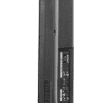
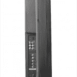

# 西屋公司将推出首款液晶高清电视混搭技术

> 原文：<https://web.archive.org/web/https://techcrunch.com/2008/08/28/westinghouse-to-offer-first-lcd-hdtv-mashup/>

# 西屋公司将推出首款液晶高清电视混搭产品

今天，随着 40 英寸 VK-40F580D 的发布，西屋公司穿上了大裤衩。这是一个全 1080p 分辨率的液晶高清电视/DVD 播放器组合。除了一个 USB 端口以外，这是它唯一能用来查看拇指驱动器或数码相机中照片的端口。不过，对于一台 1080p 的电视机来说，1049 美元的价格并不算太低。跳跃后的规格。

  

> VK-40F580D 的特点是:
> 
> 1080Pure 可提供所有高清接口中的 1080p 分辨率
> 智能前端插槽加载 DVD 播放器，可将标准 DVD 上变频至 1080p
> 多个高清输入接口，包括 2 个 HDMI 接口，采用西屋创新的 SpineDesign 结构，可实现整齐有序的线缆管理
> 一个 ATSC/NTSC/ClearQAM 调谐器
> 预设和自定义视频模式，可提供卓越的观看体验
> 用户友好的自动源功能，可自动唤醒和自动切换 DVD 插入功能
> MSRP:1，000 美元